# CubeSandbox

## 项目简介

项目目录：

```c
CubeSandbox/
├── 📄 核心文档
│   ├── README_zh.md           # 中文项目介绍
│   ├── README.md              # 英文项目介绍
│   ├── CONTRIBUTING.md        # 贡献指南
│   ├── AGENTS.md              # AI 代理贡献策略
│   ├── Makefile               # 构建系统
│   ├── openapi.yml            # OpenAPI 规范
│   └── LICENSE                # Apache 2.0 许可证
│
├── 🌐 CubeAPI/                    # REST API 网关
│   ├── src/                      # Rust 源码
│   ├── benchmark/                # 性能测试
│   ├── examples/                 # 使用示例
│   └── README.md                 # 组件说明
│
├── 🎛️ CubeMaster/                 # 集群编排调度器
│   ├── cmd/                      # 主程序入口
│   ├── pkg/                      # 核心代码包
│   │   ├── scheduler/            # 调度器（亲和性、过滤、打分）
│   │   ├── selector/             # 节点选择器
│   │   ├── templatecenter/       # 模板管理中心
│   │   ├── instancecache/        # 实例缓存
│   │   ├── service/              # HTTP/gRPC 服务
│   │   └── base/                 # 基础设施（配置、日志、数据库）
│   ├── api/                      # API 定义
│   ├── integration/              # 集成测试
│   └── docker/                   # Docker 部署配置
│
├── 📦 Cubelet/                     # 计算节点本地调度组件
│   ├── cmd/                      # 主程序入口
│   ├── pkg/                      # 核心代码包
│   │   ├── cubelet/              # 沙箱控制器
│   │   ├── container/            # 容器运行时集成
│   │   ├── controller/           # 控制器逻辑
│   │   ├── network/              # 网络配置
│   │   ├── storage/              # 存储管理
│   │   ├── allocator/            # 资源分配器
│   │   ├── services/             # 服务管理
│   │   └── config/               # 配置管理
│   ├── plugins/                  # 插件系统
│   ├── scripts/                  # 脚本工具
│   └── api/                      # API 定义
│
├── 🔌 CubeProxy/                   # 反向代理服务
│   ├── nginx.conf                # Nginx 配置
│   ├── lua/                      # Lua 脚本
│   ├── root/                     # 静态资源
│   └── start.sh                  # 启动脚本
│
├── 🦄 CubeShim/                    # containerd Shim v2 接口实现
│   ├── shim/                     # Rust shim 实现
│   ├── cube-runtime/             # 运行时工具
│   ├── protoc/                   # Protobuf 定义
│   └── Cargo.toml                # Rust 项目配置
│
├── 🏛️ hypervisor/                  # KVM 虚拟化管理器 (基于 Cloud Hypervisor)
│   ├── src/                      # Rust 源码
│   ├── vmm/                      # 虚拟机监视器
│   ├── virtio-devices/           # Virtio 设备实现
│   ├── virtiofsd/                # 文件系统守护进程
│   ├── vm-allocator/             # 虚拟机资源分配
│   ├── pci/                      # PCI 设备管理
│   ├── api_client/               # API 客户端
│   └── resources/                # 资源配置
│
├── 🌐 CubeNet/                     # 网络组件
│   ├── cubevs/                   # eBPF 虚拟交换机
│   │   ├── cubevs.go             # 主程序
│   │   ├── netpolicy.go          # 网络策略
│   │   ├── localgw_x86_bpfel.o   # eBPF 网关字节码
│   │   ├── nodenic_x86_bpfel.o   # eBPF 网卡字节码
│   │   └── mvmtap_x86_bpfel.o    # eBPF 迁移 TAP 字节码
│   ├── src/                      # Rust 网络组件
│   └── vmlinux/                  # 内核模块
│
├── 🤖 agent/                       # 沙箱内代理 (Rust)
│   ├── src/                      # 代理源码
│   ├── cube/                     # Cube 相关库
│   ├── rustjail/                 # Rust jail 实现
│   ├── libs/                     # 依赖库
│   ├── samples/                  # 示例代码
│   └── vsock-exporter/           # vSock 导出器
│
├── 🔌 network-agent/               # 网络代理 (Go)
│   ├── cmd/                      # 主程序入口
│   ├── internal/                 # 内部实现
│   ├── api/                      # API 定义
│   └── docs/                     # 文档
│
├── 🌐 web/                         # Web UI 控制台
│   ├── src/                      # TypeScript/React 源码
│   ├── public/                   # 静态资源
│   ├── package.json              # npm 配置
│   ├── vite.config.ts            # Vite 配置
│   └── tailwind.config.js        # Tailwind CSS 配置
│
├── 🛠️ dev-env/                     # 开发环境工具
│   ├── prepare_image.sh          # 准备镜像脚本
│   ├── run_vm.sh                 # 启动虚拟机脚本
│   ├── login.sh                  # 登录虚拟机脚本
│   ├── internal/                 # 内部工具
│   └── README.md                 # 使用说明
│
├── 📦 deploy/                      # 部署工具
│   ├── one-click/                # 一键部署脚本
│   ├── pvm/                      # PVM (伪虚拟机) 部署
│   ├── guest-image/              # 客户机镜像
│   └── README.md                 # 部署说明
│
├── 📚 docs/                        # 项目文档
│   ├── guide/                    # 使用指南
│   ├── architecture/             # 架构文档
│   ├── zh/                       # 中文文档
│   ├── assets/                   # 文档资源
│   ├── index.md                  # 文档首页
│   ├── changelog.md              # 变更日志
│   └── about-us.md               # 关于我们
│
├── 💡 examples/                    # 示例项目
│   ├── code-sandbox-quickstart/  # 快速开始示例
│   ├── openai-agents-example/    # OpenAI Agents 集成
│   ├── browser-sandbox/          # 浏览器沙箱示例
│   ├── mini-rl-training/         # 强化学习训练示例
│   ├── e2b-dev-sidecar/          # E2B 开发 Sidecar
│   └── openclaw-integration/     # OpenClaw 集成
│
├── 🗂️ configs/                     # 配置文件
│   ├── single-node/              # 单节点配置
│   └── kernel-oc9.config         # 内核配置
│
├── 🐳 docker/                      # 开发/构建环境，用来编译 CubeSandbox 的各个组件
│   ├── Dockerfile.builder        # 构建镜像
│   ├── Dockerfile.cube-base      # 基础镜像
│   └── cube-entrypoint.sh        # 容器入口脚本
│
├── 📊 cubelog/                     # 日志库 (Go)
│   ├── logger.go                 # 日志记录器
│   ├── logwriter.go              # 日志写入器
│   ├── metric.go                 # 指标收集
│   └── examples/                 # 使用示例
```

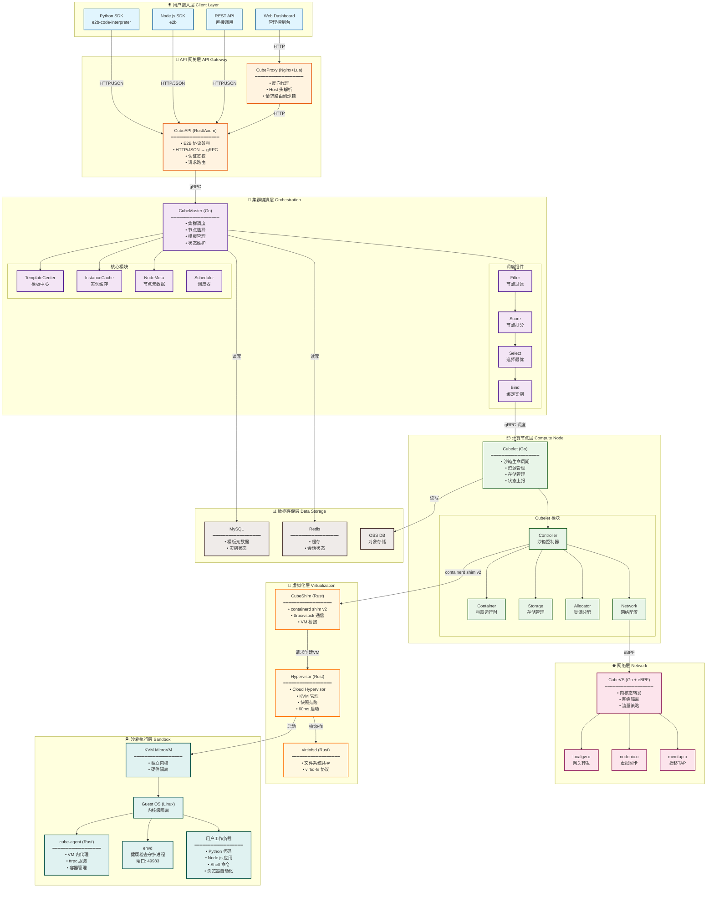
```mermaid
graph TB
    subgraph "🌐 用户接入层 Client Layer"
        SDK1["Python SDK<br/>e2b-code-interpreter"]
        SDK2["Node.js SDK<br/>e2b"]
        SDK3["REST API<br/>直接调用"]
        WEB["Web Dashboard<br/>管理控制台"]
    end

    subgraph "🔌 API 网关层 API Gateway"
        CUBEAPI["CubeAPI (Rust/Axum)<br/>━━━━━━━━━━━━━━━━━━<br/>• E2B 协议兼容<br/>• HTTP/JSON → gRPC<br/>• 认证鉴权<br/>• 请求路由"]
        CUBEPROXY["CubeProxy (Nginx+Lua)<br/>━━━━━━━━━━━━━━━━━━<br/>• 反向代理<br/>• Host 头解析<br/>• 请求路由到沙箱"]
    end

    subgraph "🎯 集群编排层 Orchestration"
        CUBEMASTER["CubeMaster (Go)<br/>━━━━━━━━━━━━━━━━━━<br/>• 集群调度<br/>• 节点选择<br/>• 模板管理<br/>• 状态维护"]
        
        subgraph "调度组件"
            FILTER["Filter<br/>节点过滤"]
            SCORE["Score<br/>节点打分"]
            SELECT["Select<br/>选择最优"]
            BIND["Bind<br/>绑定实例"]
        end
        
        subgraph "核心模块"
            TPLMGR["TemplateCenter<br/>模板中心"]
            INSTCACHE["InstanceCache<br/>实例缓存"]
            NODEMETA["NodeMeta<br/>节点元数据"]
            SCHEDULER["Scheduler<br/>调度器"]
        end
    end

    subgraph "📦 计算节点层 Compute Node"
        CUBELET["Cubelet (Go)<br/>━━━━━━━━━━━━━━━━━━<br/>• 沙箱生命周期<br/>• 资源管理<br/>• 存储管理<br/>• 状态上报"]
        
        subgraph "Cubelet 模块"
            CTRL["Controller<br/>沙箱控制器"]
            CTR["Container<br/>容器运行时"]
            STORE["Storage<br/>存储管理"]
            ALLOC["Allocator<br/>资源分配"]
            NET["Network<br/>网络配置"]
        end
    end

    subgraph "🌐 网络层 Network"
        CUBEVS["CubeVS (Go + eBPF)<br/>━━━━━━━━━━━━━━━━━━<br/>• 内核态转发<br/>• 网络隔离<br/>• 流量策略"]
        
        EBPF1["localgw.o<br/>网关转发"]
        EBPF2["nodenic.o<br/>虚拟网卡"]
        EBPF3["mvmtap.o<br/>迁移TAP"]
    end

    subgraph "🔧 虚拟化层 Virtualization"
        CUBESHIM["CubeShim (Rust)<br/>━━━━━━━━━━━━━━━━━━<br/>• containerd shim v2<br/>• ttrpc/vsock 通信<br/>• VM 桥接"]
        
        HYPERVISOR["Hypervisor (Rust)<br/>━━━━━━━━━━━━━━━━━━<br/>• Cloud Hypervisor<br/>• KVM 管理<br/>• 快照克隆<br/>• 60ms 启动"]
        
        VIRTIOFSD["virtiofsd (Rust)<br/>━━━━━━━━━━━━━━━━━━<br/>• 文件系统共享<br/>• virtio-fs 协议"]
    end

    subgraph "🏝️ 沙箱执行层 Sandbox"
        MICROVM["KVM MicroVM<br/>━━━━━━━━━━━━━━━━━━<br/>• 独立内核<br/>• 硬件隔离"]
        
        GUESTOS["Guest OS (Linux)<br/>内核级隔离"]
        
        AGENT["cube-agent (Rust)<br/>━━━━━━━━━━━━━━━━━━<br/>• VM 内代理<br/>• ttrpc 服务<br/>• 容器管理"]
        
        ENVD["envd<br/>健康检查守护进程<br/>端口: 49983"]
        
        WORKLOAD["用户工作负载<br/>━━━━━━━━━━━━━━━━━━<br/>• Python 代码<br/>• Node.js 应用<br/>• Shell 命令<br/>• 浏览器自动化"]
    end

    subgraph "📊 数据存储层 Data Storage"
        MYSQL["MySQL<br/>━━━━━━━━━━━━━━━━━━<br/>• 模板元数据<br/>• 实例状态"]
        REDIS["Redis<br/>━━━━━━━━━━━━━━━━━━<br/>• 缓存<br/>• 会话状态"]
        OSSDB["OSS DB<br/>对象存储"]
    end

    %% 连接关系
    SDK1 -->|HTTP/JSON| CUBEAPI
    SDK2 -->|HTTP/JSON| CUBEAPI
    SDK3 -->|HTTP/JSON| CUBEAPI
    WEB -->|HTTP| CUBEPROXY
    
    CUBEAPI -->|gRPC| CUBEMASTER
    CUBEPROXY -->|HTTP| CUBEAPI
    
    CUBEMASTER --> FILTER
    FILTER --> SCORE
    SCORE --> SELECT
    SELECT --> BIND
    BIND -->|gRPC 调度| CUBELET
    
    CUBEMASTER --> TPLMGR
    CUBEMASTER --> INSTCACHE
    CUBEMASTER --> NODEMETA
    
    CUBELET --> CTRL
    CTRL --> CTR
    CTRL --> STORE
    CTRL --> ALLOC
    CTRL --> NET
    
    CTRL -->|containerd shim v2| CUBESHIM
    NET -->|eBPF| CUBEVS
    
    CUBEVS --> EBPF1
    CUBEVS --> EBPF2
    CUBEVS --> EBPF3
    
    CUBESHIM -->|请求创建VM| HYPERVISOR
    HYPERVISOR -->|virtio-fs| VIRTIOFSD
    HYPERVISOR -->|启动| MICROVM
    
    MICROVM --> GUESTOS
    GUESTOS --> AGENT
    GUESTOS --> ENVD
    GUESTOS --> WORKLOAD
    
    CUBEMASTER -->|读写| MYSQL
    CUBEMASTER -->|读写| REDIS
    CUBELET -->|读写| OSSDB
    
    %% 样式定义
    classDef sdk fill:#e1f5fe,stroke:#01579b,stroke-width:2px
    classDef gateway fill:#fff3e0,stroke:#e65100,stroke-width:2px
    classDef orchestration fill:#f3e5f5,stroke:#4a148c,stroke-width:2px
    classDef compute fill:#e8f5e8,stroke:#1b5e20,stroke-width:2px
    classDef network fill:#fce4ec,stroke:#880e4f,stroke-width:2px
    classDef virt fill:#fff8e1,stroke:#ff6f00,stroke-width:2px
    classDef sandbox fill:#e0f2f1,stroke:#004d40,stroke-width:2px
    classDef storage fill:#efebe9,stroke:#3e2723,stroke-width:2px
    
    class SDK1,SDK2,SDK3,WEB sdk
    class CUBEAPI,CUBEPROXY gateway
    class CUBEMASTER,FILTER,SCORE,SELECT,BIND,TPLMGR,INSTCACHE,NODEMETA,SCHEDULER orchestration
    class CUBELET,CTRL,CTR,STORE,ALLOC,NET compute
    class CUBEVS,EBPF1,EBPF2,EBPF3 network
    class CUBESHIM,HYPERVISOR,VIRTIOFSD virt
    class MICROVM,GUESTOS,AGENT,ENVD,WORKLOAD sandbox
    class MYSQL,REDIS,OSSDB storage
```

| 层级 | 组件 | 语言 | 职责 | 关键点 |
| :--- | :--- | :--- | :--- | :--- |
| 接入层 | CubeAPI | Rust | 协议转换 | HTTP/JSON → gRPC |
| | CubeProxy | Nginx+Lua | 请求路由 | 按 `Host: <port>--<id>.domain` 路由 |
| 控制面 | CubeMaster | Go | 调度决策 | 过滤→打分→选择→绑定 |
| 节点层 | Cubelet | Go | 生命周期管理 | 创建/启动/暂停/恢复/销毁 |
| | CubeVS | Go+eBPF | 网络隔离 | eBPF 内核态转发 |
| 虚拟化层 | CubeShim | Rust | 容器运行时桥接 | containerd shim v2 |
| | Hypervisor | Rust | KVM 虚拟机管理 | 快照克隆（60ms 启动关键） |
| | virtiofsd | Rust | 文件系统共享 | virtio-fs 协议 |
| VM 内部 | cube-agent | Rust | 容器管理 | ttrpc/vsock 通信 |
| | envd | Rust | 健康检查 | 暴露 `/health` 端口 (49983) |

## 各个组件的实现

### CubeAPI

```text
CubeAPI/src/
├── main.rs              # 入口，CLI 参数解析，HTTP 服务启动
├── routes.rs            # 路由定义，E2B/CubeAPI 路由构建
├── state.rs             # AppState 共享状态
├── config.rs            # 配置结构体
├── constants.rs         # 常量定义
├── error.rs             # 错误类型定义
├── openapi.rs           # OpenAPI 文档
│
├── middleware/          # 中间件
│   ├── mod.rs
│   ├── auth.rs          # 统一认证中间件
│   └── rate_limit.rs    # 限流中间件
│
├── handlers/            # 请求处理器
│   ├── mod.rs
│   ├── sandboxes.rs     # 沙箱 CRUD 操作
│   ├── templates.rs     # 模板管理
│   ├── cluster.rs       # 集群状态查询
│   └── health.rs        # 健康检查
│
├── services/            # 业务服务层
│   ├── mod.rs
│   ├── sandboxes.rs     # 沙箱业务逻辑
│   ├── templates.rs     # 模板业务逻辑
│   └── cluster.rs       # 集群业务逻辑
│
├── cubemaster/          # CubeMaster HTTP 客户端
│   └── mod.rs           # 封装所有 CubeMaster API 调用
│
├── models/              # 数据模型 (E2B 协议格式)
│   └── mod.rs
│
└── logging/             # 日志组件
    ├── mod.rs
    └── ...
```

请求处理流程：

```text
1. Axum HTTP Server 接收请求
   │
2. 全局中间件链
   │  ├─ SetRequestId (生成 X-Request-ID)
   │  ├─ TraceLayer (链路追踪)
   │  ├─ TimeoutLayer (30s 超时)
   │  ├─ CompressionLayer (响应压缩)
   │  └─ CorsLayer (跨域)
   │
3. 路由匹配
   │  POST /sandboxes → create_sandbox handler
   │
4. 条件中间件
   │  ├─ unified_auth (认证回调)
   │  └─ rate_limit (限流)
   │
5. Handler 处理
   │  ├─ 提取请求参数
   │  ├─ 记录请求日志
   │  └─ 调用 Service 层
   │
6. Service 业务逻辑
   │  ├─ 参数转换 (E2B → 内部格式)
   │  └─ 调用 CubeMaster Client
   │
7. HTTP 调用 CubeMaster
   │  POST http://cubemaster:8089/cube/sandbox
   │
8. CubeMaster 处理
   │  └─ 调度 → 创建沙箱 → 返回结果
   │
9. 响应转换
   │  CubeMaster 格式 → E2B 格式
   │
10. 返回客户端
    ├─ 记录响应日志
    └─ HTTP 200 + JSON
```

### CubeProxy

CubeProxy 是基于 OpenResty (Nginx + Lua) 实现的反向代理服务，在 CubeSandbox 架构中扮演请求路由的关键角色。

核心作用：

* 解析请求路由 - 从 HTTP Host 头解析 <port>-<sandbox_id>.<domain> 格式
* 动态负载均衡 - 将请求转发到目标沙箱实例所在的主机
* 缓存优化 - 使用本地缓存减少 Redis 查询
* 故障检测 - 识别并隔离故障后端
* 访问日志 - 记录详细的请求/响应日志用于监控和审计

```text
┌─────────────┐      ┌─────────────┐      ┌─────────────┐      ┌─────────────┐
│   SDK/客户端 │ ───> │  CubeProxy  │ ───> │ CubeVS eBPF │ ───> │   Sandbox   │
└─────────────┘      └─────────────┘      └─────────────┘      └─────────────┘
                           │
                           ▼
                     ┌─────────────┐
                     │   Redis     │
                     │ (元数据存储) │
                     └─────────────┘
```

1. **请求到达** (`nginx.conf:89-122`)
    - 客户端请求到达 `8080` (HTTPS) 或 `8081` (HTTP) 端口
    - 请求格式: `Host: 49983-7c8fbcd45ffe450fb8f7fb223ad45507.cube.app`

2. **rewrite_by_lua 阶段** (`rewrite_phase.lua:138-150`)
    ```lua
    -- 解析 Host 头获取容器端口和沙箱ID
    local container_port, ins_id = parse_port_and_instance_from_host(ngx.var.http_host)
    -- 例如: 49983-7c8fbcd45ffe450fb8f7fb223ad45507
    ```

3. **获取后端地址** (`rewrite_phase.lua:73-136`)
    - 首先检查本地共享内存缓存 (`local_cache`)
    - 缓存未命中则从 Redis 获取元数据:
        ```lua
        -- key: "bypass_host_proxy:{sandbox_id}"
        -- 返回: HostIP, SandboxIP, 端口映射等
        ```
    - **智能路由决策**:
        - 如果调用者与目标在同一主机 → 使用 `SandboxIP`
        - 如果跨主机 → 使用 `HostIP` + 映射端口
        ```text
        ┌─────────────────────────────────────────────────────────────────────┐
        │                    rewrite_phase.lua (路由决策)                     │
        ├─────────────────────────────────────────────────────────────────────┤
        │ 1. 解析 Host: 49983-7c8fbcd45ffe...cube.app                        │
        │    → container_port = 49983                                         │
        │    → ins_id = 7c8fbcd45ffe...                                       │
        │                                                                     │
        │ 2. 查询本地缓存 local_cache                                          │
        │    Key: "{ins_id}:{container_port}:backend_ip"                      │
        │    Key: "{ins_id}:{container_port}:backend_port"                    │
        │                                                                     │
        │ 3. 缓存未命中 → 查询 Redis                                           │
        │    Key: "bypass_host_proxy:{ins_id}"                                │
        │    返回: HostIP, SandboxIP, 端口映射...                              │
        │                                                                     │
        │ 4. 智能路由决策:                                                    │
        │    ┌─────────────────────────────────────────────────────┐         │
        │    │ caller_host_ip == target_host_ip ?                   │         │
        │    │   YES → 使用 SandboxIP:container_port (同主机直接)    │         │
        │    │   NO  → 使用 HostIP:mapped_port (跨主机端口映射)      │         │
        │    └─────────────────────────────────────────────────────┘         │
        │                                                                     │
        │ 5. 设置变量:                                                        │
        │    ngx.var.backend_ip = host_ip                                     │
        │    ngx.var.backend_port = host_port                                 │
        └─────────────────────────────────────────────────────────────────────┘
                                    ↓
        ┌─────────────────────────────────────────────────────────────────────┐
        │                   balancer_phase.lua (设置后端)                      │
        ├─────────────────────────────────────────────────────────────────────┤
        │ balancer.set_current_peer(ngx.var.backend_ip, ngx.var.backend_port) │
        └─────────────────────────────────────────────────────────────────────┘

        ```

4. **故障检测** (`rewrite_phase.lua:152-162`)
    ```lua
    local faulty_backend = utils:is_faulty_backend(host_ip, true)
    -- 检查本地缓存和 Redis 中的故障后端集合
    ```

5. **balancer_by_lua 阶段** (`balancer_phase.lua:9-10`)
    ```lua
    local ok, err = balancer.set_current_peer(ngx.var.backend_ip, ngx.var.backend_port)
    -- 实际设置后端服务器地址
    ```

6. **请求转发**
    - Nginx 建立到后端的连接
    - 支持 WebSocket (HTTP/1.1 + Upgrade 头)
    - 代理响应给客户端

### CubeMaster

CubeMaster 是 CubeSandbox 的中央调度器，负责将沙箱创建请求调度到合适的节点，是整个系统的"大脑"。

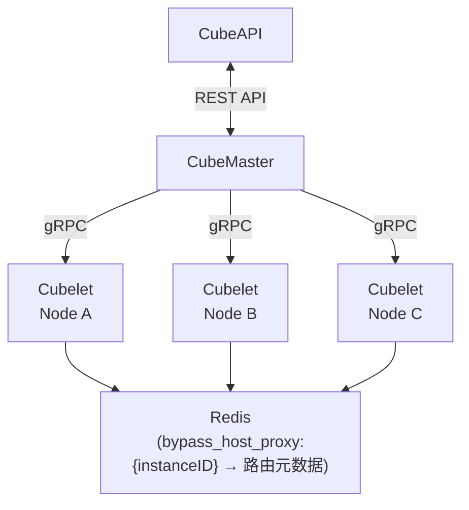
```mermaid
graph TD
    %% 定义节点
    CubeAPI["CubeAPI"]
    CubeMaster["CubeMaster"]
    CubeletA["Cubelet<br/>Node A"]
    CubeletB["Cubelet<br/>Node B"]
    CubeletC["Cubelet<br/>Node C"]
    Redis["Redis<br/>(bypass_host_proxy:{instanceID} → 路由元数据)"]

    %% 连线（与原图完全一致）
    CubeAPI <-->|REST API| CubeMaster
    CubeMaster -->|gRPC| CubeletA
    CubeMaster -->|gRPC| CubeletB
    CubeMaster -->|gRPC| CubeletC
    CubeletA --> Redis
    CubeletB --> Redis
    CubeletC --> Redis
```

CubeMaster 的架构图：

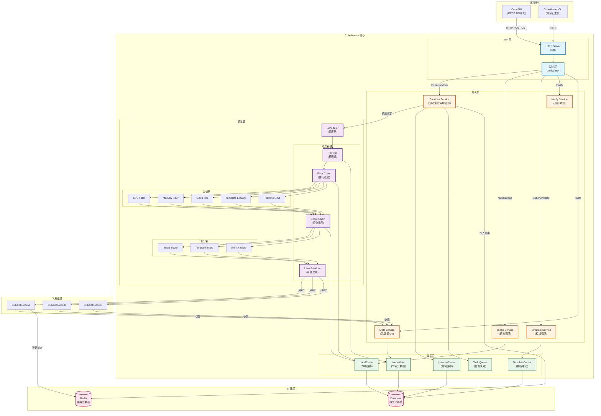
```mermaid
graph TB
    subgraph "外部组件"
        API["CubeAPI<br/>(REST API网关)"]
        CLI["CubeMaster CLI<br/>(命令行工具)"]
    end

    subgraph "CubeMaster 核心"
        subgraph "API 层"
            HTTP["HTTP Server<br/>:8080"]
            Router["路由层<br/>gorilla/mux"]
        end

        subgraph "服务层"
            SandboxSvc["Sandbox Service<br/>(沙箱生命周期管理)"]
            ImageSvc["Image Service<br/>(镜像管理)"]
            TemplateSvc["Template Service<br/>(模板管理)"]
            NotifySvc["Notify Service<br/>(通知处理)"]
            MetaSvc["Meta Service<br/>(元数据API)"]
        end

        subgraph "调度层"
            Scheduler["Scheduler<br/>(调度器)"]
            
            subgraph "过滤器链"
                PreFilter["PreFilter<br/>(预筛选)"]
                FilterChain["Filter Chain<br/>(并行过滤)"]
                ScoreChain["Score Chain<br/>(打分排序)"]
                Select["LeastRandom<br/>(最终选择)"]
            end
            
            subgraph "过滤器"
                CPUFilter["CPU Filter"]
                MemFilter["Memory Filter"]
                DiskFilter["Disk Filter"]
                TemplateLoc["Template Locality"]
                RealtimeLimit["Realtime Limit"]
            end
            
            subgraph "打分器"
                ImageScore["Image Score"]
                TemplateScore["Template Score"]
                AffinityScore["Affinity Score"]
            end
        end

        subgraph "数据层"
            NodeMeta["NodeMeta<br/>(节点元数据)"]
            InstanceCache["InstanceCache<br/>(实例缓存)"]
            LocalCache["LocalCache<br/>(本地缓存)"]
            TemplateCenter["TemplateCenter<br/>(模板中心)"]
            TaskQueue["Task Queue<br/>(任务队列)"]
        end
    end

    subgraph "存储层"
        Redis[(Redis<br/>路由元数据)]
        DB[(Database<br/>持久化存储)]
    end

    subgraph "下游组件"
        Cubelet1["Cubelet Node A"]
        Cubelet2["Cubelet Node B"]
        Cubelet3["Cubelet Node C"]
    end

    %% 外部请求
    API -->|HTTP POST/GET| HTTP
    CLI -->|HTTP| HTTP

    %% HTTP 层到服务层
    HTTP --> Router
    Router -->|/cube/sandbox| SandboxSvc
    Router -->|/cube/image| ImageSvc
    Router -->|/cube/template| TemplateSvc
    Router -->|/notify| NotifySvc
    Router -->|/meta| MetaSvc

    %% 服务层到调度层
    SandboxSvc -->|调度请求| Scheduler
    ImageSvc --> LocalCache
    TemplateSvc --> TemplateCenter
    MetaSvc --> NodeMeta

    %% 调度流程
    Scheduler --> PreFilter
    PreFilter --> FilterChain
    FilterChain --> CPUFilter
    FilterChain --> MemFilter
    FilterChain --> DiskFilter
    FilterChain --> TemplateLoc
    FilterChain --> RealtimeLimit
    CPUFilter --> ScoreChain
    MemFilter --> ScoreChain
    DiskFilter --> ScoreChain
    TemplateLoc --> ScoreChain
    RealtimeLimit --> ScoreChain
    ScoreChain --> ImageScore
    ScoreChain --> TemplateScore
    ScoreChain --> AffinityScore
    ImageScore --> Select
    TemplateScore --> Select
    AffinityScore --> Select
    Select -->|gRPC| Cubelet1
    Select -->|gRPC| Cubelet2
    Select -->|gRPC| Cubelet3

    %% 数据层连接
    PreFilter --> NodeMeta
    FilterChain --> LocalCache
    ScoreChain --> LocalCache
    SandboxSvc --> InstanceCache
    SandboxSvc --> TaskQueue
    

    %% 存储层连接
    NodeMeta --> DB
    LocalCache --> DB
    InstanceCache --> DB
    TemplateCenter --> DB
    
    Cubelet1 -->|心跳| MetaSvc
    Cubelet2 -->|心跳| MetaSvc
    Cubelet3 -->|心跳| MetaSvc
    
    SandboxSvc -->|写入路由| Redis
    Cubelet1 -->|更新状态| Redis

    %% 样式
    classDef apiClass fill:#e1f5fe,stroke:#01579b,stroke-width:2px
    classDef serviceClass fill:#fff3e0,stroke:#e65100,stroke-width:2px
    classDef schedulerClass fill:#f3e5f5,stroke:#4a148c,stroke-width:2px
    classDef dataClass fill:#e8f5e9,stroke:#1b5e20,stroke-width:2px
    classDef storageClass fill:#fce4ec,stroke:#880e4f,stroke-width:2px

    class HTTP,Router apiClass
    class SandboxSvc,ImageSvc,TemplateSvc,NotifySvc,MetaSvc serviceClass
    class Scheduler,PreFilter,FilterChain,ScoreChain,Select schedulerClass
    class NodeMeta,InstanceCache,LocalCache,TemplateCenter,TaskQueue dataClass
    class Redis,DB storageClass
```

#### 调度器

```text
┌─────────────────────────────────────────────────────────────────────┐
│                        调度决策流程                                  │
├─────────────────────────────────────────────────────────────────────┤
│                                                                     │
│  ┌──────────────┐     ┌──────────────┐     ┌──────────────┐        │
│  │  PreFilter   │ ──> │    Filter    │ ──> │    Score     │        │
│  │  (预筛选)     │     │  (并行过滤)    │     │   (打分排序)   │        │
│  └──────────────┘     └──────────────┘     └──────────────┘        │
│         │                    │                    │                 │
│         ▼                    ▼                    ▼                 │
│  健康节点预选           CPU/内存/磁盘          镜像本地性             │
│  最大实例数检查         实时创建限制          资源碎片化             │
│                       模板本地性              亲和性                │
│                                                            │        │
│                                                            ▼        │
│                                                  ┌──────────────┐   │
│                                                  │LeastRandom   │   │
│                                                  │Select (最终选择)│  │
│                                                  └──────────────┘   │
│                                                                     │
└─────────────────────────────────────────────────────────────────────┘
```

PreFilter - 预筛选 (prefilter.go:33-100)：

1. 节点健康状态
2. 最大实例数限制 (MvmNum < MaxMvmLimit)
3. 元数据更新时效性
4. 节点亲和性匹配
5. 熔断器状态

Filter - 并行过滤 (schedule.go:125-176)：

|过滤器	|功能	|逻辑|
|---|---|---|
|CPU	|cpufilter.go:32-63	|quotaCpuFree > requestCPU && CpuUtil < NodeMaxCpuUtil
|内存	|内存可用量检查	|quotaMemFree > requestMem
|磁盘	|磁盘空间检查	|磁盘可用量 > 阈值
|模板本地性	|template_locality.go	|优先选择已有模板的节点
|实时创建数	|realtimecreatelimit.go	|节点并发创建数限制

Score - 打分排序 (schedule.go:178-242)：

> 加权平均得分 = Σ(单项得分 × 权重) / Σ权重

打分因子：
1. 镜像得分 (ImageScore) - 镜像已缓存的节点得分更高
2. 模板得分 - 模板已缓存的节点得分更高  
3. 亲和性得分 - 满足亲和性规则的节点得分更高
4. 实时资源得分 - 基于实时资源使用率
```

**节点元数据管理**

管理所有 Cubelet 节点的注册和状态 (nodemeta/service.go)：

type NodeSnapshot struct {
    NodeID              string        // 节点ID
    HostIP              string        // 主机IP
    GRPCPort            int           // gRPC端口
    Capacity            ResourceSnapshot  // 资源容量
    QuotaCPU            int64         // CPU配额
    QuotaMemMB          int64         // 内存配额
    MaxMvmNum           int64         // 最大实例数
    Conditions          []NodeCondition  // 节点条件
    Images              []ContainerImage   // 已缓存的镜像
    LocalTemplates      []LocalTemplate   // 已缓存的模板
    Healthy             bool          // 健康状态
}

节点注册流程：

```text
Cubelet 启动 
    ↓
POST /meta/register (注册节点信息)
    ↓
写入数据库 + 更新内存缓存
    ↓
定期心跳 POST /meta/node/status (更新状态)
    ↓
更新 Healthy 状态、镜像列表、模板列表

设计特点：

1. 无状态设计 - 调度器本身不保存状态，从缓存/数据库读取
2. 并行过滤 - 多个过滤器并行执行，提升调度性能
3. 缓存优先 - 节点信息、镜像信息全缓存，减少数据库压力
4. 镜像本地性 - 优先选择已有镜像的节点，减少下载时间
5. 熔断机制 - 自动隔离故障节点
6. 任务队列 - 限制并发创建数，防止雪崩
```

#### 镜像管理

镜像管理是 CubeSandbox 中提升沙箱启动速度的关键组件，负责管理容器镜像在集群中的分发、跟踪和调度优先级。

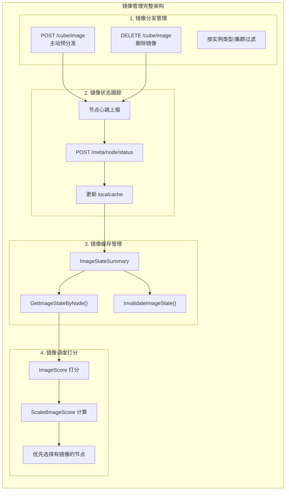
```mermaid
graph TB
    subgraph "镜像管理完整架构"
        direction TB
        
        subgraph "1. 镜像分发管理"
            A1["POST /cube/image<br/>主动预分发"]
            A2["DELETE /cube/image<br/>删除镜像"]
            A3["按实例类型/集群过滤"]
        end
        
        subgraph "2. 镜像状态跟踪"
            B1["节点心跳上报"]
            B2["POST /meta/node/status"]
            B3["更新 localcache"]
        end
        
        subgraph "3. 镜像缓存管理"
            C1["ImageStateSummary"]
            C2["GetImageStateByNode()"]
            C3["InvalidateImageState()"]
        end
        
        subgraph "4. 镜像调度打分"
            D1["ImageScore 打分"]
            D2["ScaledImageScore 计算"]
            D3["优先选择有镜像的节点"]
        end
    end
    
    A1 --> B1
    A2 --> B1
    B1 --> B2
    B2 --> B3
    B3 --> C1
    C1 --> C2
    C1 --> C3
    C2 --> D1
    D1 --> D2
    D2 --> D3
```

核心功能：

| 功能 | 说明 | API |
|:---|:---|:---|
| **镜像分发** | 预分发镜像到各节点 | `POST /cube/image` |
| **镜像删除** | 删除各节点的镜像 | `DELETE /cube/image` |
| **状态跟踪** | 节点心跳上报镜像列表 | `POST /meta/node/status` |
| **缓存管理** | localcache 存储镜像分布 | `GetImageStateByNode()` |
| **调度打分** | 优先选择有镜像的节点 | `ImageScore` |
| **缓存失效** | 删除后失效缓存 | `InvalidateImageState()` |

完整工作流程：

```text
阶段1: 预分发镜像
─────────────
运维 → POST /cube/image {image: "python:3.11"}
     ↓
CubeMaster → 异步调用所有节点的 CreateImage
     ↓
各节点并行下载镜像

阶段2: 节点上报状态
───────────────
Cubelet → (每30秒) POST /meta/node/status
          → { images: [{"names": ["python:3.11"], "size": 123456789}] }
     ↓
CubeMaster → 更新 localcache
           → imageCache["python:3.11"] = {
               Size: 123456789,
               Nodes: [node-A, node-B, node-C],
               ScaledImageScore: ...
             }

阶段3: 调度使用
───────────
用户 → POST /cube/sandbox {containers: [{image: "python:3.11"}]}
     ↓
调度器 → ImageScore 打分
     ↓
     节点A: 有镜像 → 得分 100
     节点B: 有镜像 → 得分 100
     节点C: 有镜像 → 得分 100
     节点D: 无镜像 → 得分 0
     ↓
选择 A/B/C 之一 → 秒级启动 (无需下载)

阶段4: 清理
──────
运维 → DELETE /cube/image {image: "python:3.11"}
     ↓
CubeMaster → 异步调用所有节点的 DeleteImage
     ↓
CubeMaster → InvalidateImageState("python:3.11")
```

#### 模板管理

模板管理是 CubeSandbox 实现毫秒级环境复刻的核心机制，将沙箱的完整运行环境（镜像+配置+文件系统状态）保存为可复用的模板。

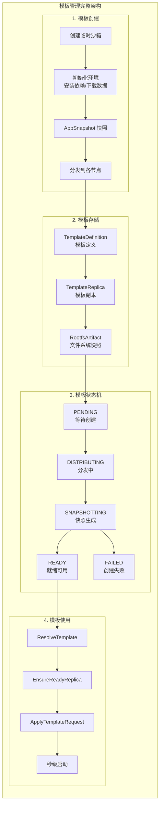
```mermaid
graph TB
    subgraph "模板管理完整架构"
        direction TB
        
        subgraph "1. 模板创建"
            A1["创建临时沙箱"]
            A2["初始化环境<br/>安装依赖/下载数据"]
            A3["AppSnapshot 快照"]
            A4["分发到各节点"]
        end
        
        subgraph "2. 模板存储"
            B1["TemplateDefinition<br/>模板定义"]
            B2["TemplateReplica<br/>模板副本"]
            B3["RootfsArtifact<br/>文件系统快照"]
        end
        
        subgraph "3. 模板状态机"
            C1["PENDING<br/>等待创建"]
            C2["DISTRIBUTING<br/>分发中"]
            C3["SNAPSHOTTING<br/>快照生成"]
            C4["READY<br/>就绪可用"]
            C5["FAILED<br/>创建失败"]
        end
        
        subgraph "4. 模板使用"
            D1["ResolveTemplate"]
            D2["EnsureReadyReplica"]
            D3["ApplyTemplateRequest"]
            D4["秒级启动"]
        end
    end
    
    A1 --> A2
    A2 --> A3
    A3 --> A4
    A4 --> B1
    B1 --> B2
    B2 --> B3
    B3 --> C1
    C1 --> C2
    C2 --> C3
    C3 --> C4
    C3 --> C5
    C4 --> D1
    D1 --> D2
    D2 --> D3
    D3 --> D4
```

核心概念：

```go
// 模板信息
type TemplateInfo struct {
    TemplateID   string          // 模板ID: "tpl-7c8fbcd45ffe..."
    InstanceType string          // 实例类型
    Version      string          // 模板版本: "v2"
    Status       string          // 状态: READY/PARTIALLY_READY/FAILED
    LastError    string          // 最后错误信息
    ImageInfo    string          // 镜像引用
    Replicas     []ReplicaStatus // 副本列表
}

// 模板副本
type ReplicaStatus struct {
    NodeID          string  // 节点ID
    NodeIP          string  // 节点IP
    SnapshotPath    string  // 快照路径
    Status          string  // 状态: READY/FAILED
    Phase           string  // 阶段: PENDING/DISTRIBUTING/SNAPSHOTTING/READY
    ArtifactID      string  // 制品ID
    LastJobID       string  // 最后任务ID
    CleanupRequired bool    // 是否需要清理
    ErrorMessage    string  // 错误信息
}
```

模板状态机：

```text
PENDING (等待创建)
    ↓
DISTRIBUTING (分发到各节点)
    ↓
SNAPSHOTTING (生成快照)
    ↓
READY (就绪可用) ←─────┐
    │                   │
    ↓                   │
FAILED (创建失败)       │
    │                   │
    └───────────────────┘ (重新创建)
```

1. 模板创建流程

    ```text
    POST /cube/template
    {
    "containers": [{
        "image": "python:3.11-slim",
        "cmd": "/app/start.sh"
    }],
    "volumes": [...],
    "env": {...},
    "snapshotDir": "/data/template"  // ← 模板数据保存路径
    }

    ↓
    ┌─────────────────────────────────────────────────────────────────────┐
    │  1. 创建临时沙箱，执行初始化                                          │
    │     - 安装依赖包                                                     │
    │     - 下载代码/数据                                                  │
    │     - 配置环境变量                                                   │
    └─────────────────────────────────────────────────────────────────────┘
        ↓
    ┌─────────────────────────────────────────────────────────────────────┐
    │  2. 执行 AppSnapshot（快照）                                         │
    │     - 冻结文件系统状态                                               │
    │     - 保存到 /data/template/                                        │
    └─────────────────────────────────────────────────────────────────────┘
        ↓
    ┌─────────────────────────────────────────────────────────────────────┐
    │  3. 将快照分发到各节点（并行）                                        │
    └─────────────────────────────────────────────────────────────────────┘
        │
        ├── Node A: 创建 Replica 1 ──> SnapshotPath: /data/tpl-xxx/1
        ├── Node B: 创建 Replica 2 ──> SnapshotPath: /data/tpl-xxx/2
        └── Node C: 创建 Replica 3 ──> SnapshotPath: /data/tpl-xxx/3
        
        ↓
    ┌─────────────────────────────────────────────────────────────────────┐
    │  4. 汇总状态                                                         │
    │     - 所有副本 READY → Template Status = READY                     │
    │     - 部分失败 → PARTIALLY_READY                                    │
    │     - 全部失败 → FAILED                                             │
    └─────────────────────────────────────────────────────────────────────┘
    ```

2. 模板存储结构

    ```text
    MySQL Database:
    ├── template_definition (模板定义表)
    │   ├── template_id (主键)
    │   ├── instance_type
    │   ├── version
    │   ├── status (PENDING/READY/PARTIALLY_READY/FAILED)
    │   ├── request_json (创建请求JSON)
    │   └── last_error
    │
    ├── template_replica (模板副本表)
    │   ├── template_id + node_id (联合主键)
    │   ├── node_ip
    │   ├── snapshot_path
    │   ├── status (READY/FAILED)
    │   ├── phase (当前阶段)
    │   └── artifact_id
    │
    └── rootfs_artifact (文件系统制品表)
        ├── artifact_id
        ├── storage_path
        └── size_bytes

    Node Local Storage:
    └── /data/tpl-{template_id}/
        ├── rootfs.erofs       # 只读根文件系统
        ├── snapshot.tar.gz    # 快照数据
        └── metadata.json      # 元数据
    ```

3. 模板调度优先级

    ```go
    // 模板本地性过滤器
    func TemplateLocalityFilter(selCtx, nodes) {
        templateID = selCtx.ReqRes.TemplateID
        if templateID == "" {
            return allNodes  // 没有模板，跳过
        }
        
        // 优先选择已有该模板副本的节点
        preferredNodes = []
        for node in nodes {
            if localcache.GetImageStateByNode(templateID, node.ID()) {
                preferredNodes.append(node)  // 该节点有模板副本
            }
        }
        return preferredNodes
    }
    ```
    调度优先级

    1. 有模板副本的节点 → 最高优先级（秒级启动）
    2. 有镜像缓存的节点 → 中优先级（10-30秒启动）
    3. 完全冷启动的节点 → 最低优先级（3-10分钟启动）


4. 使用模板创建沙箱

    ```text
    POST /cube/sandbox
    {
    "templateID": "tpl-7c8fbcd45ffe...",  // ← 指定模板
    "containers": [{
        "image": "python:3.11-slim"        // 可覆盖模板配置
    }]
    }

    ↓
    ┌─────────────────────────────────────────────────────────────────────┐
    │  1. ResolveTemplate                                                  │
    │     - 获取模板定义                                                   │
    │     - 检查是否有可用副本                                             │
    │     - 合并模板配置与请求配置                                         │
    └─────────────────────────────────────────────────────────────────────┘
        ↓
    ┌─────────────────────────────────────────────────────────────────────┐
    │  2. EnsureReadyReplica                                               │
    │     - 检查副本状态                                                   │
    │     - 确保至少有一个副本就绪                                         │
    └─────────────────────────────────────────────────────────────────────┘
        ↓
    ┌─────────────────────────────────────────────────────────────────────┐
    │  3. ApplyTemplateRequest                                             │
    │     - 应用模板的 Annotations                                         │
    │     - 应用模板的 Labels                                              │
    │     - 应用模板的 Volumes                                            │
    │     - 应用模板的 Containers                                         │
    │     - 应用模板的网络配置                                             │
    └─────────────────────────────────────────────────────────────────────┘
        ↓
    调度器选择有模板副本的节点 → 秒级启动
    ```

5. 对比：传统方式 vs 模板方式

    ```text
    传统方式:
    ┌─────────────┐
    │ 1. 下载镜像 │ 2-5分钟
    ├─────────────┤
    │ 2. 启动容器 │ 10-30秒
    ├─────────────┤
    │ 3. 安装依赖 │ 1-5分钟
    ├─────────────┤
    │ 4. 下载数据 │ 变长
    └─────────────┘
    总耗时: 3-10分钟

    模板方式:
    ┌─────────────┐
    │ 1. 检查模板  │ 毫秒级
    ├─────────────┤
    │ 2. 复用快照  │ 秒级
    ├─────────────┤
    │ 3. 直接可用  │ 无等待
    └─────────────┘
    总耗时: 1-5秒
    ```

**6. 典型使用场景**

    ```text
    场景1: AI 开发环境
    POST /cube/template
    {
    "containers": [{
        "image": "nvidia/cuda:12.1-runtime",
        "cmd": "jupyter lab --allow-root"
    }],
    "snapshotDir": "/opt/ai-env"
    }
    → 创建包含 Jupyter + PyTorch + CUDA 的模板

    后续创建沙箱直接使用模板（秒级启动）

    场景2: CI/CD 测试环境
    创建模板 → 各节点预分发 → 并行测试 → 快速回收

    场景3: 代码执行环境
    预置常用编程语言环境 → 按需创建 → 快速执行
    ```

### Cubelet

Cubelet 位于上层控制面和底层虚拟化运行时之间，是计算节点上的本地控制面组件。它向上接收 CubeMaster 下发的沙箱创建、销毁、更新、执行命令等生命周期请求，并根据请求中的镜像、模板、资源规格、网络策略、端口暴露等配置，编排本机资源准备流程。

向下，Cubelet 主要协调 containerd / CubeShim 完成 MicroVM 沙箱的创建和运行，同时通过 network-agent / CubeVS 规划和配置虚拟网络，包括 TAP 设备、IP、端口映射和 eBPF 转发策略。除此之外，Cubelet 还负责本地存储、cgroup 资源限制、沙箱状态记录和节点心跳上报。

因此，Cubelet 的核心作用是把上层的“沙箱配置与生命周期操作”转换为底层的“虚拟机、网络、存储和资源控制动作”，是 CubeSandbox 中连接集群调度与单机运行时的关键桥梁。

在这里 Cubelet 主要做四件事：

1. 接收 CubeMaster 下发的沙箱生命周期请求。
2. 在本机准备镜像、磁盘、网络、cgroup、挂载、netfile 等资源。
3. 调用 containerd / CubeShim 创建真正的沙箱实例。
4. 向 CubeMaster 注册节点并周期性上报节点状态、镜像列表、本地模板列表。

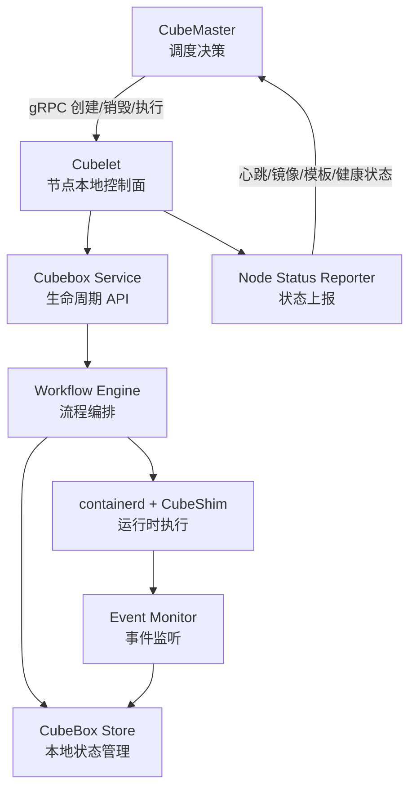
```mermaid
graph TB
    Master["CubeMaster<br/>调度决策"]
    Cubelet["Cubelet<br/>节点本地控制面"]
    Service["Cubebox Service<br/>生命周期 API"]
    Workflow["Workflow Engine<br/>流程编排"]
    Store["CubeBox Store<br/>本地状态管理"]
    Runtime["containerd + CubeShim<br/>运行时执行"]
    Event["Event Monitor<br/>事件监听"]
    Status["Node Status Reporter<br/>状态上报"]

    Master -->|gRPC 创建/销毁/执行| Cubelet
    Cubelet --> Service
    Service --> Workflow
    Workflow --> Runtime
    Workflow --> Store
    Runtime --> Event
    Event --> Store
    Cubelet --> Status
    Status -->|心跳/镜像/模板/健康状态| Master
```

Cubelet 基于 containerd 插件体系实现，在 Cubelet 中嵌入 containerd server，然后注册大量自定义插件。

Cubelet = 原生插件 + CubeSandbox 自定义插件 + Cubelet gRPC 服务 + workflow 编排引擎

#### 沙箱管理

cubebox 是 Cubelet 中对“沙箱实例”的管理模块。

它主要负责：

1. 接收生命周期请求：Create、Destroy、Exec、Update、List。
2. 构造沙箱对象 CubeBox。
3. 记录沙箱元数据：SandboxID、IP、端口、容器、runtime、cgroup、模板等。
3. 编排 container 创建参数。
4. 生成 OCI spec。
5. 调用 containerd 创建 sandbox/container。
6. 监听事件并更新状态。
7. 销毁时清理 containerd 对象和本地状态。

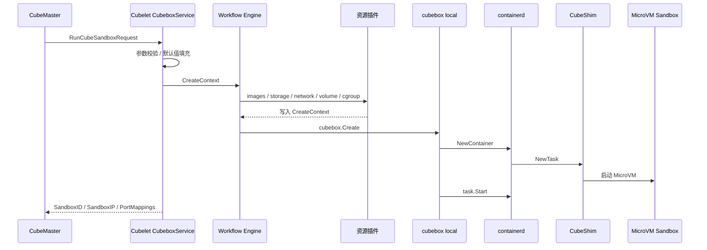
```mermaid
sequenceDiagram
    participant Master as CubeMaster
    participant Svc as Cubelet CubeboxService
    participant WF as Workflow Engine
    participant Plugins as 资源插件
    participant Cubebox as cubebox local
    participant Containerd as containerd
    participant Shim as CubeShim
    participant VM as MicroVM Sandbox

    Master->>Svc: RunCubeSandboxRequest
    Svc->>Svc: 参数校验 / 默认值填充
    Svc->>WF: CreateContext
    WF->>Plugins: images / storage / network / volume / cgroup
    Plugins-->>WF: 写入 CreateContext
    WF->>Cubebox: cubebox.Create
    Cubebox->>Containerd: NewContainer
    Containerd->>Shim: NewTask
    Shim->>VM: 启动 MicroVM
    Cubebox->>Containerd: task.Start
    Svc-->>Master: SandboxID / SandboxIP / PortMappings

```

CubeMaster 选好目标节点后，会调用目标 Cubelet 的 Create 接口。

Cubelet 收到的是 RunCubeSandboxRequest，里面会包含请求 ID 以及一些配置信息。在这一步会根据 Cubelet 会根据请求中的 RuntimeHandler 选择 runtime。默认配置里 runtime 是 cube，如果是 Cube 则是走 Cubelet -> containerd -> CubeShim -> MicroVM 的流程。否则会根据传入的参数来创建一个其他格式的 runtime。

在进入 workflow 后，Cubelet 会按照配置执行 create flow。在这一步会对需要的环境进行一个配置，这里会并行的对镜像、磁盘快照等的内容进行准备。

workflow 最后会调用 cubebox local.Create，在这里 它会创建一个 CubeBox 本地对象。然后这里会把 workflow 前面准备好的结果写进去。

在对沙箱进行管理时 Cubelet 会把每个沙箱抽象成一个 `CubeBox` 对象，并保存在本地状态存储中。它相当于 Cubelet 的“本机沙箱账本”。

```text
CubeBox
├── SandboxID
├── Namespace
├── Labels / Annotations
├── IP
├── PortMappings
├── CGroupPath
├── Containers
├── Runtime 信息
├── Status
├── LocalRunTemplate
├── ImageReferences
└── CreatedAt / DeletedTime
```

后续的销毁、查询、事件处理、异常恢复，都依赖这个本地状态。

Cubelet 会为请求中的每个 container 创建本地 Container 对象，同时会为其准备文件系统等。

在这里 cubebox 会调用 containerd client 创建 container / task ，在 containerd 中根据 runtime_type 找到 CubeShim 并在其中启动 MicroVM。在 MicroVM 启动完成后，会状态回传给 containerd / Cubelet。

上述组件的关系可以这样理解：

containerd 是通用生命周期管理框架；CubeShim 把 MicroVM 包装成 containerd 能管理的 runtime 对象；cubebox 是 Cubelet 在 containerd 之上的有状态沙箱管理抽象；Cubelet 通过 cubebox 对外提供沙箱创建、销毁、执行命令、状态查询等接口。

|层	|作用|
|---|---|
|Cubelet	|节点侧控制面，对上接收 CubeMaster 请求，对下驱动本机沙箱生命周期。
|cubebox	|Cubelet 里的有状态沙箱抽象，记录 SandboxID、容器、网络、端口、cgroup、runtime、状态等信息，并编排 containerd 调用。
|containerd	|通用生命周期管理器，提供 container/task/image/snapshot/event 等标准运行时接口。
|CubeShim	|containerd shim v2 实现，把 containerd 的 container/task 操作转换为 MicroVM 创建、启动、停止、IO、事件等操作。
|MicroVM	|最终真正运行用户代码的隔离环境。

####  网络配置管理

Cubelet 内部有一个 network 插件，参与沙箱创建 workflow。在 沙箱启动前的 workflow network 阶段 完成网络准备。

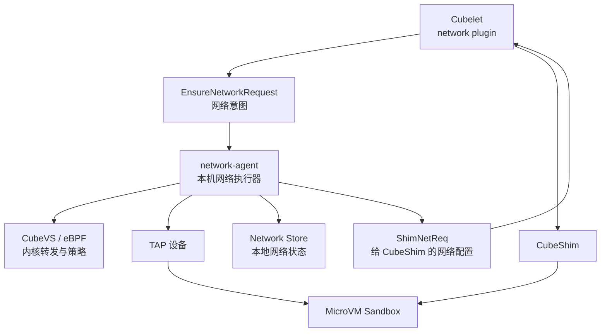
```mermaid
graph TB
    Cubelet["Cubelet<br/>network plugin"]
    Intent["EnsureNetworkRequest<br/>网络意图"]
    Agent["network-agent<br/>本机网络执行器"]
    CubeVS["CubeVS / eBPF<br/>内核转发与策略"]
    Tap["TAP 设备"]
    Store["Network Store<br/>本地网络状态"]
    ShimReq["ShimNetReq<br/>给 CubeShim 的网络配置"]
    Shim["CubeShim"]
    VM["MicroVM Sandbox"]

    Cubelet --> Intent
    Intent --> Agent
    Agent --> CubeVS
    Agent --> Tap
    Agent --> Store
    Agent --> ShimReq
    ShimReq --> Cubelet
    Cubelet --> Shim
    Shim --> VM
    Tap --> VM

```

Cubelet 会根据三类信息构造 EnsureNetworkRequest 这里用 EnsureNetworkRequest 网络意图来描述对网络的配置。

1. 节点本机网络配置

    来自 Cubelet 配置：

    ```go
    [plugins."io.cubelet.internal.v1.network"]
    eth_name = "eth0"
    cidr = "192.168.0.0/18"
    mvm_inner_ip = "169.254.68.6"
    mvm_mac_addr = "20:90:6f:fc:fc:fc"
    mvm_gw_dest_ip = "169.254.68.5"
    mvm_gw_mac_addr = "20:90:6f:cf:cf:cf"
    mvm_mtu = 1300
    default_exposed_ports = [8080, 32000]
    ```
    这些配置决定：沙箱内部网卡 IP、沙箱内部网卡 MAC、沙箱默认网关、MTU、默认暴露端口、宿主机物理网卡

2. 沙箱创建请求

    来自 RunCubeSandboxRequest：

    ```text
    ExposedPorts
    NetworkType
    Annotations
    CubeVSContext
    DNS 配置
    QoS 配置
    ```

    这些会影响：端口映射、网络策略、DNS allow 规则、带宽 / PPS 等 QoS

3. Cubelet 自动补充的默认规则

    比如：

    ```text
    默认路由
    默认 ARP
    默认暴露端口 8080 / 32000
    DNS allow CIDR
    PersistMetadata
    ```

最终变成：

```text
EnsureNetworkRequest
├── SandboxID
├── IdempotencyKey
├── Interfaces
│   ├── MAC
│   ├── MTU
│   ├── IPs
│   └── Gateway
├── Routes
├── ARPNeighbors
├── PortMappings
├── CubeVSContext
└── PersistMetadata
```

Cubelet 会调用到 networkagentclient.EnsureNetwork 在这里它会做几件事：

1. 分配或复用 TAP 设备
2. 分配 sandbox IP
3. 分配 host port
4. 调用 CubeVS 注册 TAP 设备
5. 调用 CubeVS 写入端口映射
6. 写入网络策略 allow/deny
7. 保存本地网络状态

与之相反还有一个 ReleaseNetwork 用来对网络资源进行清理。


### Cubeshim 与 MicroVM

Cubeshim 是 containerd shim v2 实现，其作用是把 containerd 的 container/task 操作转换为 MicroVM 创建、启动、停止、IO、事件等操作。

它主要负责：

1. 对上实现 containerd Shim v2 API：containerd 认为自己在管理 container/task，但实际这些 task 会运行在 MicroVM 内部。
2. 对下调用 cube-hypervisor 管理 MicroVM：包括创建 VM、启动 VM、快照恢复、暂停、恢复、销毁等。
3. 管理沙箱生命周期：创建 sandbox、连接 guest agent、初始化网络/存储/挂载、监控 VM 状态。
4. 管理容器生命周期：把 Create / Start / Exec / Kill / Delete / Wait 等操作转发给 MicroVM 内部的 cube-agent。
5. 处理文件系统与设备：解析 pmem、disk、virtio-fs、vsock、tap、VFIO 等配置，并注入到 VM 配置中。
6. 支持快照恢复：通过 cube-hypervisor 的 snapshot/restore API，把已初始化的 MicroVM 状态恢复出来，实现快速启动。

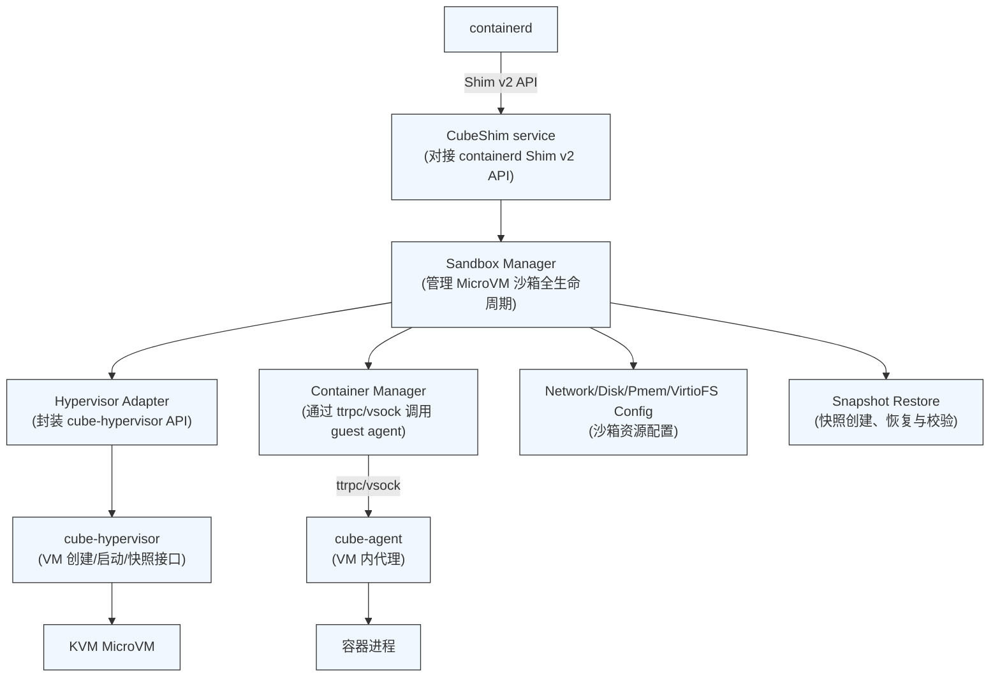
```mermaid
graph TD
    classDef box fill:#f0f7ff,stroke:#333,stroke-width:1px

    containerd["containerd"]:::box
    service["CubeShim service<br/>(对接 containerd Shim v2 API)"]:::box
    sandbox["Sandbox Manager<br/>(管理 MicroVM 沙箱全生命周期)"]:::box

    hypervisor["Hypervisor Adapter<br/>(封装 cube-hypervisor API)"]:::box
    container["Container Manager<br/>(通过 ttrpc/vsock 调用 guest agent)"]:::box
    config["Network/Disk/Pmem/VirtioFS Config<br/>(沙箱资源配置)"]:::box
    snapshot["Snapshot Restore<br/>(快照创建、恢复与校验)"]:::box

    hypervisor_api["cube-hypervisor<br/>(VM 创建/启动/快照接口)"]:::box
    kvm["KVM MicroVM"]:::box
    agent["cube-agent<br/>(VM 内代理)"]:::box
    process["容器进程"]:::box

    containerd -->|"Shim v2 API"| service
    service --> sandbox

    sandbox --> hypervisor
    sandbox --> container
    sandbox --> config
    sandbox --> snapshot

    hypervisor --> hypervisor_api
    hypervisor_api --> kvm

    container -->|"ttrpc/vsock"| agent
    agent --> process
```

#### MicroVM

CubeSandbox 的 MicroVM 基于 Cloud Hypervisor 实现。在代码中叫做 cube-hypervisor 由 CubeShim 调用。底层通过 KVM 创建和管理轻量虚拟机。

创建一个虚拟机的流程：

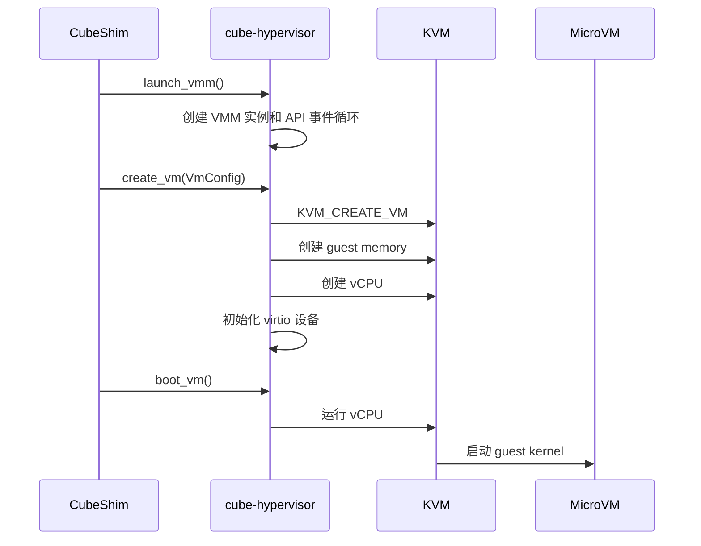
```mermaid
sequenceDiagram
  participant S as CubeShim
  participant H as cube-hypervisor
  participant K as KVM
  participant V as MicroVM

  S->>H: launch_vmm()
  H->>H: 创建 VMM 实例和 API 事件循环
  S->>H: create_vm(VmConfig)
  H->>K: KVM_CREATE_VM
  H->>K: 创建 guest memory
  H->>K: 创建 vCPU
  H->>H: 初始化 virtio 设备
  S->>H: boot_vm()
  H->>K: 运行 vCPU
  K->>V: 启动 guest kernel

```

在 cube-hypervisor 这个虚拟机管理器的内部，由多个 manager 模块共同构造和管理一个 VM 实例。
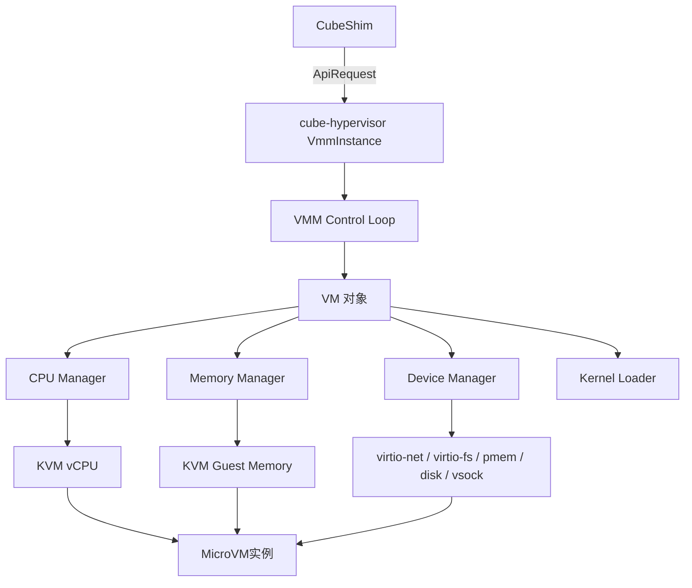
```mermaid
graph TD
  A[CubeShim] -->|ApiRequest| B[cube-hypervisor VmmInstance]
  B --> C[VMM Control Loop]
  C --> D[VM 对象]
  D --> E[CPU Manager]
  D --> F[Memory Manager]
  D --> G[Device Manager]
  D --> H[Kernel Loader]
  E --> I[KVM vCPU]
  F --> J[KVM Guest Memory]
  G --> K[virtio-net / virtio-fs / pmem / disk / vsock]
  I --> L[MicroVM实例]
  J --> L
  K --> L

```

cube-hypervisor 如何实现快照恢复?

快照恢复的核心思想是：

不重新启动一个 Linux VM，而是恢复一个已经启动完成的 VM 运行现场。

普通冷启动路径是：创建 KVM VM -> 创建 vCPU -> 分配 guest memory -> 加载 kernel -> 启动 Linux -> 初始化系统 -> 启动 guest agent -> 挂载文件系统 -> 配置网络 -> 进入可用状态

这个过程慢，因为 Linux 内核启动、设备初始化、agent 启动都要重新来一遍。

快照恢复路径变成：读取快照 -> 恢复 guest memory -> 恢复 vCPU 寄存器状态 -> 恢复设备状态 -> 替换当前实例的网络/磁盘/virtiofs/vsock -> resume VM

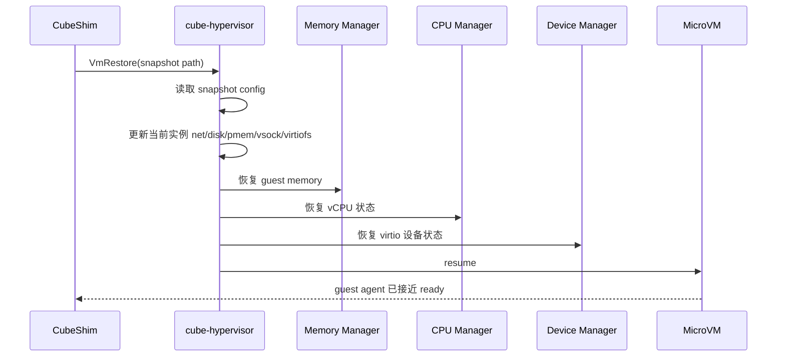
```mermaid
sequenceDiagram
  participant S as CubeShim
  participant H as cube-hypervisor
  participant M as Memory Manager
  participant C as CPU Manager
  participant D as Device Manager
  participant V as MicroVM

  S->>H: VmRestore(snapshot path)
  H->>H: 读取 snapshot config
  H->>H: 更新当前实例 net/disk/pmem/vsock/virtiofs
  H->>M: 恢复 guest memory
  H->>C: 恢复 vCPU 状态
  H->>D: 恢复 virtio 设备状态
  H->>V: resume
  V-->>S: guest agent 已接近 ready

```

快照里保存的不只是磁盘，而是 VM 的运行状态，包括 VM 配置与运行上下文。

恢复时，cube-hypervisor 会先读取快照目录中的 VM config 和 VM state，然后构造一个新的 VM 对象。他并不完全照搬基础快照，而是在恢复时会替换网络TAP 磁盘路径等动态资源。

* 基础快照：保存一个已经初始化好的 MicroVM
* 新沙箱：复用基础快照状态，但替换自己的网络、磁盘、共享目录和通信通道

这里快的原因主要有三点：

1. 跳过内核冷启动：Linux kernel 不需要重新从头启动。
2. 跳过大部分系统初始化：guest agent、基础文件系统、基础服务已经在快照点附近准备好了。
3. 恢复运行现场而不是重新构建现场：vCPU、内存、设备状态直接从快照恢复。

CubeSandbox 的文件系统不是宿主机直接用 overlayfs 挂出一个容器 rootfs，而是先把镜像、模板、共享目录和数据盘转换成 MicroVM 可识别的虚拟设备，例如 pmem、virtio-fs 和 virtio-blk，再由 MicroVM 内部的 guest agent 挂载和组装容器运行所需的文件系统。这样既保留容器式管理接口，又获得虚拟机级内核隔离和快启动能力。

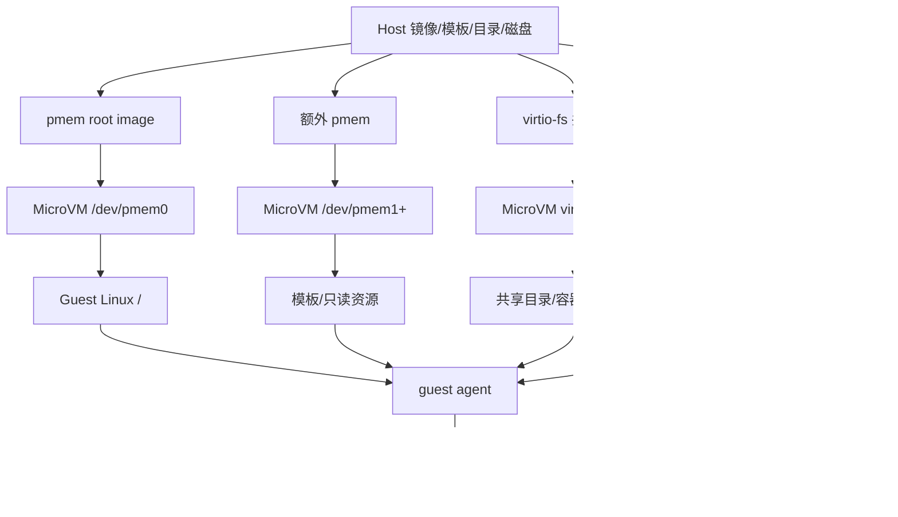
```mermaid
graph TD
  A[Host 镜像/模板/目录/磁盘] --> B[pmem root image]
  A --> C[额外 pmem]
  A --> D[virtio-fs 共享目录]
  A --> E[virtio-blk disk]

  B --> F[MicroVM /dev/pmem0]
  C --> G[MicroVM /dev/pmem1+]
  D --> H[MicroVM virtio-fs mount]
  E --> I[MicroVM /dev/vdX]

  F --> J[Guest Linux /]
  G --> K[模板/只读资源]
  H --> L[共享目录/容器 rootfs 资源]
  I --> M[数据盘]

  J --> N[guest agent]
  K --> N
  L --> N
  M --> N
  N --> O[沙箱进程]

```

### CubeVS

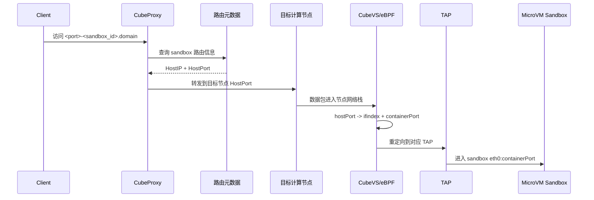
```mermaid
sequenceDiagram
    participant Client as Client
    participant Proxy as CubeProxy
    participant Redis as 路由元数据
    participant Node as 目标计算节点
    participant CubeVS as CubeVS/eBPF
    participant Tap as TAP
    participant VM as MicroVM Sandbox

    Client->>Proxy: 访问 <port>-<sandbox_id>.domain
    Proxy->>Redis: 查询 sandbox 路由信息
    Redis-->>Proxy: HostIP + HostPort
    Proxy->>Node: 转发到目标节点 HostPort
    Node->>CubeVS: 数据包进入节点网络栈
    CubeVS->>CubeVS: hostPort -> ifindex + containerPort
    CubeVS->>Tap: 重定向到对应 TAP
    Tap->>VM: 进入 sandbox eth0:containerPort

```

CubeVS Go API	CubeNet/cubevs	封装 eBPF map 操作，例如 AddTAPDevice、AddPortMapping

CubeSandbox 在网络层没有采用“每个沙箱一个用户态代理进程”的方式，而是通过 CubeVS 将沙箱网络的数据面下沉到 Linux 内核态。Cubelet 在创建沙箱时只负责生成网络意图，`network-agent` 负责创建 TAP、分配 IP/端口并调用 CubeVS 的 Go API 写入 eBPF Maps；真正的数据包转发、NAT、会话追踪和访问控制由挂载在 TC/XDP 上的 eBPF 程序完成。

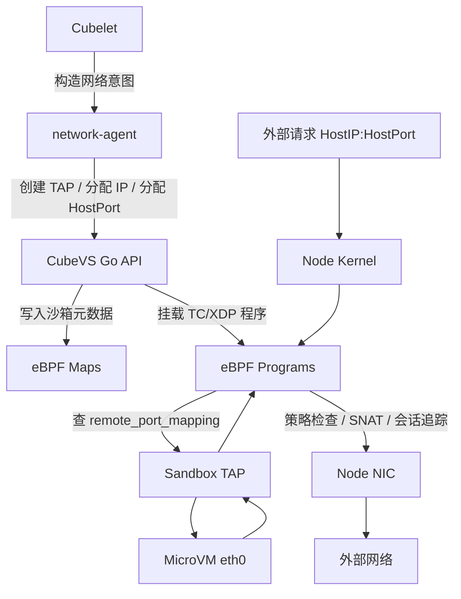
```mermaid
graph TD
  A[Cubelet] -->|构造网络意图| B[network-agent]
  B -->|创建 TAP / 分配 IP / 分配 HostPort| C[CubeVS Go API]
  C -->|写入沙箱元数据| D[eBPF Maps]
  C -->|挂载 TC/XDP 程序| E[eBPF Programs]

  F[外部请求 HostIP:HostPort] --> G[Node Kernel]
  G --> E
  E -->|查 remote_port_mapping| H[Sandbox TAP]
  H --> I[MicroVM eth0]

  I --> H
  H --> E
  E -->|策略检查 / SNAT / 会话追踪| J[Node NIC]
  J --> K[外部网络]
```

1.转发路径更短，性能开销更低

如果不使用 eBPF，常见做法通常是：

```text
外部请求
  -> HostPort
  -> iptables / 用户态 proxy / sidecar 代理
  -> TAP / veth
  -> 沙箱
```

这种方式的问题是路径较长，规则匹配复杂，并且用户态代理会带来额外的上下文切换和进程资源开销。沙箱数量变多后，端口规则、连接追踪和代理进程都会明显膨胀。

CubeVS 使用 eBPF 后，转发路径变成：

```text
外部请求
  -> HostPort
  -> eBPF 查表
  -> TAP
  -> MicroVM
```

eBPF 程序直接在内核网络路径上执行，通过 `remote_port_mapping`、`local_port_mapping` 等 eBPF Maps 查找目标沙箱，避免频繁进入用户态处理数据包。

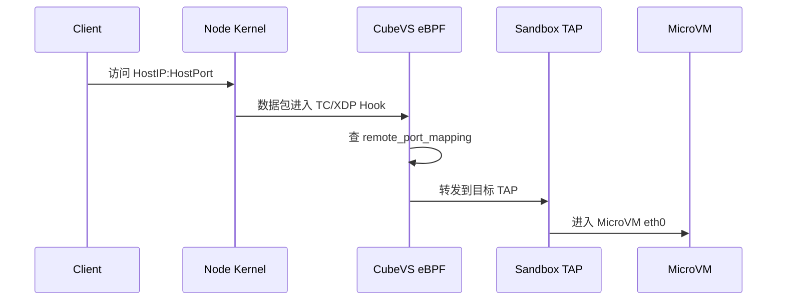
```mermaid
sequenceDiagram
  participant Client as Client
  participant Kernel as Node Kernel
  participant BPF as CubeVS eBPF
  participant TAP as Sandbox TAP
  participant VM as MicroVM

  Client->>Kernel: 访问 HostIP:HostPort
  Kernel->>BPF: 数据包进入 TC/XDP Hook
  BPF->>BPF: 查 remote_port_mapping
  BPF->>TAP: 转发到目标 TAP
  TAP->>VM: 进入 MicroVM eth0
```

这种设计的好处是：

- 减少用户态代理带来的上下文切换
- 避免为大量沙箱维护大量转发进程
- 端口转发逻辑变成内核态查表，路径更短
- 更适合高并发和大规模沙箱场景

2.配置面和数据面分离

CubeSandbox 网络管理采用“低频配置在用户态，高频转发在内核态”的设计。

用户态的 `network-agent` 只处理配置类操作：

```text
创建 TAP
分配沙箱 IP
分配 HostPort
注册端口映射
写入出站策略
释放网络资源
```

内核态 CubeVS 处理高频数据包：

```text
HostPort 转发
SNAT/DNAT
会话追踪
策略匹配
沙箱间隔离
```

这种拆分让系统职责更清晰。创建或销毁沙箱时，用户态更新 eBPF Maps；数据包到来时，eBPF 程序只需要查表执行，不需要再请求用户态服务。

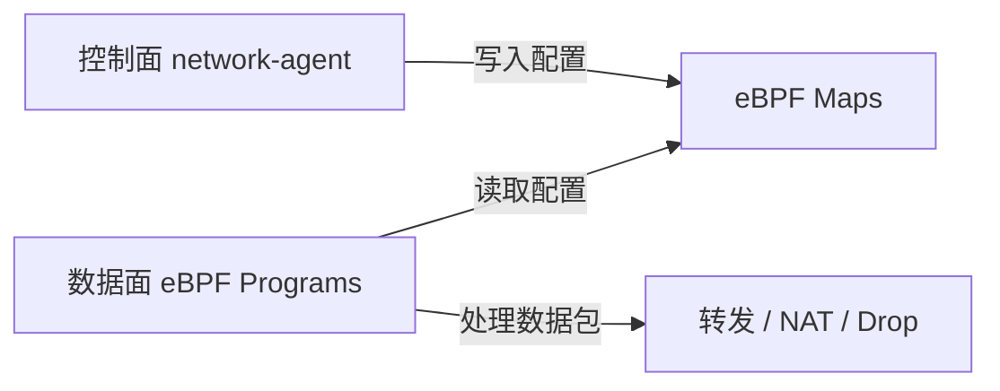
```mermaid
flowchart LR
  A[控制面 network-agent] -->|写入配置| B[eBPF Maps]
  C[数据面 eBPF Programs] -->|读取配置| B
  C -->|处理数据包| D[转发 / NAT / Drop]
```

这样带来的收益是：

- 配置逻辑保持在 Go 用户态，易维护
- 转发逻辑下沉到内核态，性能更高
- 沙箱创建/销毁只更新 Maps，不需要重启网络代理
- 数据面不依赖用户态进程逐包处理，稳定性更好

---

3.支持细粒度出站访问控制

Agent 沙箱经常需要运行不可信代码，因此“能不能访问外网、能访问哪些地址”是核心安全问题。

CubeVS 支持按沙箱配置出站策略，例如：

```text
AllowInternetAccess
AllowOut
DenyOut
```

这些策略由 Cubelet 通过 `CubeVSContext` 传给 `network-agent`，再写入 CubeVS 的 eBPF Maps。对于 CIDR/IP 规则，CubeVS 使用 LPM Trie 这类适合前缀匹配的数据结构，在内核态快速判断目标地址是否允许访问。

出站流量处理流程：

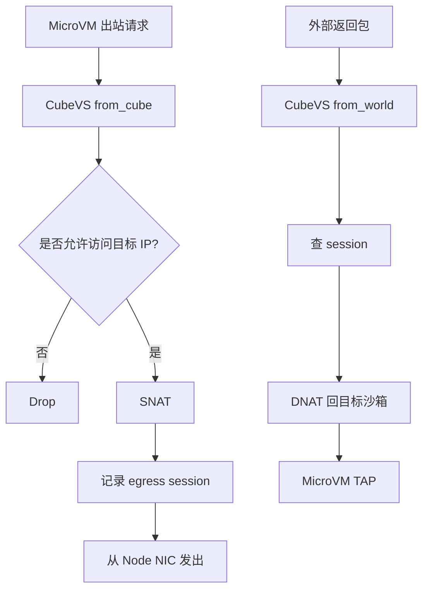
```mermaid
flowchart TD
  A[MicroVM 出站请求] --> B[CubeVS from_cube]
  B --> C{是否允许访问目标 IP?}
  C -->|否| D[Drop]
  C -->|是| E[SNAT]
  E --> F[记录 egress session]
  F --> G[从 Node NIC 发出]

  H[外部返回包] --> I[CubeVS from_world]
  I --> J[查 session]
  J --> K[DNAT 回目标沙箱]
  K --> L[MicroVM TAP]
```

这种方式的优势是：

- 每个沙箱可以有独立网络策略
- 策略检查发生在内核态，开销低
- 可以默认禁止外网，只放行必要地址
- 可以精确控制 Agent 对外访问范围
- 返回流量通过会话追踪恢复到正确沙箱

---

4.沙箱之间天然隔离

CubeSandbox 中每个 MicroVM 都有自己的 TAP 设备和沙箱 IP。CubeVS 会维护：

```text
ifindex_to_mvmmeta: TAP ifindex -> 沙箱元数据
mvmip_to_ifindex:   沙箱 IP -> TAP ifindex
```

数据包转发时，eBPF 程序会根据这些映射决定包应该进入哪个沙箱。未注册的 TAP、未登记的 IP、未允许的端口或不符合策略的流量都会被拦截或无法路由。

这相当于在计算节点内核层给每个沙箱建立了独立网络边界：

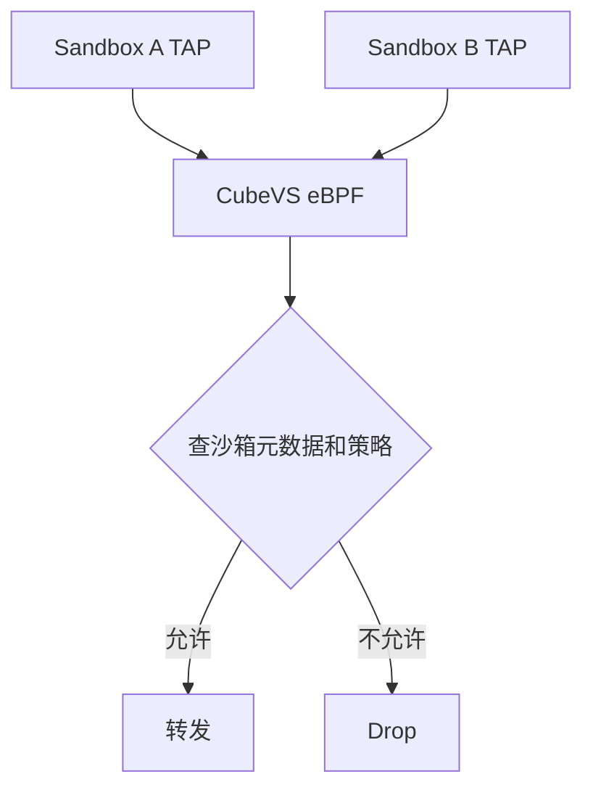
```mermaid
graph TD
  A[Sandbox A TAP] --> C[CubeVS eBPF]
  B[Sandbox B TAP] --> C
  C --> D{查沙箱元数据和策略}
  D -->|允许| E[转发]
  D -->|不允许| F[Drop]
```

相比只依赖普通 bridge 或 iptables 规则，CubeVS 的好处是：

- 通过 eBPF Maps 精确绑定 TAP、IP、沙箱 ID
- 沙箱网络状态可动态更新
- 不需要线性增长的大量 iptables 规则
- 更适合快速创建和销毁大量沙箱

---

5.端口映射更适合动态沙箱场景

沙箱创建和销毁非常频繁时，端口映射也会频繁变化。CubeVS 使用 eBPF Maps 保存 HostPort 到沙箱端口的映射：

```text
remote_port_mapping:
  HostPort -> TAP ifindex + SandboxPort

local_port_mapping:
  TAP ifindex + SandboxPort -> HostPort
```

新增沙箱时，只需要写入 map：

```text
AddPortMapping(ifindex, sandboxPort, hostPort)
```

销毁沙箱时，删除 map：

```text
DelPortMapping(ifindex, sandboxPort, hostPort)
```

相比频繁修改 iptables 规则，这种方式更适合大量短生命周期沙箱：

- 更新成本更低
- 查找路径稳定
- 不容易因为规则膨胀导致性能下降
- 状态与沙箱生命周期更容易绑定和清理

6.网络状态可观测、可恢复

CubeVS 的网络状态集中保存在 eBPF Maps 中，例如：

```text
TAP 元数据
端口映射
SNAT IP 列表
出站策略
入站/出站会话
```

`network-agent` 可以在创建、恢复、释放网络时检查这些状态。例如沙箱重建或 agent 重启后，可以通过已有状态进行 reconcile，重新挂载过滤器或补齐缺失映射。

这对生产环境很重要，因为沙箱网络不是一次性配置，而是需要持续维护：

```text
创建时写入
运行时转发
异常时恢复
销毁时清理
```

7.与 MicroVM 架构天然匹配

CubeSandbox 的沙箱不是普通容器，而是 MicroVM。每个 MicroVM 通过 TAP 接入宿主机网络。CubeVS 正好以 TAP 为核心管理对象，把每个 TAP 与沙箱 ID、沙箱 IP、端口映射和网络策略绑定起来。

```text
MicroVM
  -> eth0
      -> TAP
          -> CubeVS eBPF
              -> Node NIC / HostPort
```

这种设计非常适合 MicroVM 沙箱：

- TAP 是 VM 网络的天然边界
- eBPF 可以在 TAP 入方向做过滤和转发
- SNAT/DNAT 可以在节点内核态完成
- 每个 MicroVM 的网络策略可以独立配置

---

## 总结

CubeSandbox 使用 eBPF 做网络转发与隔离的亮点在于：**它把高频网络数据面放到内核态，把低频网络配置面留在用户态**。Cubelet 和 `network-agent` 负责创建 TAP、分配 IP/端口、写入策略；CubeVS 通过 eBPF Maps 保存沙箱网络状态，并由 TC/XDP 程序在数据包经过时直接完成查表转发、NAT、会话追踪和访问控制。

这种设计相比传统用户态代理或大量 iptables 规则，具有更短的转发路径、更低的上下文切换、更好的动态更新能力和更细粒度的沙箱隔离能力。对于 CubeSandbox 这种大量短生命周期、高并发、需要运行不可信代码的 Agent 沙箱场景，eBPF 网络数据面能够同时满足性能、隔离和可运维性要求。
