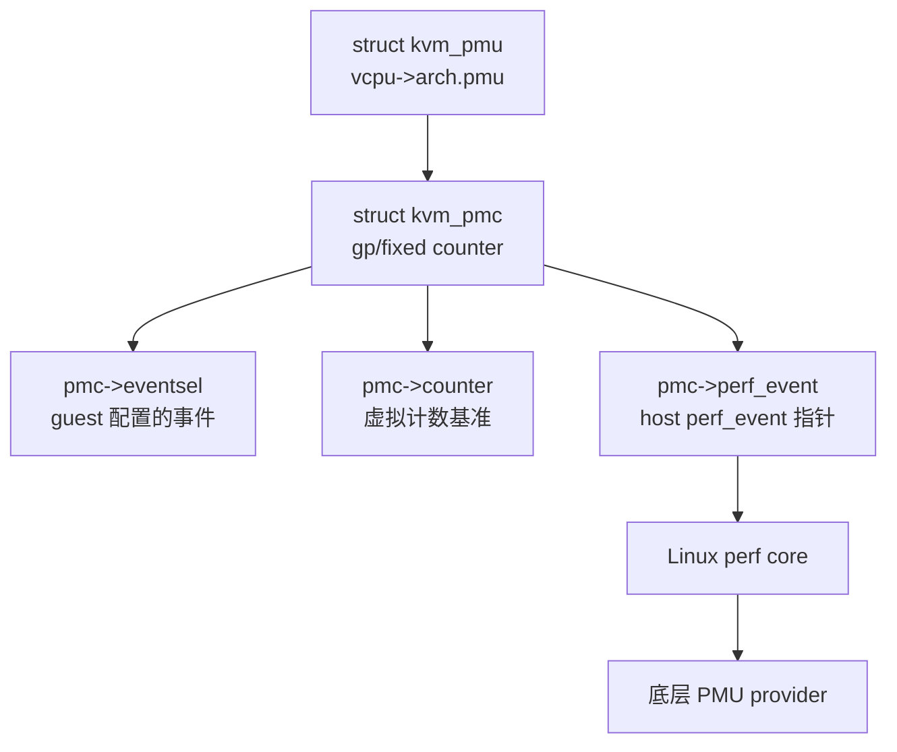
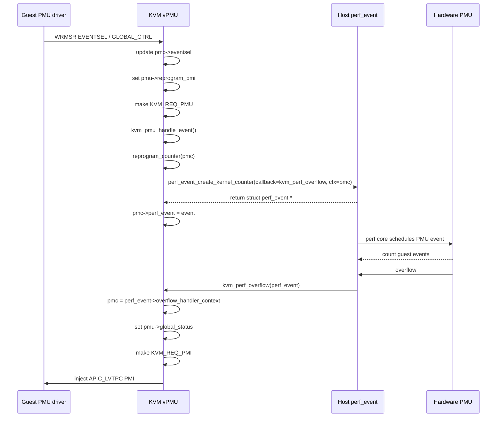
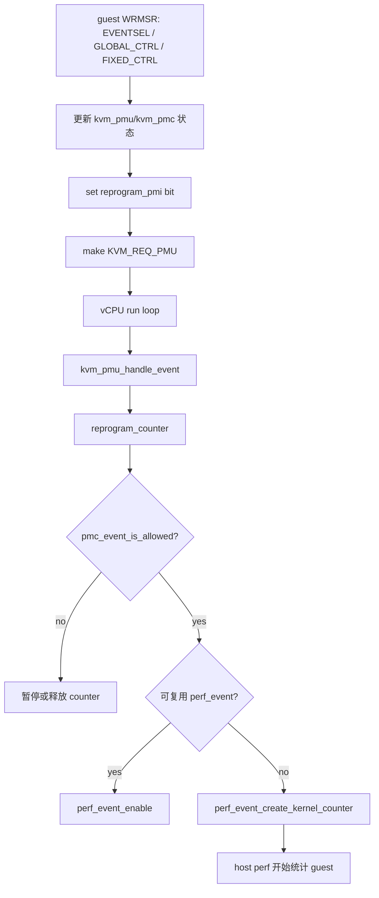
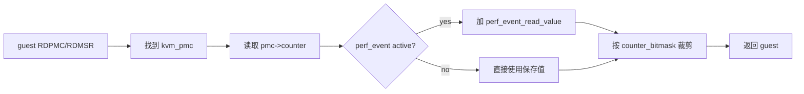
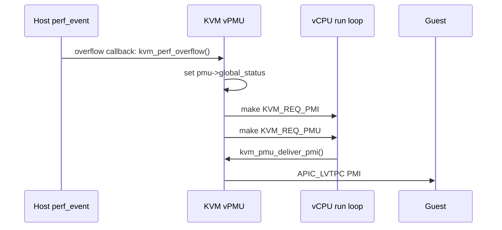
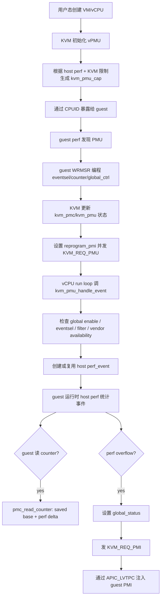

# KVM x86 vPMU

**vPMU 的目的是让 guest 以为自己在操作真实 PMU；KVM 维护虚拟 PMU 状态，并用 host 的 perf_event 尽量兑现计数、读数和溢出中断。**

## PMU/vPMU 的目标：让 guest 里的 perf 能工作

PMU，Performance Monitoring Unit，是 CPU 用来统计性能事件的硬件单元。例如指令退休数、CPU cycles、分支指令数、cache miss 等。Linux 的 `perf`、一些 profiler、甚至 guest kernel 自身都可能通过 PMU MSR 和 `RDPMC` 指令读取这些计数。

在虚拟化场景下，guest 不能随意独占 host 的真实 PMU。KVM vPMU 的目标是给 guest 呈现一套“像真实硬件一样”的 PMU 接口，同时由 KVM 控制资源、安全边界和兼容性。

从源码看，KVM 的 vPMU 大致做五件事：

1. 通过硬件向 guest 暴露 PMU 能力，例如 Intel CPUID leaf `0xA`，AMD CPUID leaf `0x80000022`。
2. 每个 vCPU 维护自己的虚拟 PMU 状态。
3. guest 写 PMU MSR 后，KVM 根据 guest 配置创建或复用 host `perf_event`。
4. guest 读 PMC 时，KVM 合并虚拟基准值和 host perf 增量。
5. host perf overflow 时，KVM 把它转成 guest 可见的 PMI。

模块参数 `enable_pmu` 控制是否启用 PMU 虚拟化：

- `arch/x86/kvm/x86.c:191` 定义 `enable_pmu = true`。
- `arch/x86/kvm/pmu.h:181` 的 `kvm_init_pmu_capability()` 从 host perf 获取 PMU 能力，并根据 KVM 支持范围裁剪。


## `kvm_pmu` 和 `kvm_pmc` 两个核心结构体

理解 vPMU，先抓住两个结构体。

### `struct kvm_pmu`

`struct kvm_pmu` 是每个 vCPU 的 PMU 总状态，定义在 `arch/x86/include/asm/kvm_host.h:515`。它包含：

```c
struct kvm_pmu {
    u8 version;                          // 虚拟 PMU 版本（对应 Intel CPUID leaf 0xA 返回的 version）
    unsigned nr_arch_gp_counters;        // guest 可见的通用性能计数器数量（general-purpose counters）
    unsigned nr_arch_fixed_counters;     // guest 可见的固定性能计数器数量（fixed counters）
    unsigned available_event_types;      // guest 可用的事件类型位掩码（哪些硬件事件可以监控）
    
    u64 fixed_ctr_ctrl;                   // 固定计数器控制寄存器（IA32_FIXED_CTR_CTRL MSR）值
    u64 fixed_ctr_ctrl_mask;              // 固定计数器控制寄存器的有效位掩码
    
    u64 global_ctrl;                      // 全局控制寄存器（IA32_PERF_GLOBAL_CTRL MSR）值，开启/关闭所有计数器
    u64 global_status;                    // 全局状态寄存器（IA32_PERF_GLOBAL_STATUS MSR），计数器溢出/PMI 状态
    u64 counter_bitmask[2];               // 每个计数器的有效位宽掩码（例如 48-bit），控制计数器的位范围
    
    u64 global_ctrl_mask;                 // global_ctrl 可修改的有效位掩码
    u64 global_status_mask;               // global_status 可读取的有效位掩码
    u64 reserved_bits;                    // 保留位，防止 guest 写入无效位
    u64 raw_event_mask;                   // 原始事件编码的掩码，用于事件验证
    
    struct kvm_pmc gp_counters[KVM_INTEL_PMC_MAX_GENERIC];  // 通用计数器数组（每个 PMC 记录当前计数值和事件类型）
    struct kvm_pmc fixed_counters[KVM_PMC_MAX_FIXED];      // 固定计数器数组（固定计数器）

    union {
        DECLARE_BITMAP(reprogram_pmi, X86_PMC_IDX_MAX);   // 需要重编程性能中断(PMI)的计数器 bitmap
        atomic64_t __reprogram_pmi;                       // 以原子方式访问 reprogram_pmi
    };
    
    DECLARE_BITMAP(all_valid_pmc_idx, X86_PMC_IDX_MAX);    // 当前有效 PMC 索引 bitmap（哪些 PMC 可用）
    DECLARE_BITMAP(pmc_in_use, X86_PMC_IDX_MAX);          // 最近 guest 访问过的 PMC bitmap

    u64 ds_area;                    // Data Store 区域地址（用于 PEBS，存储精确事件数据）
    u64 pebs_enable;                // PEBS（Precise Event-Based Sampling）使能寄存器
    u64 pebs_enable_mask;           // PEBS 可修改位掩码
    u64 pebs_data_cfg;              // PEBS 数据配置寄存器
    u64 pebs_data_cfg_mask;         // PEBS 数据配置掩码

    u64 host_cross_mapped_mask;     // host cross mapped PMC mask，用于跟 host PMU 交互或映射

    bool need_cleanup;              // 是否需要在 vCPU 上做 PMU 状态清理（如切换 vCPU 时）
    u8 event_count;                 // guest 当前使用的事件计数数量
};

```

* struct kvm_pmu 是 vCPU 上的“虚拟 PMU 总账本”：
    * 控制寄存器（global_ctrl/status, fixed_ctr_ctrl） → 虚拟化 guest PMU 控制
    * 计数器数组（gp_counters / fixed_counters） → 存储当前计数值和事件类型
    * bitmap（pmc_in_use, all_valid_pmc_idx, reprogram_pmi） → 管理计数器使用状态、PMI 重编程
    * PEBS/LBR 相关 → 支持精确事件采样
    * 其他控制字段 → 位掩码、保留位、状态清理等
* 作用：
    * Hypervisor 通过这个结构体管理每个 vCPU 的 PMU 状态
    * guest 可以像操作真实 PMU 一样读写 MSR
    * Hypervisor 可以安全地虚拟化性能计数器、PEBS/LBR 等高级功能

它是“vCPU 上这套虚拟 PMU 的总账本”。

### `struct kvm_pmc`

`struct kvm_pmc` 是单个虚拟 counter，定义在 `arch/x86/include/asm/kvm_host.h:490`。它包含：

- `type`：gp counter 还是 fixed counter。
- `idx`：KVM 内部使用的全局 PMC index。
- `counter`：KVM 保存的虚拟计数基准值。
- `prev_counter`：用于检测某些溢出场景。
- `eventsel`：guest 编程的事件选择值。
- `perf_event`：host 上对应的 perf event。
- `is_paused`：perf event 是否暂停。
- `intr`：是否允许溢出后产生 PMI。
- `current_config`：用于判断能否复用已有 perf event。

可以把 `kvm_pmc` 理解为“guest 看到的一个计数器”和“host perf_event”的粘合点。

在 kvm_pmc 计数时会先取 guest 保存的基准值 pmc->counter ，如果 host perf event 正在运行，则把 host perf event 自上次保存以来的增量加上去。如果 host perf event 因为某些原因要被

```c
counter = pmc->counter;
if (pmc->perf_event && !pmc->is_paused)
	counter += perf_event_read_value(pmc->perf_event, &enabled, &running);
return counter & pmc_bitmask(pmc);
```

也就是说，guest 读到的值不是简单的 `perf_event` 当前值，而是：

```text
guest visible counter = KVM saved base + active host perf_event delta
```


## vPMU 的初始化

```text
模块加载阶段
├── vmx_init() 或 svm_init()                   [arch/x86/kvm/vmx/vmx.c:8649 或 svm.c]
│   └── kvm_x86_vendor_init(&vmx_init_ops)    [arch/x86/kvm/x86.c:9465]
│       ├── kvm_init_pmu_capability(pmu_ops)   [pmu.h:181, x86.c:9515]
│       │   ├── perf_get_x86_pmu_capability()  [获取宿主机PMU能力]
│       │   ├── 检查hybrid CPU并禁用vPMU
│       │   ├── 验证GP计数器数量 >= MIN_NR_GP_COUNTERS
│       │   └── 设置kvm_pmu_cap全局能力
│       │
│       ├── kvm_ops_update(ops)               [x86.c:9407]
│       │   └── kvm_pmu_ops_update(ops->pmu_ops)  [pmu.c:83]
│       │       └── 复制并更新static_call
│       │
│       └── kvm_init()
│           └── kvm_x86_ops_update()
│
vCPU创建阶段 (每创建一个vCPU)
└── kvm_vm_ioctl_create_vcpu()                [virt/kvm/kvm_main.c]
    └── kvm_vcpu_init()                       [arch/x86/kvm/x86.c:11882]
        └── kvm_pmu_init(vcpu)                [pmu.c:660]
            ├── memset(pmu, 0, sizeof(*pmu))  [清零PMU结构]
            ├── static_call(kvm_x86_pmu_init) [调用架构特定初始化]
            │   ├── intel_pmu_init()          [pmu_intel.c:608] Intel
            │   │   ├── 初始化GP计数器 (0~KVM_INTEL_PMC_MAX_GENERIC-1)
            │   │   │   └── 设置 type=KVM_PMC_GP, vcpu, idx, current_config
            │   │   ├── 初始化Fixed计数器 (0~KVM_PMC_MAX_FIXED-1)
            │   │   │   └── 设置 type=KVM_PMC_FIXED, vcpu, idx, current_config
            │   │   └── 初始化LBR相关 (lbr_desc)
            │   │
            │   └── amd_pmu_init()            [svm/pmu.c:220] AMD
            │       └── 初始化GP计数器 (0~KVM_AMD_PMC_MAX_GENERIC-1)
            │           └── 设置 type=KVM_PMC_GP, vcpu, idx, current_config
            │
            ├── pmu->event_count = 0           [重置事件计数]
            ├── pmu->need_cleanup = false      [设置清理标志]
            └── kvm_pmu_refresh(vcpu)          [pmu.c:646]
                └── static_call(kvm_x86_pmu_refresh)
                    ├── intel_pmu_refresh()    [pmu_intel.c:485] Intel
                    │   ├── 从CPUID读取PMU版本和计数器信息
                    │   ├── 设置 nr_arch_gp_counters
                    │   ├── 设置 nr_arch_fixed_counters
                    │   ├── 设置 counter_bitmask[]
                    │   ├── 设置 global_ctrl_mask
                    │   ├── 设置 global_status_mask
                    │   ├── 设置 reserved_bits
                    │   ├── 设置 all_valid_pmc_idx bitmap
                    │   └── 初始化PEBS相关配置
                    │
                    └── amd_pmu_refresh()      [svm/pmu.c:181] AMD
                        ├── 检查PERFMON_V2/PERFCTR_CORE特性
                        ├── 设置 version (1或2)
                        ├── 设置 nr_arch_gp_counters
                        ├── 设置 counter_bitmask[KVM_PMC_GP]
                        ├── 设置 reserved_bits
                        ├── 设置 raw_event_mask
                        └── 设置 all_valid_pmc_idx bitmap

```

### kvm_pmu_ops_update——厂商 PMU ops 注册

KVM x86 的 PMU 通用层通过 `struct kvm_pmu_ops` 调到 Intel 或 AMD 实现。ops 定义在 `arch/x86/kvm/pmu.h:21`，包含：

- `pmc_idx_to_pmc`
- `rdpmc_ecx_to_pmc`
- `msr_idx_to_pmc`
- `is_valid_rdpmc_ecx`
- `is_valid_msr`
- `get_msr`
- `set_msr`
- `refresh`
- `init`
- `reset`
- `deliver_pmi`
- `cleanup`

VMX 初始化时使用 `intel_pmu_ops`：

- `arch/x86/kvm/vmx/vmx.c:8613`

SVM 初始化时使用 `amd_pmu_ops`：

- `arch/x86/kvm/svm/svm.c:5327`

通用层在 `arch/x86/kvm/x86.c:9421` 调用 `kvm_pmu_ops_update()`，把厂商 ops 接到 static call 上。

### 3.2 PMU capability 初始化

KVM 模块初始化阶段会调用：

- `arch/x86/kvm/x86.c:9515`：`kvm_init_pmu_capability(ops->pmu_ops)`

`kvm_init_pmu_capability()` 位于 `arch/x86/kvm/pmu.h:181`。它做了几件事：

1. 如果是 hybrid PMU，当前 KVM 会禁用 vPMU。
2. 调 `perf_get_x86_pmu_capability(&kvm_pmu_cap)` 获取 host perf 能力。
3. 如果 host 没有足够的 gp counters，则禁用 PMU。
4. 把 PMU version、gp counter 数、fixed counter 数裁剪到 KVM 支持范围。

这里的重点是：**guest 可见能力不是 host 能力的原样拷贝，而是 host perf 能力和 KVM 支持范围的交集。**

### 3.3 vCPU 创建时初始化 vPMU

vCPU 创建路径中：

- `arch/x86/kvm/x86.c:11924` 设置 `vcpu->arch.perf_capabilities`。
- `arch/x86/kvm/x86.c:11925` 调用 `kvm_pmu_init(vcpu)`。

`kvm_pmu_init()` 位于 `arch/x86/kvm/pmu.c:660`，流程是：

1. 清空 `struct kvm_pmu`。
2. 调厂商 `init` 初始化 counter 数组。
3. 设置通用字段。
4. 调 `kvm_pmu_refresh()` 根据 CPUID 刷新 guest 可见 PMU 配置。

Intel 的 `intel_pmu_init()` 位于 `arch/x86/kvm/vmx/pmu_intel.c:608`，会初始化最多 8 个 gp counters 和 3 个 fixed counters。

AMD 的 `amd_pmu_init()` 位于 `arch/x86/kvm/svm/pmu.c:220`，会初始化 AMD gp counters。

### 3.4 CPUID 暴露

Intel PMU 能力主要通过 CPUID leaf `0xA` 暴露：

- `arch/x86/kvm/cpuid.c:976`

如果 `enable_pmu` 关闭，或者 host 没有 `ARCH_PERFMON`，KVM 会把该 leaf 清零。否则会把 `kvm_pmu_cap` 中的 version、counter 数量、bit width、events mask 填给 guest。

AMD PMU v2 能力通过 leaf `0x80000022` 暴露：

- `arch/x86/kvm/cpuid.c:1268`

这一步决定 guest 里 `perf` 或 guest kernel 认为自己拥有怎样的 PMU。

## 4. guest 写 MSR 如何触发 counter reprogram

guest 编程 PMU 的典型方式是写 PMU MSR。例如：

- 写 gp counter 的 event select MSR。
- 写 fixed counter control MSR。
- 写 global ctrl MSR。
- 写 counter 本身。

KVM 的 MSR 入口在 `arch/x86/kvm/x86.c` 中会判断某个 MSR 是否属于 PMU，如果是，就转给：

- `kvm_pmu_get_msr()`
- `kvm_pmu_set_msr()`

通用 `kvm_pmu_set_msr()` 位于 `arch/x86/kvm/pmu.c:583`。它直接处理 global PMU MSR：

- `MSR_CORE_PERF_GLOBAL_STATUS`
- `MSR_CORE_PERF_GLOBAL_CTRL`
- `MSR_CORE_PERF_GLOBAL_OVF_CTRL`
- AMD 对应的 global status/control/clear MSR

当 guest 修改 `global_ctrl` 时，KVM 会计算变化的 bit，并调用 `reprogram_counters()`：

- `arch/x86/kvm/pmu.c:616`

`reprogram_counters()` 位于 `arch/x86/kvm/pmu.h:229`，它会把变化的 counter 标记到 `reprogram_pmi`，然后发起 `KVM_REQ_PMU`。

### 4.1 Intel 写 MSR

Intel PMU 的 set MSR 位于：

- `arch/x86/kvm/vmx/pmu_intel.c:391`

几个关键路径：

- 写 `MSR_CORE_PERF_FIXED_CTR_CTRL`：调用 `reprogram_fixed_counters()`，见 `arch/x86/kvm/vmx/pmu_intel.c:400`。
- 写 gp counter 本身：调用 `pmc_write_counter()`，然后更新 sample period，见 `arch/x86/kvm/vmx/pmu_intel.c:430`。
- 写 gp counter 的 `EVENTSEL`：更新 `pmc->eventsel`，然后调用 `kvm_pmu_request_counter_reprogram(pmc)`，见 `arch/x86/kvm/vmx/pmu_intel.c:446`。

### 4.2 AMD 写 MSR

AMD PMU 的 set MSR 位于：

- `arch/x86/kvm/svm/pmu.c:153`

主要路径：

- 写 counter MSR：`pmc_write_counter()`，见 `arch/x86/kvm/svm/pmu.c:160`。
- 写 EVNTSEL MSR：更新 `pmc->eventsel`，然后调用 `kvm_pmu_request_counter_reprogram(pmc)`，见 `arch/x86/kvm/svm/pmu.c:167`。

### 4.3 request 驱动模型

`kvm_pmu_request_counter_reprogram()` 位于 `arch/x86/kvm/pmu.h:223`：

```c
set_bit(pmc->idx, pmc_to_pmu(pmc)->reprogram_pmi);
kvm_make_request(KVM_REQ_PMU, pmc->vcpu);
```

它没有立刻创建 perf event，而是把工作延迟到 vCPU request 处理点。`KVM_REQ_PMU` 定义在：

- `arch/x86/include/asm/kvm_host.h:83`

vCPU run loop 处理它的位置：

- `arch/x86/kvm/x86.c:10596`

这样可以把 guest MSR 写入路径和实际 PMU 重编程路径解耦。

## 5. KVM 如何用 host `perf_event` 承接计数

`KVM_REQ_PMU` 最终进入：

- `arch/x86/kvm/pmu.c:436`：`kvm_pmu_handle_event()`

它遍历 `pmu->reprogram_pmi` 中的 bit，找到对应 `kvm_pmc`，然后调用 `reprogram_counter()`。

### 5.1 判断 counter 是否允许运行

`reprogram_counter()` 位于：

- `arch/x86/kvm/pmu.c:381`

真正创建 perf event 前，它会调用 `pmc_event_is_allowed()`：

- `arch/x86/kvm/pmu.c:374`

检查条件包括：

1. `pmc_is_globally_enabled(pmc)`：global ctrl 是否打开。
2. `pmc_speculative_in_use(pmc)`：counter 是否被 guest 启用。
3. `hw_event_available(pmc)`：厂商逻辑认为事件是否可用。
4. `check_pmu_event_filter(pmc)`：用户态 event filter 是否允许。

这一步说明：**guest 写了 eventsel 不等于 KVM 一定会创建 host perf event。**

### 5.2 创建 host perf_event

真正连接 host perf 的函数是：

- `arch/x86/kvm/pmu.c:164`：`pmc_reprogram_counter()`

它构造 `struct perf_event_attr`，关键字段包括：

- `.type = PERF_TYPE_RAW`
- `.pinned = true`
- `.exclude_idle = true`
- `.exclude_host = 1`
- `.exclude_user` / `.exclude_kernel` 根据 guest eventsel 的 USR/OS 位决定
- `.config` 使用 guest eventsel 裁剪后的 raw event config
- `.sample_period` 根据 guest counter 当前值计算

然后调用：

- `arch/x86/kvm/pmu.c:203`：`perf_event_create_kernel_counter(&attr, -1, current, kvm_perf_overflow, pmc)`

这里有两个非常重要的点：

1. `exclude_host = 1` 表示这个 perf event 用来统计 guest，而不是 host。
2. overflow callback 是 `kvm_perf_overflow()`，这让 host perf overflow 能回到 KVM vPMU。

如果 event 创建成功：

- `pmc->perf_event = event`
- `pmu->event_count++`
- `pmc->is_paused = false`
- `pmc->intr = intr || pebs`
    ### 5.3 `vPMU -> vPMC -> perf_event` 的注册和触发链路

`struct kvm_pmu` 是每个 vCPU 的虚拟 PMU 总状态，它内部包含多个 `struct kvm_pmc`，例如 `gp_counters[]` 和 `fixed_counters[]`。每个 `kvm_pmc` 表示一个 guest 可见的虚拟 counter。只有当 guest 编程的 counter 满足启用条件时，KVM 才会为这个 `kvm_pmc` 创建一个 host `struct perf_event`，并把返回的指针保存在 `pmc->perf_event` 中。

这个关系可以概括为：



注册链路从 guest 写 PMU MSR 开始。Intel 下，guest 写 gp counter 的 `EVENTSEL` MSR 时，`intel_pmu_set_msr()` 会更新 `pmc->eventsel`，然后调用 `kvm_pmu_request_counter_reprogram(pmc)`，见 `arch/x86/kvm/vmx/pmu_intel.c:454`。AMD 下对应逻辑在 `amd_pmu_set_msr()`，见 `arch/x86/kvm/svm/pmu.c:171`。`kvm_pmu_request_counter_reprogram()` 会设置 `pmu->reprogram_pmi` 中对应 counter 的 bit，并发起 `KVM_REQ_PMU`，见 `arch/x86/kvm/pmu.h:223`。

`KVM_REQ_PMU` 被处理后进入 `kvm_pmu_handle_event()`，它遍历 `pmu->reprogram_pmi`，用厂商的 `pmc_idx_to_pmc` 回调把 bit index 转成 `struct kvm_pmc *`，然后调用 `reprogram_counter(pmc)`，见 `arch/x86/kvm/pmu.c:436`。`reprogram_counter()` 会先检查这个 counter 是否真的允许运行：global enable 是否打开、counter 是否被 guest 启用、事件是否可用、是否通过 PMU event filter，见 `arch/x86/kvm/pmu.c:374`。

如果允许运行，并且旧的 `perf_event` 不能复用，KVM 会调用 `pmc_reprogram_counter()` 创建新的 host `perf_event`。真正的创建点是：

```c
event = perf_event_create_kernel_counter(&attr, -1, current,
					 kvm_perf_overflow, pmc);
```

位置是 `arch/x86/kvm/pmu.c:203`。这里最后两个参数很关键：`kvm_perf_overflow` 是 host perf_event overflow 后调用的回调函数，`pmc` 是传给回调的上下文。创建成功后，KVM 保存指针：

```c
pmc->perf_event = event;
```

位置是 `arch/x86/kvm/pmu.c:211`。从这时起，这个 guest vPMC 和 host perf_event 建立了绑定关系。

触发链路发生在 host perf_event 到达 sample period 或 overflow 时。perf core 调用创建时注册的回调：

```c
kvm_perf_overflow(struct perf_event *perf_event,
		  struct perf_sample_data *data,
		  struct pt_regs *regs)
```

位置是 `arch/x86/kvm/pmu.c:123`。KVM 在回调里通过：

```c
struct kvm_pmc *pmc = perf_event->overflow_handler_context;
```

取回创建 perf_event 时传入的 `kvm_pmc`，见 `arch/x86/kvm/pmu.c:127`。随后 `__kvm_perf_overflow(pmc, true)` 会更新 guest 可见的 `pmu->global_status`。如果该 counter 开启了中断，KVM 会发起 `KVM_REQ_PMI`，见 `arch/x86/kvm/pmu.c:119`。之后 vCPU run loop 处理该 request，调用 `kvm_pmu_deliver_pmi()`，最终通过 `APIC_LVTPC` 给 guest 注入虚拟 PMI，见 `arch/x86/kvm/pmu.c:527`。

完整链路如下：



读 counter 时也会使用 `pmc->perf_event`。`pmc_read_counter()` 先取 `pmc->counter` 作为虚拟计数基准；如果 `pmc->perf_event` 存在并且没有暂停，就调用 `perf_event_read_value()` 读取 host perf_event 的当前增量，然后两者相加并按 counter 位宽裁剪，见 `arch/x86/kvm/pmu.h:65`。因此 guest 看到的值可以理解为：

```text
guest visible counter = pmc->counter + host perf_event delta
```

### 5.4 复用、暂停和释放

KVM 不会每次都粗暴重建 perf event。`reprogram_counter()` 会先暂停已有 counter：

- `arch/x86/kvm/pmu.c:388`

如果配置没有变，并且 `pmc_resume_counter()` 成功，就复用原来的 perf event：

- `arch/x86/kvm/pmu.c:411`

如果不能复用，则释放旧 event：

- `arch/x86/kvm/pmu.c:414`

暂停时会把当前 perf 增量累计回 `pmc->counter`：

- `arch/x86/kvm/pmu.c:218`：`pmc_pause_counter()`

释放 event 的 helper 在：

- `arch/x86/kvm/pmu.h:83`：`pmc_release_perf_event()`

这一套机制保证了 guest 看到的 counter 尽量连续，而 host perf 资源可以被 KVM 动态管理。

### 5.5 总体流程图



## 6. RDPMC/RDMSR 如何读虚拟 counter

guest 读 PMU counter 主要有两种方式：

- 执行 `RDPMC`。
- 读 PMU counter MSR。

### 6.1 RDPMC 路径

KVM 的 RDPMC 模拟入口是：

- `arch/x86/kvm/x86.c:1422`：`kvm_emulate_rdpmc()`

它读取 guest RCX，调用 `kvm_pmu_rdpmc()`。如果失败，则给 guest 注入 `#GP`。

通用 RDPMC 实现在：

- `arch/x86/kvm/pmu.c:501`：`kvm_pmu_rdpmc()`

流程如下：

1. 如果 `pmu->version == 0`，失败。
2. 如果是 VMware backdoor PMC，走特殊路径。
3. 调厂商 `rdpmc_ecx_to_pmc()` 把 ECX 转成 `struct kvm_pmc`。
4. 检查 CR4.PCE 和 CPL 权限。
5. 调 `pmc_read_counter(pmc)` 返回 guest 可见值。

Intel 的 ECX 解析位于：

- `arch/x86/kvm/vmx/pmu_intel.c:128`

Intel 支持通过 ECX bit 30 区分 fixed counter。

AMD 的 ECX 解析位于：

- `arch/x86/kvm/svm/pmu.c:81`

AMD 只映射 gp counters。

### 6.2 RDMSR 路径

guest 读 PMU MSR 时会进入通用：

- `arch/x86/kvm/pmu.c:558`：`kvm_pmu_get_msr()`

通用层直接处理 global status/control/overflow clear 等 MSR；其他 MSR 转给厂商实现。

Intel 读 MSR 位于：

- `arch/x86/kvm/vmx/pmu_intel.c:348`

读 counter MSR 时，它调用 `pmc_read_counter()`，然后按 gp/fixed counter bitmask 裁剪：

- `arch/x86/kvm/vmx/pmu_intel.c:368`
- `arch/x86/kvm/vmx/pmu_intel.c:374`

AMD 读 MSR 位于：

- `arch/x86/kvm/svm/pmu.c:131`

读 counter MSR 同样调用 `pmc_read_counter()`。

### 6.3 读数模型回顾



## 7. overflow 如何变成 guest PMI

PMI 是 Performance Monitoring Interrupt。guest 配置了 counter overflow interrupt 后，counter 溢出时应该收到 PMI。

### 7.1 host perf overflow callback

KVM 创建 host perf event 时，把 overflow callback 设置为：

- `arch/x86/kvm/pmu.c:123`：`kvm_perf_overflow()`

当 host perf event overflow：

1. 如果 counter 正在等待重编程，则忽略这次 overflow，避免旧配置 racing。
2. 调 `__kvm_perf_overflow(pmc, true)` 设置 guest 可见 overflow 状态。
3. 发起 `KVM_REQ_PMU`，让 KVM 后续重新处理 PMU。

`__kvm_perf_overflow()` 位于：

- `arch/x86/kvm/pmu.c:96`

它会：

- 对普通事件设置 `pmu->global_status` 中对应 PMC bit。
- 对 PEBS 事件处理 buffer overflow 状态。
- 如果 `pmc->intr` 为真，则发起 `KVM_REQ_PMI`。

### 7.2 KVM_REQ_PMI 到 APIC LVTPC

`KVM_REQ_PMI` 定义在：

- `arch/x86/include/asm/kvm_host.h:84`

vCPU run loop 处理它的位置：

- `arch/x86/kvm/x86.c:10598`

实际 delivery 函数是：

- `arch/x86/kvm/pmu.c:527`：`kvm_pmu_deliver_pmi()`

如果 vCPU 使用 in-kernel LAPIC，KVM 会：

1. 调厂商可选的 `deliver_pmi` hook。
2. 通过 `kvm_apic_local_deliver(vcpu->arch.apic, APIC_LVTPC)` 向 guest 注入本地 APIC performance counter interrupt。

Intel 还会处理 LBR freeze 等行为：

- `arch/x86/kvm/vmx/pmu_intel.c:676`

### 7.3 overflow 流程图



## 8. 用户态 API：关闭 PMU 与事件过滤

用户态 VMM，例如 QEMU，可以影响 vPMU 行为。主要关注两个 API。

### 8.1 `KVM_CAP_PMU_CAPABILITY`

文档位于：

- `Documentation/virt/kvm/api.rst:8363`

它是 VM capability。当前唯一能力是：

- `KVM_PMU_CAP_DISABLE`

用户态可以在创建 vCPU 之前用 `KVM_ENABLE_CAP` 禁用该 VM 的 PMU 虚拟化。

实现位于：

- `arch/x86/kvm/x86.c:4625`：`KVM_CHECK_EXTENSION` 返回可调 capability mask。
- `arch/x86/kvm/x86.c:6437`：`KVM_ENABLE_CAP` 设置 `kvm->arch.enable_pmu`。

注意文档说明：禁用 PMU 后，用户态应该调整 CPUID leaf `0xA`，让 guest 看到 PMU disabled。

### 8.2 `KVM_SET_PMU_EVENT_FILTER`

文档位于：

- `Documentation/virt/kvm/api.rst:5032`

ioctl 定义在：

- `include/uapi/linux/kvm.h:1560`

它允许用户态限制 guest 可以编程哪些 PMU events。结构体是：

```c
struct kvm_pmu_event_filter {
	__u32 action;
	__u32 nevents;
	__u32 fixed_counter_bitmap;
	__u32 flags;
	__u32 pad[4];
	__u64 events[0];
};
```

它可以配置 allow list 或 deny list：

- `KVM_PMU_EVENT_ALLOW`
- `KVM_PMU_EVENT_DENY`

普通模式按 event select + unit mask 匹配。masked events 模式可以提供更灵活的 mask/match/exclude 规则。

实现位于：

- `arch/x86/kvm/pmu.c:834`：`kvm_vm_ioctl_set_pmu_event_filter()`

实现流程：

1. 从用户态 copy filter。
2. 校验 action、flags、nevents。
3. copy events 数组。
4. 如果不是 masked events，转换成内部 masked 格式。
5. 排序并拆分 includes/excludes。
6. RCU 替换 `kvm->arch.pmu_event_filter`。
7. 把所有 vCPU 的 `reprogram_pmi` 置满。
8. 给所有 vCPU 发 `KVM_REQ_PMU`。

事件过滤在 `pmc_event_is_allowed()` 中生效：

- `arch/x86/kvm/pmu.c:374`

也就是说，新的 filter 会导致已编程 counter 重新判断是否还能运行。

## 9. Intel/AMD 差异和进阶特性

建议初学者先理解前面的通用框架，再看 Intel/AMD 差异。因为厂商差异很多，但它们都被收束进 `struct kvm_pmu_ops`。

### 9.1 Intel vPMU

Intel 实现在：

- `arch/x86/kvm/vmx/pmu_intel.c`

特点：

1. 同时支持 gp counters 和 fixed counters。
2. 主要通过 CPUID leaf `0xA` 描述 PMU 能力。
3. fixed counter 事件是预设的。
4. 处理 PEBS、LBR 等 Intel 扩展。

fixed counter 和事件的映射在：

- `arch/x86/kvm/vmx/pmu_intel.c:64`

例如：

- fixed counter 0：instructions retired。
- fixed counter 1：CPU cycles。
- fixed counter 2：reference cycles。

Intel 的 `refresh` 位于：

- `arch/x86/kvm/vmx/pmu_intel.c:485`

它根据 CPUID 0xA 设置：

- PMU version。
- gp counter 数量和位宽。
- fixed counter 数量和位宽。
- 可用 architectural events。
- global ctrl/status mask。
- PEBS/LBR 能力。

Intel 的 ops 表位于：

- `arch/x86/kvm/vmx/pmu_intel.c:791`

### 9.2 AMD vPMU

AMD 实现在：

- `arch/x86/kvm/svm/pmu.c`

特点：

1. 主要使用 gp counters。
2. 支持 legacy K7 MSR 和 F15H MSR 映射。
3. 如果 guest 有 `PERFMON_V2`，则支持 global status/control。
4. `refresh` 逻辑比 Intel 更短。

AMD MSR 到 PMC 的映射在：

- `arch/x86/kvm/svm/pmu.c:38`

AMD 的 `refresh` 位于：

- `arch/x86/kvm/svm/pmu.c:181`

其中：

- 如果 guest 有 `X86_FEATURE_PERFMON_V2`，PMU version 为 2。
- 否则使用 legacy/core counter 数量。
- counter bitmask 固定为 48 bit。
- fixed counters 对 AMD 不适用，因此清零。

AMD 的 ops 表位于：

- `arch/x86/kvm/svm/pmu.c:251`

### 9.3 差异对照表

| 主题 | Intel | AMD |
| --- | --- | --- |
| 主要文件 | `vmx/pmu_intel.c` | `svm/pmu.c` |
| CPUID | leaf `0xA` | leaf `0x80000022` 和相关 feature |
| counter 类型 | gp + fixed | 主要是 gp |
| fixed counter | 支持 | 不适用 |
| global ctrl/status | PMU version > 1 | PERFMON_V2/version > 1 |
| 扩展特性 | PEBS、LBR | 代码中相对简单 |
| ops 表 | `intel_pmu_ops` | `amd_pmu_ops` |

## 10. 推荐阅读路径

如果要带新人读源码，建议按这个顺序：

1. `arch/x86/include/asm/kvm_host.h:490`：看 `struct kvm_pmc`。
2. `arch/x86/include/asm/kvm_host.h:515`：看 `struct kvm_pmu`。
3. `arch/x86/kvm/pmu.h:21`：看 `struct kvm_pmu_ops`。
4. `arch/x86/kvm/pmu.h:65`：看 `pmc_read_counter()`，理解读数模型。
5. `arch/x86/kvm/pmu.c:660`：看 `kvm_pmu_init()`。
6. `arch/x86/kvm/vmx/pmu_intel.c:485` 或 `arch/x86/kvm/svm/pmu.c:181`：看厂商 `refresh`。
7. `arch/x86/kvm/pmu.c:583`：看通用 MSR set。
8. `arch/x86/kvm/vmx/pmu_intel.c:391` 或 `arch/x86/kvm/svm/pmu.c:153`：看厂商 MSR set。
9. `arch/x86/kvm/pmu.c:436`：看 `kvm_pmu_handle_event()`。
10. `arch/x86/kvm/pmu.c:164`：看 `pmc_reprogram_counter()` 如何创建 perf event。
11. `arch/x86/kvm/pmu.c:501`：看 `kvm_pmu_rdpmc()`。
12. `arch/x86/kvm/pmu.c:123` 和 `arch/x86/kvm/pmu.c:527`：看 overflow 到 PMI。
13. `arch/x86/kvm/pmu.c:834`：看 event filter。

## 11. 一条完整链路串起来

最后把 vPMU 的主链路完整串一次：



一句话总结：

**KVM x86 vPMU 的本质是一个 PMU 状态机、host perf_event 后端和 PMI 注入器的组合。guest 看到的是 PMU MSR 与 RDPMC，KVM 内部真正调度的是 host perf。**
