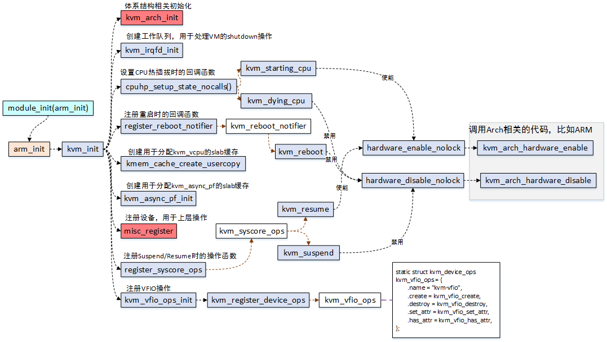

# KVM的初始化

对于kvm的初始化大致分为三部分

1. 宿主机 kvm 模块的初始化
2. 创建一个虚拟机并初始化虚拟机
3. 虚拟机上 os 的初始化

## 初始化kvm模块

kvm作为内核的一个模块会被编译为 .ko 并被加载。



图为 KVM版本：5.9.1 arm 架构。

在 6.0 版本后，初始化这里被拆分为两部分。

1. kvm_init 该函数主要用于通用的初始化
2. kvm_x86_init 则用于对体系结构相关的部分进行初始化

这两个函数都是作为模块在 module_init 中调用。

### kvm_init

在x86架构下会在模块的初始化处理中先调用 vmx_init 并在 vmx_init 中调用继续调用 kvm_init 。

```c
// 
int kvm_init(unsigned vcpu_size, unsigned vcpu_align, struct module *module)
{
	int r;
	int cpu;

#ifdef CONFIG_KVM_GENERIC_HARDWARE_ENABLING
	// 注册 CPU 热插拔状态处理函数（上线和下线操作）
	r = cpuhp_setup_state_nocalls(CPUHP_AP_KVM_ONLINE, "kvm/cpu:online",
				      kvm_online_cpu, kvm_offline_cpu);
	if (r)
		return r;

	// 注册系统核心操作（在休眠和恢复时调用）
	register_syscore_ops(&kvm_syscore_ops);
#endif

	// 如果没有提供特定对齐要求，使用 kvm_vcpu 的对齐要求
	if (!vcpu_align)
		vcpu_align = __alignof__(struct kvm_vcpu);

	// 创建一个内存缓存（kmem_cache），用于分配 kvm_vcpu 对象
	kvm_vcpu_cache =
		kmem_cache_create_usercopy("kvm_vcpu", vcpu_size, vcpu_align,
					   SLAB_ACCOUNT,
					   offsetof(struct kvm_vcpu, arch),
					   offsetofend(struct kvm_vcpu, stats_id)
					   - offsetof(struct kvm_vcpu, arch),
					   NULL);
	if (!kvm_vcpu_cache) {
		// 内存不足时返回错误
		r = -ENOMEM;
		goto err_vcpu_cache;
	}

	// 为每个可能的 CPU 分配一个 kick mask，存储在 per_cpu 数据结构中
	for_each_possible_cpu(cpu) {
		if (!alloc_cpumask_var_node(&per_cpu(cpu_kick_mask, cpu),
					    GFP_KERNEL, cpu_to_node(cpu))) {
			r = -ENOMEM;
			goto err_cpu_kick_mask;
		}
	}

	// 初始化 KVM 的 irqfd 功能，用于管理中断通知
	r = kvm_irqfd_init();
	if (r)
		goto err_irqfd;

	// 初始化异步页面错误处理
	r = kvm_async_pf_init();
	if (r)
		goto err_async_pf;

	// 设置 KVM 的字符设备操作所有者
	kvm_chardev_ops.owner = module;
	kvm_vm_fops.owner = module;
	kvm_vcpu_fops.owner = module;
	kvm_device_fops.owner = module;

	// 设置调度相关的钩子函数
	kvm_preempt_ops.sched_in = kvm_sched_in;
	kvm_preempt_ops.sched_out = kvm_sched_out;

	// 初始化调试相关功能
	kvm_init_debug();

	// 初始化与 VFIO（虚拟功能 I/O）相关的操作
	r = kvm_vfio_ops_init();
	if (WARN_ON_ONCE(r))
		goto err_vfio;

	// 初始化 gmem（用于 KVM 的内存管理）
	kvm_gmem_init(module);

	/*
	 * 注册 /dev/kvm 设备。该步骤必须放在最后，因为它向用户空间暴露了
	 * /dev/kvm 设备，要求所有基础设施已经完全初始化。
	 */
	r = misc_register(&kvm_dev);
	if (r) {
		pr_err("kvm: misc device register failed\n");
		goto err_register;
	}

	return 0;

err_register:
	// 清理 VFIO 操作
	kvm_vfio_ops_exit();
err_vfio:
	// 取消初始化异步页面错误处理
	kvm_async_pf_deinit();
err_async_pf:
	// 清理 irqfd 功能
	kvm_irqfd_exit();
err_irqfd:
err_cpu_kick_mask:
	// 释放每个 CPU 的 kick mask
	for_each_possible_cpu(cpu)
		free_cpumask_var(per_cpu(cpu_kick_mask, cpu));
	// 销毁 vcpu 的内存缓存
	kmem_cache_destroy(kvm_vcpu_cache);
err_vcpu_cache:
#ifdef CONFIG_KVM_GENERIC_HARDWARE_ENABLING
	// 注销系统核心操作并移除 CPU 热插拔状态
	unregister_syscore_ops(&kvm_syscore_ops);
	cpuhp_remove_state_nocalls(CPUHP_AP_KVM_ONLINE);
#endif
	return r;
}
EXPORT_SYMBOL_GPL(kvm_init); // 导出符号，以便其他模块使用
```

**misc_register**


该函数会将 kvm 注册为一个字符设备。

字符设备的注册分为三级，分别代表kvm, vm, vcpu，上层最终使用底层的服务都是通过ioctl函数来操作；

kvm：代表kvm内核模块，可以通过kvm_dev_ioctl来管理kvm版本信息，以及vm的创建等；

vm：虚拟机实例，可以通过kvm_vm_ioctl函数来创建vcpu，设置内存区间，分配中断等；

vcpu：代表虚拟的CPU，可以通过kvm_vcpu_ioctl来启动或暂停CPU的运行，设置vcpu的寄存器等；

以Qemu的使用为例：

打开/dev/kvm设备文件；

ioctl(xx, KVM_CREATE_VM, xx)创建虚拟机对象；

ioctl(xx, KVM_CREATE_VCPU, xx)为虚拟机创建vcpu对象；

ioctl(xx, KVM_RUN, xx)让vcpu运行起来；

### kvm_x86_init

```c
/**
 * kvm_x86_init - 初始化 KVM 模块的 x86 架构支持
 *
 * 该函数会在内核模块加载时调用，用于初始化与 x86 架构相关的 KVM 功能。
 * 使用 `module_init` 宏将该函数注册为模块加载时的入口点。
 *
 * 返回值：
 *  - 始终返回 0，表示初始化成功。
 */
static int __init kvm_x86_init(void)
{
    // 初始化 KVM 的 x86 MMU 子模块
    kvm_mmu_x86_module_init();

    // 如果当前 CPU 存在 SMT（超线程）和 RSB（Return Stack Buffer）漏洞，
    // 并且 CPU 硬件支持 SMT，启用相应的漏洞缓解措施。
    mitigate_smt_rsb &= boot_cpu_has_bug(X86_BUG_SMT_RSB) && cpu_smt_possible();

    return 0; // 返回成功
}
```

## 初始化一个虚拟机

### kvmtool

当输入命令启动 kvmtool 时会更具命令调用一系列的初始化函数：

```c
int init_list__init(struct kvm *kvm)
{
	unsigned int i;
	int r = 0;
	struct init_item *t;

	for (i = 0; i < ARRAY_SIZE(init_lists); i++)
		hlist_for_each_entry(t, &init_lists[i], n) {
			r = t->init(kvm);
			if (r < 0) {
				pr_warning("Failed init: %s\n", t->fn_name);
				goto fail;
			}
		}

fail:
	return r;
}
```

在该函数中会运行所有的kvmtool初始化所需要的函数。

这些初始化函数会以链表的形式被记录在结构体 `init_item` 结构体当中。

使用这样的结构可以在不改动原来的基础上加入新的初始化函数（责任链模式）

```c
struct init_item {
    struct hlist_node n;      // 哈希链表节点，用于将多个 init_item 组织到哈希链表中
    const char *fn_name;      // 指向初始化函数名称的字符串指针，便于调试或日志记录
    int (*init)(struct kvm *); // 函数指针，指向具体的初始化函数，接受一个指向 kvm 结构体的参数
};

```

```c
/**
 * 初始化 KVM（Kernel-based Virtual Machine）虚拟机
 *
 * @param kvm 指向 KVM 结构体的指针
 * @return 成功返回 0，失败返回负值错误代码
 */
int kvm__init(struct kvm *kvm)
{
    int ret;

    // 检查当前 CPU 是否支持虚拟化
    if (!kvm__arch_cpu_supports_vm()) {
        pr_err("Your CPU does not support hardware virtualization");
        ret = -ENOSYS; // -ENOSYS 表示功能未实现
        goto err; // 跳转到错误处理代码
    }

    // 打开 KVM 设备文件（/dev/kvm）
    kvm->sys_fd = open(kvm->cfg.dev, O_RDWR);
    if (kvm->sys_fd < 0) { // 如果打开失败
        if (errno == ENOENT) // 文件不存在
            pr_err("'%s' not found. Please make sure your kernel has CONFIG_KVM "
                   "enabled and that the KVM modules are loaded.", kvm->cfg.dev);
        else if (errno == ENODEV) // 设备不存在
            pr_err("'%s' KVM driver not available.\n  # (If the KVM "
                   "module is loaded then 'dmesg' may offer further clues "
                   "about the failure.)", kvm->cfg.dev);
        else // 其他错误
            pr_err("Could not open %s: ", kvm->cfg.dev);

        ret = -errno; // 保存错误代码
        goto err_free; // 跳转到资源释放部分
    }

    // 检查 KVM API 版本是否匹配
    ret = ioctl(kvm->sys_fd, KVM_GET_API_VERSION, 0);
    if (ret != KVM_API_VERSION) {
        pr_err("KVM_API_VERSION ioctl");
        ret = -errno; // 保存错误代码
        goto err_sys_fd; // 跳转到关闭文件描述符的部分
    }

    // 创建虚拟机
    kvm->vm_fd = ioctl(kvm->sys_fd, KVM_CREATE_VM, kvm__get_vm_type(kvm));
    if (kvm->vm_fd < 0) { // 如果创建失败
        pr_err("KVM_CREATE_VM ioctl");
        ret = kvm->vm_fd; // 保存错误代码
        goto err_sys_fd; // 跳转到关闭文件描述符的部分
    }

    // 检查操作系统是否支持所需的 KVM 扩展
    if (kvm__check_extensions(kvm)) {
        pr_err("A required KVM extension is not supported by OS");
        ret = -ENOSYS; // 功能未实现
        goto err_vm_fd; // 跳转到虚拟机文件描述符关闭部分
    }

    // 初始化架构相关的 KVM 配置
    kvm__arch_init(kvm);

    // 初始化内存区域列表
    INIT_LIST_HEAD(&kvm->mem_banks);
    kvm__init_ram(kvm); // 初始化内存

    // 如果没有指定固件文件名，则加载内核和 initrd 文件
    if (!kvm->cfg.firmware_filename) {
        if (!kvm__load_kernel(kvm, kvm->cfg.kernel_filename,
                              kvm->cfg.initrd_filename, kvm->cfg.real_cmdline)) {
            die("unable to load kernel %s", kvm->cfg.kernel_filename);
        }
    }

    // 如果指定了固件文件名，则加载固件
    if (kvm->cfg.firmware_filename) {
        if (!kvm__load_firmware(kvm, kvm->cfg.firmware_filename)) {
            die("unable to load firmware image %s: %s", kvm->cfg.firmware_filename, strerror(errno));
        }
    } else {
        // 设置架构相关的固件环境
        ret = kvm__arch_setup_firmware(kvm);
        if (ret < 0)
            die("kvm__arch_setup_firmware() failed with error %d\n", ret);
    }

    // 初始化成功
    return 0;

// 以下是错误处理部分
err_vm_fd:
    close(kvm->vm_fd); // 关闭虚拟机文件描述符
err_sys_fd:
    close(kvm->sys_fd); // 关闭系统文件描述符
err_free:
    free(kvm); // 释放 KVM 结构体
err:
    return ret; // 返回错误代码
}

// 注册初始化函数为核心初始化
core_init(kvm__init);
```

虚拟化支持检查：通过 kvm__arch_cpu_supports_vm() 判断当前 CPU 是否支持硬件虚拟化。

设备文件操作：尝试打开 /dev/kvm，以便与内核交互。

API 版本校验：通过 KVM_GET_API_VERSION ioctl 确保用户态和内核的 KVM API 版本匹配。

虚拟机创建：调用 KVM_CREATE_VM ioctl 创建虚拟机。

扩展功能支持检查：验证操作系统是否支持必需的 KVM 扩展。

固件与内核加载：根据配置加载指定的内核或固件。

错误处理：逐步释放资源以防止内存泄漏或句柄泄漏。

### 内核kvm模块

在 kvmtool 或者是 qemu 等虚拟化软件中创建一个虚拟机时会先 open 一个 fd 再使用ioctl函数对底层的 kvm 进行初始化

```c
static struct file_operations kvm_chardev_ops = {
	.unlocked_ioctl = kvm_dev_ioctl,
	.llseek		= noop_llseek,
	KVM_COMPAT(kvm_dev_ioctl),
};
```

在 kvm 对应的 file 操作函数中指定了 unlocked_ioctl 为 kvm_dev_ioctl。这样就可以通过ioctl函数来初始化kvm。

```c
kvm_dev_ioctl - kvm_dev_ioctl_create_vm - kvm_create_vm - 
				kvm_arch_dev_ioctl - 
```

在 kvm_dev_ioctl_create_vm 函数中会创建 dev/kvm-vm 设备用于操作虚拟机的内存。

```c
long kvm_arch_dev_ioctl(struct file *filp,
			unsigned int ioctl, unsigned long arg)
{
	void __user *argp = (void __user *)arg; // 用户传递的参数指针
	long r; // 保存返回值

	switch (ioctl) {
	// 处理 KVM_GET_MSR_INDEX_LIST 请求
	case KVM_GET_MSR_INDEX_LIST: {
		struct kvm_msr_list __user *user_msr_list = argp; // 用户空间的 MSR 列表
		struct kvm_msr_list msr_list; // 内核中的临时 MSR 列表
		unsigned n;

		// 检查并复制用户传递的结构体到内核空间
		r = -EFAULT; // 设置默认错误值
		if (copy_from_user(&msr_list, user_msr_list, sizeof(msr_list)))
			goto out;

		// 设置 MSR 列表的总数（包括保存的和模拟的 MSR）
		n = msr_list.nmsrs; // 保存用户传递的数量
		msr_list.nmsrs = num_msrs_to_save + num_emulated_msrs;

		// 将更新的 MSR 列表信息复制回用户空间
		if (copy_to_user(user_msr_list, &msr_list, sizeof(msr_list)))
			goto out;

		// 如果用户提供的数量不足以容纳所有 MSR 索引，则返回错误
		r = -E2BIG;
		if (n < msr_list.nmsrs)
			goto out;

		// 将 MSR 索引数组复制到用户空间
		r = -EFAULT;
		if (copy_to_user(user_msr_list->indices, &msrs_to_save,
				 num_msrs_to_save * sizeof(u32)))
			goto out;
		if (copy_to_user(user_msr_list->indices + num_msrs_to_save,
				 &emulated_msrs,
				 num_emulated_msrs * sizeof(u32)))
			goto out;

		r = 0; // 成功处理请求
		break;
	}
	// 处理获取支持的 CPUID 请求
	case KVM_GET_SUPPORTED_CPUID:
	case KVM_GET_EMULATED_CPUID: {
		struct kvm_cpuid2 __user *cpuid_arg = argp; // 用户空间的 CPUID 结构
		struct kvm_cpuid2 cpuid; // 内核中的临时 CPUID 结构

		// 从用户空间复制 CPUID 结构到内核
		r = -EFAULT;
		if (copy_from_user(&cpuid, cpuid_arg, sizeof(cpuid)))
			goto out;

		// 获取支持或模拟的 CPUID 信息
		r = kvm_dev_ioctl_get_cpuid(&cpuid, cpuid_arg->entries,
					    ioctl);
		if (r)
			goto out;

		// 将更新后的 CPUID 结构复制回用户空间
		r = -EFAULT;
		if (copy_to_user(cpuid_arg, &cpuid, sizeof(cpuid)))
			goto out;

		r = 0; // 成功处理请求
		break;
	}
	// 处理获取支持的机器检查异常（MCE）能力请求
	case KVM_X86_GET_MCE_CAP_SUPPORTED:
		r = -EFAULT;
		if (copy_to_user(argp, &kvm_caps.supported_mce_cap,
				 sizeof(kvm_caps.supported_mce_cap)))
			goto out;
		r = 0; // 成功处理请求
		break;
	// 处理获取 MSR 特性索引列表请求
	case KVM_GET_MSR_FEATURE_INDEX_LIST: {
		struct kvm_msr_list __user *user_msr_list = argp;
		struct kvm_msr_list msr_list;
		unsigned int n;

		r = -EFAULT;
		if (copy_from_user(&msr_list, user_msr_list, sizeof(msr_list)))
			goto out;

		// 设置特性列表的数量
		n = msr_list.nmsrs;
		msr_list.nmsrs = num_msr_based_features;

		if (copy_to_user(user_msr_list, &msr_list, sizeof(msr_list)))
			goto out;

		// 如果用户提供的数量不足，返回错误
		r = -E2BIG;
		if (n < msr_list.nmsrs)
			goto out;

		// 将特性索引数组复制到用户空间
		r = -EFAULT;
		if (copy_to_user(user_msr_list->indices, &msr_based_features,
				 num_msr_based_features * sizeof(u32)))
			goto out;

		r = 0; // 成功处理请求
		break;
	}
	// 处理获取 MSR 请求
	case KVM_GET_MSRS:
		// 通过通用函数处理 MSR 的读取操作
		r = msr_io(NULL, argp, do_get_msr_feature, 1);
		break;
#ifdef CONFIG_KVM_HYPERV
	// 处理获取支持的 Hyper-V CPUID 请求
	case KVM_GET_SUPPORTED_HV_CPUID:
		r = kvm_ioctl_get_supported_hv_cpuid(NULL, argp);
		break;
#endif
	// 处理获取设备属性请求
	case KVM_GET_DEVICE_ATTR: {
		struct kvm_device_attr attr;

		r = -EFAULT;
		if (copy_from_user(&attr, (void __user *)arg, sizeof(attr)))
			break;

		// 获取设备属性
		r = kvm_x86_dev_get_attr(&attr);
		break;
	}
	// 处理检查设备属性是否存在请求
	case KVM_HAS_DEVICE_ATTR: {
		struct kvm_device_attr attr;

		r = -EFAULT;
		if (copy_from_user(&attr, (void __user *)arg, sizeof(attr)))
			break;

		// 检查设备是否支持某个属性
		r = kvm_x86_dev_has_attr(&attr);
		break;
	}
	// 默认情况返回无效请求
	default:
		r = -EINVAL;
		break;
	}
out:
	// 返回处理结果
	return r;
}

```

```c
static struct kvm *kvm_create_vm(unsigned long type, const char *fdname)
{
	// 分配并初始化 KVM 虚拟机的架构相关数据结构
	struct kvm *kvm = kvm_arch_alloc_vm();
	struct kvm_memslots *slots;
	int r = -ENOMEM;
	int i, j;

	// 如果分配失败，返回错误指针
	if (!kvm)
		return ERR_PTR(-ENOMEM);

	// 初始化 KVM 数据结构的锁和相关组件
	KVM_MMU_LOCK_INIT(kvm); // 初始化 MMU 锁
	mmgrab(current->mm); // 增加当前进程的内存描述符的引用计数
	kvm->mm = current->mm; // 绑定当前进程的内存描述符到 KVM 虚拟机
	kvm_eventfd_init(kvm); // 初始化事件通知机制
	mutex_init(&kvm->lock); // 初始化 KVM 主锁
	mutex_init(&kvm->irq_lock); // 初始化 IRQ 锁
	mutex_init(&kvm->slots_lock); // 初始化内存槽锁
	mutex_init(&kvm->slots_arch_lock); // 初始化架构相关内存槽锁
	spin_lock_init(&kvm->mn_invalidate_lock); // 初始化内存槽无效化锁
	rcuwait_init(&kvm->mn_memslots_update_rcuwait); // 初始化 RCU 等待机制
	xa_init(&kvm->vcpu_array); // 初始化虚拟 CPU 数组
#ifdef CONFIG_KVM_GENERIC_MEMORY_ATTRIBUTES
	xa_init(&kvm->mem_attr_array); // 初始化内存属性数组
#endif

	// 初始化通用保护组件列表
	INIT_LIST_HEAD(&kvm->gpc_list);
	spin_lock_init(&kvm->gpc_lock);

	// 初始化设备列表和最大虚拟 CPU 数量
	INIT_LIST_HEAD(&kvm->devices);
	kvm->max_vcpus = KVM_MAX_VCPUS;

	// 检查内存槽数量是否超过允许范围
	BUILD_BUG_ON(KVM_MEM_SLOTS_NUM > SHRT_MAX);

	// 设置 debugfs 的默认状态为失败
	kvm->debugfs_dentry = ERR_PTR(-ENOENT);

	// 设置虚拟机的统计信息 ID
	snprintf(kvm->stats_id, sizeof(kvm->stats_id), "kvm-%d",
		 task_pid_nr(current));

	// 初始化 SRCU 结构
	if (init_srcu_struct(&kvm->srcu))
		goto out_err_no_srcu;
	if (init_srcu_struct(&kvm->irq_srcu))
		goto out_err_no_irq_srcu;

	// 初始化用户引用计数
	refcount_set(&kvm->users_count, 1);

	// 初始化 KVM 内存槽
	for (i = 0; i < kvm_arch_nr_memslot_as_ids(kvm); i++) {
		for (j = 0; j < 2; j++) { // 初始化主和备内存槽
			slots = &kvm->__memslots[i][j];

			atomic_long_set(&slots->last_used_slot, (unsigned long)NULL); // 设置最后使用的内存槽
			slots->hva_tree = RB_ROOT_CACHED; // 初始化 hva 红黑树
			slots->gfn_tree = RB_ROOT; // 初始化 gfn 红黑树
			hash_init(slots->id_hash); // 初始化 ID 哈希表
			slots->node_idx = j; // 设置内存槽节点索引

			// 为每个地址空间设置不同的 generation 值
			slots->generation = i;
		}

		// 将内存槽指针分配给 RCU 结构
		rcu_assign_pointer(kvm->memslots[i], &kvm->__memslots[i][0]);
	}

	// 初始化 KVM 总线
	for (i = 0; i < KVM_NR_BUSES; i++) {
		rcu_assign_pointer(kvm->buses[i],
			kzalloc(sizeof(struct kvm_io_bus), GFP_KERNEL_ACCOUNT));
		if (!kvm->buses[i])
			goto out_err_no_arch_destroy_vm;
	}

	// 初始化架构相关的虚拟机
	r = kvm_arch_init_vm(kvm, type);
	if (r)
		goto out_err_no_arch_destroy_vm;

	// 启用硬件支持
	r = hardware_enable_all();
	if (r)
		goto out_err_no_disable;

#ifdef CONFIG_HAVE_KVM_IRQCHIP
	INIT_HLIST_HEAD(&kvm->irq_ack_notifier_list); // 初始化 IRQ 通知列表
#endif

	// 初始化 MMU 通知器
	r = kvm_init_mmu_notifier(kvm);
	if (r)
		goto out_err_no_mmu_notifier;

	// 初始化合并的 MMIO 机制
	r = kvm_coalesced_mmio_init(kvm);
	if (r < 0)
		goto out_no_coalesced_mmio;

	// 创建虚拟机的 debugfs 条目
	r = kvm_create_vm_debugfs(kvm, fdname);
	if (r)
		goto out_err_no_debugfs;

	// 执行架构相关的后期初始化
	r = kvm_arch_post_init_vm(kvm);
	if (r)
		goto out_err;

	// 将虚拟机添加到全局虚拟机列表
	mutex_lock(&kvm_lock);
	list_add(&kvm->vm_list, &vm_list);
	mutex_unlock(&kvm_lock);

	// 增加抢占通知器计数
	preempt_notifier_inc();
	kvm_init_pm_notifier(kvm); // 初始化电源管理通知器

	return kvm; // 返回初始化成功的虚拟机

// 错误处理路径
out_err:
	kvm_destroy_vm_debugfs(kvm);
out_err_no_debugfs:
	kvm_coalesced_mmio_free(kvm);
out_no_coalesced_mmio:
#ifdef CONFIG_KVM_GENERIC_MMU_NOTIFIER
	if (kvm->mmu_notifier.ops)
		mmu_notifier_unregister(&kvm->mmu_notifier, current->mm);
#endif
out_err_no_mmu_notifier:
	hardware_disable_all();
out_err_no_disable:
	kvm_arch_destroy_vm(kvm);
out_err_no_arch_destroy_vm:
	WARN_ON_ONCE(!refcount_dec_and_test(&kvm->users_count));
	for (i = 0; i < KVM_NR_BUSES; i++)
		kfree(kvm_get_bus(kvm, i));
	cleanup_srcu_struct(&kvm->irq_srcu);
out_err_no_irq_srcu:
	cleanup_srcu_struct(&kvm->srcu);
out_err_no_srcu:
	kvm_arch_free_vm(kvm);
	mmdrop(current->mm); // 减少内存描述符的引用计数
	return ERR_PTR(r); // 返回错误指针
}

```

## 初始化一个虚拟机上的操作系统

宿主机上的操作系统：负责提供虚拟化支持，运行 Hypervisor（如 KVM 模块），直接控制硬件。
虚拟机上的操作系统：通过 para-virtualization 或硬件虚拟化接口与宿主机交互，运行代码如 init_hypervisor_platform 来初始化这些接口。

### 初始化过程

在操作系统启动期间，detect_hypervisor_vendor 和 init_hypervisor_platform 会被调用。这两个函数用来检测当前的 kernel 是否运行在虚拟化平台上。

```c
kernel_start setup_arch init_hypervisor_platform detect_hypervisor_vendor
```

这部分代码通常是在 Linux 内核初始化阶段执行，用于判断宿主机提供的虚拟化平台（KVM、Xen、VMware 等），并加载相应的支持功能。

如果没有找到匹配的虚拟化平台，就可能是系统运行在物理机上（或是某种不支持的虚拟化环境）。

而有没有 hypervisor_x86 有几个则是在内核的编译阶段就已经确定的。

```c
void __init init_hypervisor_platform(void)
{
	const struct hypervisor_x86 *h;

	h = detect_hypervisor_vendor();

	if (!h)
		return;

	copy_array(&h->init, &x86_init.hyper, sizeof(h->init));
	copy_array(&h->runtime, &x86_platform.hyper, sizeof(h->runtime));

	x86_hyper_type = h->type;
	x86_init.hyper.init_platform();
}

//用于判断 “系统是否运行在虚拟机中”
static inline const struct hypervisor_x86 * __init
detect_hypervisor_vendor(void)
{
	const struct hypervisor_x86 *h = NULL, * const *p;
	uint32_t pri, max_pri = 0;

	for (p = hypervisors; p < hypervisors + ARRAY_SIZE(hypervisors); p++) {
		if (unlikely(nopv) && !(*p)->ignore_nopv)
			continue;

		pri = (*p)->detect();
		if (pri > max_pri) {
			max_pri = pri;
			h = *p;
		}
	}

	if (h)
		pr_info("Hypervisor detected: %s\n", h->name);

	return h;
}
```

### hypervisor_x86 结构体

在 Linux 内核被编译时会根据 kconfig 文件中传入的对虚拟化平台的选择配置对结构体进行初始化。

```c
static const __initconst struct hypervisor_x86 * const hypervisors[] =
{
#ifdef CONFIG_XEN_PV
	&x86_hyper_xen_pv,
#endif
#ifdef CONFIG_XEN_PVHVM
	&x86_hyper_xen_hvm,
#endif
	&x86_hyper_vmware,
	&x86_hyper_ms_hyperv,
#ifdef CONFIG_KVM_GUEST
	&x86_hyper_kvm,
#endif
#ifdef CONFIG_JAILHOUSE_GUEST
	&x86_hyper_jailhouse,
#endif
#ifdef CONFIG_ACRN_GUEST
	&x86_hyper_acrn,
#endif
};
```

hypervisor_x86结构体定义如下：

```c
// 定义一个结构体 `hypervisor_x86`，用于描述 x86 架构上的虚拟化环境。
// 该结构体包含了虚拟化平台的基本信息、初始化过程、运行时回调和其他相关的配置。
struct hypervisor_x86 {
	/* 虚拟化平台的名称 */
	const char *name;

	/* 用于检测虚拟化环境是否存在的检测函数 */
	uint32_t (*detect)(void);

	/* 虚拟化平台的类型，用于标识具体的虚拟化技术，如 KVM、Xen 等 */
	enum x86_hypervisor_type type;

	/* 虚拟化平台初始化过程中的回调函数集合 */
	struct x86_hyper_init init;

	/* 运行时的回调函数集合，用于处理虚拟化环境在运行时的特性 */
	struct x86_hyper_runtime runtime;

	/* 是否忽略 NOPV（No PV，表示是否不使用 Paravirtualization）参数的标志 */
	bool ignore_nopv;
};
```

1. **`name`**：
   - **类型**：`const char *`
   - **说明**：表示虚拟化平台的名称。这个字段用于标识虚拟化平台，如 "KVM" 或 "Xen"。

2. **`detect`**：
   - **类型**：`uint32_t (*detect)(void)`
   - **说明**：这是一个函数指针，用于检测是否存在该虚拟化平台。`detect` 函数会返回一个 `uint32_t` 类型的值，通常用于指示虚拟化环境是否已经启用或支持。

3. **`type`**：
   - **类型**：`enum x86_hypervisor_type`
   - **说明**：表示虚拟化平台的类型。`enum x86_hypervisor_type` 是一个枚举类型，用于描述不同的虚拟化平台类型。例如，KVM、Xen 等，可能会有不同的类型值。

4. **`init`**：
   - **类型**：`struct x86_hyper_init`
   - **说明**：这是一个结构体，包含了虚拟化平台初始化时需要调用的回调函数集合。它可能包括多个函数指针，用于处理虚拟化平台的初始化操作，如创建虚拟机、检测硬件支持等。

5. **`runtime`**：
   - **类型**：`struct x86_hyper_runtime`
   - **说明**：这是一个结构体，包含了虚拟化平台在运行时的回调函数集合。它提供了虚拟化平台运行时需要的功能，如执行特定的硬件操作、管理虚拟机的执行等。

6. **`ignore_nopv`**：
   - **类型**：`bool`
   - **说明**：这是一个布尔值，表示是否应该忽略 NOPV（No Paravirtualization）参数。NOPV 通常用于控制是否启用或禁用 **ParaVirtualization**（一种虚拟化技术），它允许虚拟机与宿主机之间有更多的交互。如果设置为 `true`，则忽略该参数。

对于kvm来说会被注册为：

```c
// 定义并初始化一个静态常量结构体 `x86_hyper_kvm`，该结构体描述了 KVM 虚拟化环境在 x86 架构上的具体实现
const __initconst struct hypervisor_x86 x86_hyper_kvm = {
	// 设置虚拟化技术的名称
	.name = "KVM",

	// 设置用于检测宿主机是否支持 KVM 的函数指针
	.detect = kvm_detect,

	// 设置虚拟化类型为 KVM 对应的类型标识
	.type = X86_HYPER_KVM,

	// 初始化函数指针：客户机启动后期的初始化操作
	.init.guest_late_init = kvm_guest_init,

	// 初始化函数指针：检查客户机是否支持 x2APIC（高级的 APIC）
	.init.x2apic_available = kvm_para_available,

	// 初始化函数指针：检查客户机是否支持扩展的 MSI 目标标识符
	.init.msi_ext_dest_id = kvm_msi_ext_dest_id,

	// 初始化函数指针：平台初始化时的 KVM 设置
	.init.init_platform = kvm_init_platform,

	// 条件编译块：如果启用了 `AMD_MEM_ENCRYPT`（即支持 AMD 的内存加密功能），则初始化这些与 SEV 相关的 Hypercall
#if defined(CONFIG_AMD_MEM_ENCRYPT)
	.runtime.sev_es_hcall_prepare = kvm_sev_es_hcall_prepare,  // 准备 SEV-ES 的 Hypercall
	.runtime.sev_es_hcall_finish = kvm_sev_es_hcall_finish,    // 完成 SEV-ES 的 Hypercall
#endif
};
```

当在函数 init_hypervisor_platform 检测到有 x86_hyper_kvm 就会调用注册好的初始化函数。
