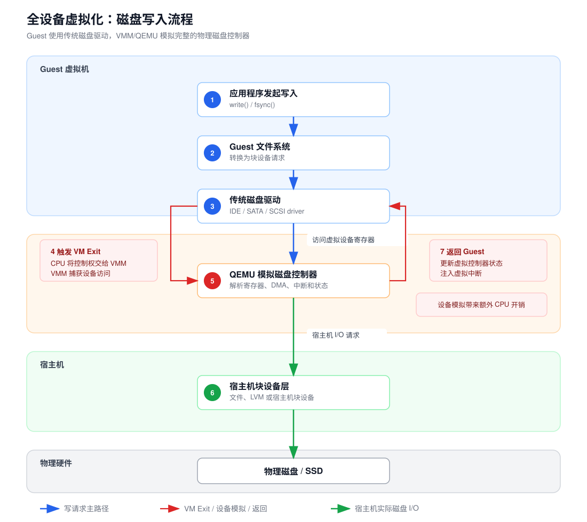
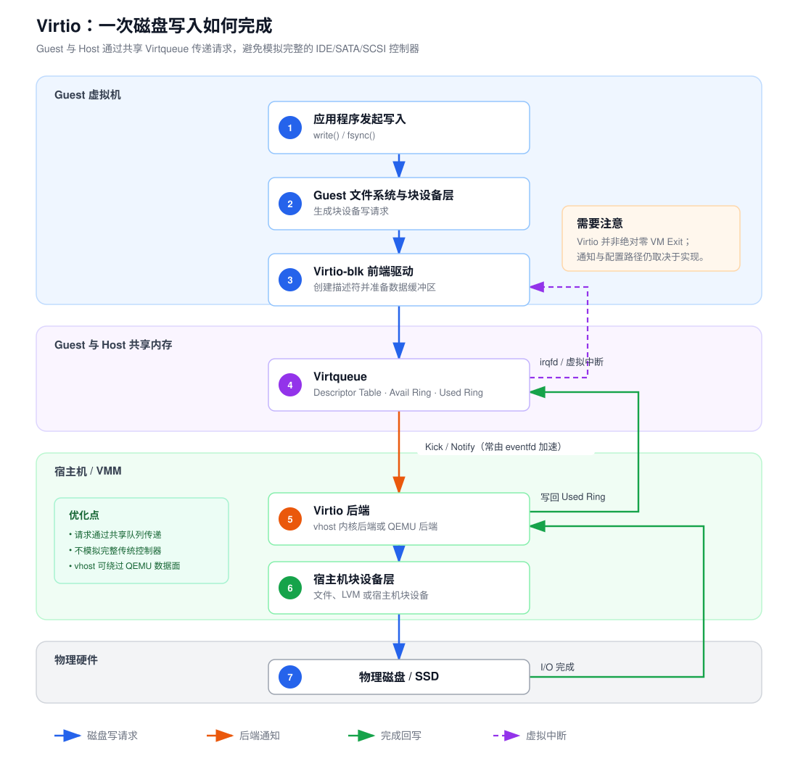

# vritio

Virtio 是一种虚拟化标准，用于提高虚拟化环境中I/O设备的性能。它通过半虚拟化技术，让客户机和宿主机之间的通信更高效。常见的应用包括网络、存储和图形设备。

​前端驱动（Guest Driver）​：安装在客户机中，直接与应用程序交互。
​后端驱动（Host Backend）​：宿主机中实现，处理前端驱动的请求（如 QEMU 模拟）。
​Virtio 环（Virtqueue）​：共享内存环形缓冲区，用于高效传输数据和控制信息。

## 为什么需要 ​Virtio

为什么需要 Virtio ？这里以访问磁盘为例举例说明。

### 全虚拟化

磁盘写入：

1. Guest 应用通过 `write()` 写入文件，Guest 文件系统将请求转换为块设备请求；
2. Guest OS 中的传统 IDE/SATA/SCSI 驱动准备好请求描述符，并通过访问虚拟磁盘控制器的寄存器通知设备；
3. 由于这是对虚拟硬件寄存器的访问，CPU 触发 VM Exit，由 KVM 接管；
4. KVM 将 VM Exit 原因返回给 QEMU，QEMU 识别出这是虚拟磁盘控制器的寄存器访问，并模拟 IDE/SATA/SCSI 控制器的行为；
5. QEMU 读取 Guest 内存中的数据，将其转换为宿主机的文件或块设备 I/O 请求，并提交给宿主机存储层；
6. 宿主机完成磁盘写入后，QEMU 更新虚拟控制器的状态和描述符，并通过虚拟中断通知 Guest；
7. KVM 再次执行 VM Entry，Guest OS 恢复执行并在中断处理程序中确认写入完成；

因此，一次普通的全虚拟化磁盘访问通常包含一次 Guest → VMM 的 VM Exit 和一次 VMM → Guest 的 VM Entry。这里的“前后端切换”不严格等同于操作系统进程之间的上下文切换。

### 半虚拟化

从图中的流程可以看出，在全虚拟化磁盘访问中，Guest 需要通过传统磁盘控制器寄存器提交请求。该访问会触发 VM Exit，KVM 再将退出原因交给 QEMU，由 QEMU 模拟磁盘控制器并执行宿主机 I/O，完成后再通过虚拟中断通知 Guest。

引入 Virtio 后，Virtio 前端驱动直接运行在 Guest 内核中。Guest 将磁盘请求描述符和数据放入共享的 Virtqueue，而不是逐次访问复杂的 IDE/SATA 控制器寄存器。宿主机的 Virtio 后端读取 Virtqueue 中的请求并执行磁盘 I/O。

在使用 `eventfd`、`irqfd`、`vhost` 等优化机制时，普通数据路径可以减少甚至绕过 QEMU 用户态参与，因而减少 Guest 与 VMM 之间的 VM Exit/VM Entry 切换。不过，Virtio 并不意味着任何实现下都绝对没有 VM Exit；通知后端、设备配置或未启用相关优化时，仍可能发生 VM Exit。

https://blog.csdn.net/qq_41596356/article/details/128248214

## ​Virtio 的核心机制

Virtio Device、Virtio Driver、Virtqueue和Notification（eventfd/irqfd）是虚拟化环境中Virtio架构的关键组件，它们共同作用以实现高效的I/O虚拟化。以下是对这四个组件的详细解释：

**Virtio Device（虚拟设备）**

- 作用：Virtio Device是虚拟机（Guest OS）中模拟的虚拟设备，如网卡、块设备等。它们通过Virtio接口与宿主机（Host）进行通信，提供虚拟化环境中的I/O功能。
- 特点：Virtio Device通过半虚拟化技术，允许Guest OS直接与宿主机的设备驱动程序交互，从而提高I/O性能。

**Virtio Driver（虚拟设备驱动）**

- 作用：Virtio Driver是安装在Guest OS内核中的驱动程序，用于管理Virtio Device。它负责处理I/O请求，并与宿主机的Virtio后端驱动程序进行通信。
- 特点：Virtio Driver通过Virtio接口与宿主机的后端驱动程序进行交互，实现高效的数据传输。它需要Guest OS的支持，并且通常在制作虚拟机镜像时预装。

**Virtqueue（虚拟队列）**

- 作用：Virtqueue是Virtio架构中用于前后端通信的机制，它允许Guest OS和宿主机之间高效地传输数据。每个Virtio Device可以配置一个或多个Virtqueue。
- 特点：Virtqueue使用环形缓冲区（Ring Buffer）来存储描述符和数据，支持批量处理I/O请求，减少上下文切换和内存拷贝，提高I/O性能。

**Notification（事件通知，如eventfd/irqfd）**

- 作用：Notification机制用于在Virtio Device和Virtio Driver之间传递事件通知，如数据可用或设备状态变化。常见的实现方式包括eventfd和irqfd。
- 特点：
  - eventfd：用于进程间或用户态与内核态之间的事件通知，通过文件描述符进行通信。它适用于轻量级的事件通知，但不能传递复杂的数据内容。
  - irqfd：用于向Guest OS注入中断，实现中断虚拟化。它将eventfd与全局中断号关联，当向eventfd写入数据时，触发对应的中断。
