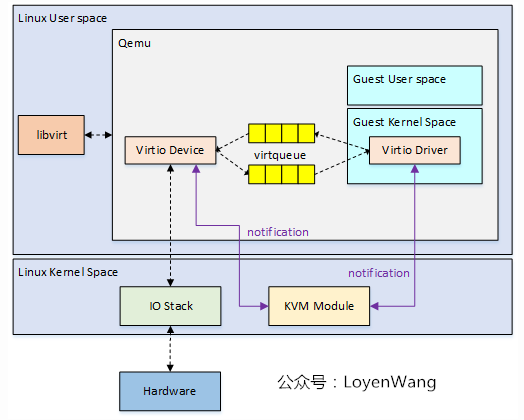

# vritio

Virtio 是一种虚拟化标准，用于提高虚拟化环境中I/O设备的性能。它通过半虚拟化技术，让客户机和宿主机之间的通信更高效。常见的应用包括网络、存储和图形设备。

​前端驱动（Guest Driver）​：安装在客户机中，直接与应用程序交互。
​后端驱动（Host Backend）​：宿主机中实现，处理前端驱动的请求（如 QEMU 模拟）。
​Virtio 环（Virtqueue）​：共享内存环形缓冲区，用于高效传输数据和控制信息。

为什么需要 Virtio ？这里以网络收包为例举例说明。

## 全虚拟化

发送：

1. Guest OS在准备好网络包数据以及描述符资源后，通过写TDT寄存器，触发VM的异常退出，由KVM模块接管；
2. KVM模块返回到Qemu后，Qemu会检查VM退出的原因，比如检查到e1000寄存器访问出错，因而触发e1000前端工作；
3. Qemu能访问Guest OS中的地址内容，因而e1000前端能获取到Guest OS内存中的网络包数据，发送给后端，后端再将网络包数据发送给TUN/TAP驱动，其中TUN/TAP为虚拟网络设备；
4. 数据发送完成后，除了更新ring-buffer的指针及描述符状态信息外，KVM模块会模拟TX中断；
5. 当再次进入VM时，Guest OS看到的是数据已经发送完毕，同时还需要进行中断处理；
6. Guest OS跑在vCPU线程中，发送数据时相当于会打断它的执行，直到处理完后再恢复回来，也就是一个严格的同步处理过程；

这里的e1000前端相当于是

## 设备的半虚拟化

从图中的流程可以看出，原先虚拟机准备好数据之后需要先通过中断退出到宿主机的内核态，再由内核态的kvm向qemu返回虚拟机退出的原因，在由qemu找到虚拟机退出的原因，最后才能执行设备的前端驱动来模拟网卡。

但是在引入了 vritio 之后，前端驱动在虚拟机的内核中实现。这样就能减少一次虚拟机到客户机的切换（中断上下文切换）

在 vritio 前端将数据准备好放入到 vritio_queue 后虚拟机通过kvm向qemu发送通知表示已将数据准备好。

https://blog.csdn.net/qq_41596356/article/details/128248214

Virtio Device、Virtio Driver、Virtqueue和Notification（eventfd/irqfd）是虚拟化环境中Virtio架构的关键组件，它们共同作用以实现高效的I/O虚拟化。以下是对这四个组件的详细解释：

**Virtio Device（虚拟设备）**

- 作用：Virtio Device是虚拟机（Guest OS）中模拟的虚拟设备，如网卡、块设备等。它们通过Virtio接口与宿主机（Host）进行通信，提供虚拟化环境中的I/O功能。
- 特点：Virtio Device通过半虚拟化技术，允许Guest OS直接与宿主机的设备驱动程序交互，从而提高I/O性能。

**Virtio Driver（虚拟设备驱动）**

- 作用：Virtio Driver是安装在Guest OS内核中的驱动程序，用于管理Virtio Device。它负责处理I/O请求，并与宿主机的Virtio后端驱动程序进行通信。
- 特点：Virtio Driver通过Virtio接口与宿主机的后端驱动程序进行交互，实现高效的数据传输。它需要Guest OS的支持，并且通常在制作虚拟机镜像时预装。

**Virtqueue（虚拟队列）**

- 作用：Virtqueue是Virtio架构中用于前后端通信的机制，它允许Guest OS和宿主机之间高效地传输数据。每个Virtio Device可以配置一个或多个Virtqueue。
- 特点：Virtqueue使用环形缓冲区（Ring Buffer）来存储描述符和数据，支持批量处理I/O请求，减少上下文切换和内存拷贝，提高I/O性能。

**Notification（事件通知，如eventfd/irqfd）**

- 作用：Notification机制用于在Virtio Device和Virtio Driver之间传递事件通知，如数据可用或设备状态变化。常见的实现方式包括eventfd和irqfd。
- 特点：
  - eventfd：用于进程间或用户态与内核态之间的事件通知，通过文件描述符进行通信。它适用于轻量级的事件通知，但不能传递复杂的数据内容。
  - irqfd：用于向Guest OS注入中断，实现中断虚拟化。它将eventfd与全局中断号关联，当向eventfd写入数据时，触发对应的中断。