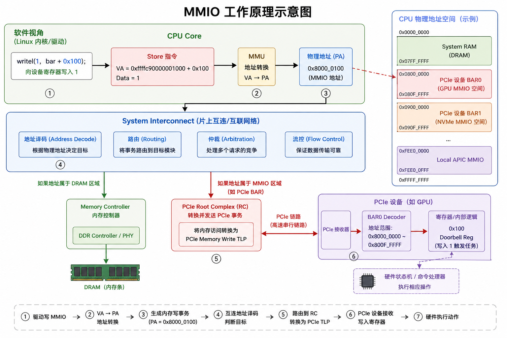
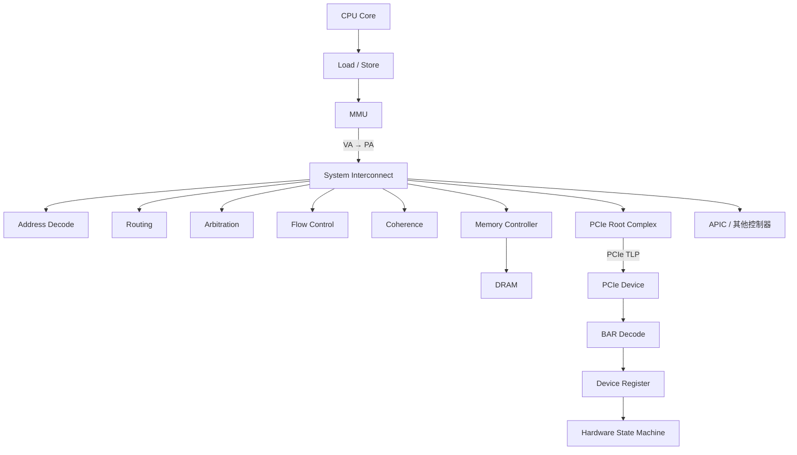
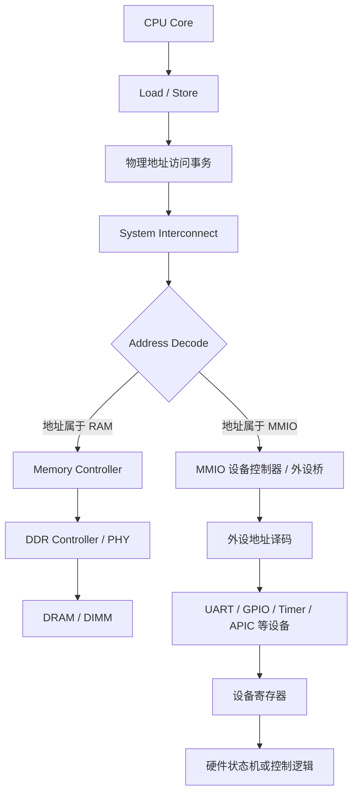

# MMIO




## MMIO 是什么

MMIO，全称 Memory-Mapped I/O，即“内存映射 I/O”。

它的核心思想是：把设备寄存器放入 CPU 的物理地址空间中，使 CPU 可以像访问普通内存一样，通过 Load/Store 指令访问硬件设备。

它的出现，本质上是为了让 CPU 能以统一、可扩展的方式访问各种硬件设备。

早期 x86 常通过独立的 I/O Port 空间和 IN/OUT 指令访问外设，但这种方式地址空间有限、软件模型独立、扩展性较差；MMIO 则把设备寄存器纳入 CPU 的统一物理地址空间，使 CPU 可以直接使用普通的 Load/Store 指令访问设备，并复用 MMU、页表、权限控制和系统互连等机制。

现代系统中，CPU 发起对某个物理地址的访问后，System Interconnect 根据地址进行译码：如果属于 RAM，就转发到 Memory Controller；如果属于设备的 MMIO 区域，例如 PCIe BAR，就转发到 PCIe Root Complex，再由设备解析到具体寄存器。因此，MMIO 的核心思想就是把“访问设备”统一成“访问地址”，从而实现 CPU 与 GPU、NIC、NVMe、APIC 等设备之间高效且通用的控制通信。

## MMIO的工作机制

在 MMIO 把硬件映射到内存中时指的并不是把硬件寄存器复制到 DRAM 中，也不是 CPU 先将数据写入内存，再由内存把数据传给设备。

而是：

MMIO 只是给硬件设备分配了一段 CPU 可见的物理地址。当 CPU 访问这段地址时，硬件互连系统会根据地址判断目标并不是 DRAM，而是某个设备，然后直接把访问事务发送给对应设备。

因此，MMIO 本质上是一种统一地址空间的设备访问机制。

这里我们需要是区分两个概念：

* CPU Physical Address Space
* DRAM Physical Memory

CPU 的物理地址空间通常远大于真正安装的 DRAM。

例如，一个系统的物理地址空间可以抽象成：

```text
CPU Physical Address Space
0x0000000000
    │
    │ System RAM
    │
0x07FFFFFFFF
────────────────────────────
0x0800000000
    │
    │ PCIe MMIO / GPU BAR
    │
0x080FFFFFFF
────────────────────────────
0x0900000000
    │
    │ NVMe BAR
    │
0x09000FFFFF
────────────────────────────
0xFEE00000
    │
    │ Local APIC MMIO
    │
────────────────────────────
```

其中：x0800000000虽然是一个 CPU 物理地址，但在实际的内存条上并没有一个 0x0800000000 对应的存储单元，它只是 CPU 整个物理地址空间中的一个“地址编号”。

该地址最终对应 DRAM 还是设备，由硬件地址译码系统决定。

因此：

Physical Address ≠ DRAM Address。

上面所说的每一段地址以及其对应的作用，会在内核启动时会通过固件传参的形式获得系统物理地址布局以及这一片地址的作用。

从硬件角度看：

```text
RAM 地址
    ↓
Memory Controller
    ↓
DRAM
MMIO 地址
    ↓
PCIe Root Complex / APIC / 其他控制器
```

因此 Reserved/MMIO 更准确的理解应该是：

这些地址会作为保留地址，保留给其他硬件模块，这里些地址不会参与后续的内存子系统的对于伙伴系统等等一系列的初始化与分配。

## MMIO 寄存器的本质

MMIO 访问的寄存器不是 DRAM 中的一块存储空间，而是设备内部由 Flip-Flop、Latch、计数器或硬件状态机等电路实现的控制接口。寄存器中的每个 bit 通常都对应某种硬件状态或控制功能，例如：

```text
bit0 = ENABLE
bit1 = RESET
bit2 = INTERRUPT_ENABLE
```

当 CPU 执行一次 MMIO 写入时，写入的值可能会直接改变这些硬件控制信号：

```text
MMIO Write: value = 1
       ↓
ENABLE = 1
       ↓
硬件状态机启动
```

因此，MMIO 写入的本质通常不是“保存一个数据”，而是修改设备内部状态或触发硬件行为。常见寄存器包括：

- **控制寄存器**：改变设备配置或工作状态；
- **状态寄存器**：反映当前硬件状态，某些 bit 可能在读取后清除；
- **命令寄存器**：写入特定值后触发一次操作；
- **Doorbell 寄存器**：写入本身不保存数据，而是通知设备有新任务需要处理；
- **FIFO 或数据寄存器**：读写动作可能对应数据的入队或出队。

例如，驱动向 Doorbell 寄存器写入一个值，设备可能据此启动 DMA、读取命令队列或推进硬件状态机。驱动必须按照设备手册规定的寄存器偏移、访问宽度、读写顺序和内存屏障要求进行访问。

设备寄存器通常以物理地址暴露给系统，而 Linux 内核代码通常使用虚拟地址。因此，驱动需要先通过 `ioremap()` 将设备的 MMIO 物理地址映射到内核虚拟地址空间：

```text
Kernel Virtual Address
        ↓
       MMU / Page Table
        ↓
MMIO Physical Address
```

例如：

```text
Kernel VA = 0xffffc90000001000
       ↓
MMIO PA   = 0x800000000
```

完成映射后，驱动可以使用内核提供的 MMIO 访问函数：

```c
writel(value, va + 0x100);
```

CPU 执行这条访问时，处理过程可以概括为：

```text
va + 0x100
    ↓
MMU: VA → PA
    ↓
MMIO Physical Address
    ↓
System Interconnect 地址译码
    ↓
设备控制器 / 外设桥
    ↓
设备寄存器
```

这里需要区分两个不同的映射过程：

1. `ioremap()` 和页表负责建立 **Kernel Virtual Address → MMIO Physical Address** 的映射；
2. 系统硬件中的地址译码和 Interconnect 负责将 **MMIO Physical Address → 具体设备或寄存器**。

前者由操作系统和 MMU 管理，后者由 SoC、总线控制器、设备地址窗口和硬件译码逻辑共同完成。

## 运行过程



### CPU 发送访存的指令

假设某个 GPU BAR 被分配为：BAR0 = 0x800000000

其中：Offset 0x100 = Doorbell Register

Linux 驱动可能执行：

```c
writel(1, bar + 0x100);
```

从 CPU 的角度来看，它最终执行的仍然只是一条访存指令。从 CPU core 的角度来看，它并不会感知这个指令到底是去内存条上取出数据，还是要和

可以抽象成：

```text 
Store Transaction
Address = 0x800000100
Data    = 1
Size    = 4 Bytes
```

CPU 在这里并不感知这条访存指令最终访问到的到底是真正的物理内存条，还是访问其他寄存器或者设备空间。这里 CPU 对某个物理地址发起一次访问事务。至于这个访问应该送给谁，是后面的硬件互连系统决定的。

### MMIO 访问分流

MMIO 的访问分离依赖于硬件 System Interconnect（系统片上互连）。

System Interconnect是 CPU 或 SoC 内部连接各个功能模块的硬件通信网络。它连接 CPU Core、Cache、Memory Controller、PCIe Root Complex、IOMMU 以及其他控制器，负责在这些模块之间传递访问事务。

它不是一根简单的总线，也不只是某一种协议，而是由链路、Router/Switch、地址译码、仲裁、流控、一致性和内部事务协议等部分组成的硬件基础设施。早期处理器可能使用共享 Bus，现代处理器则更多采用 Crossbar、Ring、Mesh、NoC 或 Fabric 等结构。

在理解 MMIO 时，可以把 Interconnect 简化看成一个硬件地址路由器。CPU 发起 Load/Store 时，会产生包含物理地址、数据和访问大小的访问事务，例如：

```text
Address = 0x800000100
Data    = 1
Size    = 4 Bytes
```

Interconnect 根据物理地址进行 Address Decode，将事务转发到对应的硬件目标。这个地址译码通常由地址比较器、配置寄存器、地址窗口和分布式路由逻辑共同完成，并不一定对应一张软件意义上的路由表。

普通内存访问和 MMIO 访问在 CPU 侧的起点是相同的，都是 Load/Store 加物理地址。二者的区别发生在 Interconnect 的地址译码和路由阶段：



对于普通内存访问，Interconnect 将事务送往 Memory Controller，最终访问 DRAM；对于 MMIO 访问，Interconnect 将事务送往片上外设控制器、总线桥或其他设备控制器，最终访问设备寄存器或控制状态机。

因此，CPU 通常不需要使用一套专门的“MMIO 指令”。从 CPU Core 的角度看，`writel(1, device_base + 0x100)` 仍然是一次 Store 操作；真正决定它访问内存还是设备的，是物理地址所属的地址窗口以及 Interconnect 的硬件路由结果。

可以将整个过程概括为：

```text
CPU Load / Store
       ↓
形成物理地址访问事务
       ↓
System Interconnect 地址译码
       ├── RAM 地址 → Memory Controller → DRAM
       └── MMIO 地址 → PCIe Root Complex / 控制器 → 设备寄存器
```

### PCIe 链路上的访问过程

当 MMIO 地址属于 PCIe 设备的 BAR 地址窗口时，System Interconnect 不会直接访问设备寄存器，而是先将访问交给 PCIe Root Complex（根复合体）。Root Complex 负责把 CPU 内部的访问事务转换成 PCIe 协议事务，并把它发送到 PCIe 链路。

以一次设备寄存器写入为例：

```text
CPU Store
Address = 0x800000100
Data    = 1
        ↓
System Interconnect
        ↓
PCIe Root Complex
        ↓
Memory Write TLP
        ↓
PCIe Link
        ↓
PCIe Switch（可选）
        ↓
Endpoint Device
        ↓
BAR Decode
        ↓
Device Register
```

其中，Memory Write TLP（Transaction Layer Packet）通常包含目标地址、传输长度、Payload 和访问属性等信息。对于 MMIO 写入，设备通常不返回 Completion TLP；对于 MMIO 读取，则通常需要设备返回 Completion with Data。

PCIe 不只是“Root Complex 发送 TLP 到设备”的一条通道。一个完整的 PCIe 访问路径通常还包含以下内容：

1. **Root Complex**：连接 CPU/SoC 内部互连与 PCIe 层次结构，负责地址转换、TLP 生成和转发。
2. **PCIe Port**：设备或交换芯片上的端口，分为连接上游的 Upstream Port 和连接下游设备的 Downstream Port。
3. **PCIe Switch**：可选组件，将一个上游端口扩展为多个下游端口，并根据 TLP 地址或路由信息选择出口。
4. **Endpoint Device**：最终的 PCIe 设备，例如 GPU、NIC、NVMe 控制器或 FPGA。
5. **Transaction Layer**：生成和解析 Memory、I/O、Configuration、Message 等 TLP，表达“要访问什么”。
6. **Data Link Layer**：为 TLP 增加序号和 LCRC，负责链路级确认、重放和错误检测，保证相邻 PCIe 节点之间可靠传输。
7. **Physical Layer**：负责链路训练、Lane 管理、编码、串行化和电气信号传输。x1、x4、x8、x16 表示链路包含的 Lane 数量。
8. **配置空间与枚举**：系统启动时通过 Configuration TLP 读取设备信息、分配 BAR、设置 Bus/Device/Function 编号，并建立 PCIe 拓扑。
9. **流控与仲裁**：设备通过 Credit-based Flow Control 表示接收缓冲区容量，发送端只有获得足够 Credit 才能继续发送对应类型的 TLP。
10. **中断与消息**：设备可以通过传统 INTx、MSI 或 MSI-X 通知 CPU；这些通知通常通过 Message TLP 或平台相关的中断机制完成。

因此，一次 PCIe MMIO 访问可以分成三层理解：

```text
事务层：      Memory Write / Memory Read TLP
数据链路层：  序号、LCRC、ACK/NAK、Replay、Flow Control
物理层：      Link Training、Lane、编码、串行信号
```

#### BAR 如何映射到具体设备寄存器

PCIe 设备通过 BAR（Base Address Register）声明所需的 MMIO 地址空间。系统枚举设备时为 BAR 分配一段物理地址，例如：

```text
BAR0 Base = 0x800000000
Size      = 16 MB
```

于是地址范围 `0x800000000` 到 `0x800FFFFFF` 被映射到该设备。假设 Doorbell Register 位于 BAR0 的 `0x100` 偏移处：

```text
CPU Physical Address - BAR0 Base
= 0x800000100 - 0x800000000
= 0x100
```

设备收到 TLP 后，BAR Decoder 先确认该地址属于自己的 BAR，再得到偏移 `0x100`，最后由设备内部地址译码选择具体寄存器：

```text
0x000  Control Register
0x004  Status Register
0x100  Doorbell Register
0x200  DMA Address Register
```

所以，BAR 解决的是“这段物理地址属于哪个设备”，设备内部寄存器译码解决的是“这段地址对应设备内部的哪个寄存器”。
