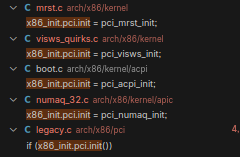

# pci 子系统的初始化

pci 结构

## 

```c
struct bus_type pci_bus_type = {
	.name		= "pci",
	.match		= pci_bus_match,
	.uevent		= pci_uevent,
	.probe		= pci_device_probe,
	.remove		= pci_device_remove,
	.shutdown	= pci_device_shutdown,
	.dev_attrs	= pci_dev_attrs,
	.bus_attrs	= pci_bus_attrs,
	.pm		= PCI_PM_OPS_PTR,
};
```

```c
struct bus_type_private {
	struct kset subsys;                  // 此总线的主 kset
	struct kset *drivers_kset;           // 与此总线关联的驱动程序的 kset
	struct kset *devices_kset;           // 与此总线关联的设备的 kset
	struct klist klist_devices;          // 遍历设备的 klist
	struct klist klist_drivers;          // 遍历驱动程序的 klist
	struct blocking_notifier_head bus_notifier;  // 总线事件的通知器头
	unsigned int drivers_autoprobe:1;    // 自动探测驱动程序标志位
	struct bus_type *bus;                // 指向关联的总线类型
};
```

## 注册pci总线

```c
static int __init pci_driver_init(void)
{
	return bus_register(&pci_bus_type);
}
postcore_initcall(pci_driver_init);
```

## pci总线初始化的入口函数

pci子系统的初始化函数被注册在宏`subsys_initcall`中。该函数会在初始化时由1号线程 init 在 `do_initcalls` 函数中被隐式的调用。

在 `pci_subsys_init` 中执行了对 pci 设备的初始化

```c
//pci子系统的初始化
int __init pci_subsys_init(void)
{
	/*
	 * The init function returns an non zero value when
	 * pci_legacy_init should be invoked.
	 */
	if (x86_init.pci.init())
		pci_legacy_init();

	pcibios_fixup_peer_bridges();
	x86_init.pci.init_irq();
	pcibios_init();

	return 0;
}
subsys_initcall(pci_subsys_init);
```

## 特定的初始化选项

x86_init.pci.init()是特定模式下的pci初始化函数，注册在结构体 `x86_init_ops`中。

```c
struct x86_init_ops {
	struct x86_init_resources	resources;
	struct x86_init_mpparse		mpparse;
	struct x86_init_irqs		irqs;
	struct x86_init_oem		oem;
	struct x86_init_paging		paging;
	struct x86_init_timers		timers;
	struct x86_init_iommu		iommu;
	struct x86_init_pci		pci;
};
```

在2.6中包含以下几种初始化的选项。



以 `pci_numaq_init` 为例

```c
//初始化 NUMA (非一致性内存访问) 环境下的 PCI 总线。
int __init pci_numaq_init(void)
{
    int quad;

    // 设置 PCI 操作的函数指针，指向特定的 PCI 配置函数
    raw_pci_ops = &pci_direct_conf1_mq;

    // 扫描根 PCI 总线并获取其设备
    pci_root_bus = pcibios_scan_root(0);
    if (pci_root_bus)
        pci_bus_add_devices(pci_root_bus);

    // 如果有多个在线 NUMA 节点，则对每个节点的 PCI 总线进行扫描
    if (num_online_nodes() > 1)
        for_each_online_node(quad) {
            // 跳过节点 0
            if (quad == 0)
                continue;

            // 打印扫描信息，显示当前扫描的 PCI 总线和 NUMA 节点
            printk("Scanning PCI bus %d for quad %d\n", 
                QUADLOCAL2BUS(quad,0), quad);

            // 使用特定的数据扫描当前 NUMA 节点的 PCI 总线
            pci_scan_bus_with_sysdata(QUADLOCAL2BUS(quad, 0));
        }

    // 初始化成功，返回 0
    return 0;
}
```

以下为 pci_numaq_init 注册的流程：

```c
setup_arch() -> initmem_init() -> get_memcfg_numa() -> get_memcfg_numaq() -> early_check_numaq() 
```

```c
static __init void early_check_numaq(void)
{
	/*
	 * get boot-time SMP configuration:
	 */
	if (smp_found_config)
		early_get_smp_config();

	if (found_numaq) {
		x86_init.mpparse.mpc_record = numaq_mpc_record;
		x86_init.mpparse.setup_ioapic_ids = x86_init_noop;
		x86_init.mpparse.mpc_apic_id = mpc_apic_id;
		x86_init.mpparse.smp_read_mpc_oem = smp_read_mpc_oem;
		x86_init.mpparse.mpc_oem_pci_bus = mpc_oem_pci_bus;
		x86_init.mpparse.mpc_oem_bus_info = mpc_oem_bus_info;
		x86_init.timers.tsc_pre_init = numaq_tsc_init;
		x86_init.pci.init = pci_numaq_init;
	}
}
```

## 通用的初始化程序

在通用pci子系统的初始化中，对所有连接在 pci 总线上的 pci 设备进行扫描，得到设备连接情况之后，再将连接在 pci 总线上的。

```c
int __init pci_legacy_init(void)
{
	if (!raw_pci_ops) {
		printk("PCI: System does not support PCI\n");
		return 0;
	}

	printk("PCI: Probing PCI hardware\n");
	pci_root_bus = pcibios_scan_root(0);//扫描pci总线上的设备
	if (pci_root_bus)
		pci_bus_add_devices(pci_root_bus);//向设备管理框架中添加 pci 设备

	return 0;
}
```

### 扫描总线上的设备

`pcibios_scan_root`

```c
struct pci_bus * __devinit pcibios_scan_root(int busnum)
{
	struct pci_bus *bus = NULL;          // 初始化 PCI 总线指针为 NULL
	struct pci_sysdata *sd;              // 用于存储每个根总线特定于架构的数据

	// 查找现有的 PCI 总线
	while ((bus = pci_find_next_bus(bus)) != NULL) {
		if (bus->number == busnum) {
			// 如果找到指定的总线号，则返回该总线，因为它已经被扫描过
			return bus;
		}
	}

	/*
	 * 为每个根总线分配特定于架构的数据（而不是每个总线）。
	 * TODO: 内存泄漏；这个内存从未释放。
	 * 是否值得关心这个问题是有争议的。
	 */
	sd = kzalloc(sizeof(*sd), GFP_KERNEL);
	if (!sd) {
		// 如果内存分配失败，打印错误信息，并返回 NULL
		printk(KERN_ERR "PCI: OOM, not probing PCI bus %02x\n", busnum);
		return NULL;
	}

	// 获取该总线对应的 NUMA 节点
	sd->node = get_mp_bus_to_node(busnum);

	printk(KERN_DEBUG "PCI: Probing PCI hardware (bus %02x)\n", busnum);
	// 扫描 PCI 总线并将其初始化
	bus = pci_scan_bus_parented(NULL, busnum, &pci_root_ops, sd);
	if (!bus)
		// 如果扫描失败，释放分配的内存
		kfree(sd);

	// 返回扫描到的总线
	return bus;
}
```

通过一系列的调用过程，最后由函数 `pci_scan_child_bus` 执行真正的设备扫描功能。

并在函数`pci_device_add`中将pci总线下的子设备加入 `pci_bus` 中记录的 `devices` 链表中。

函数调用链：
```c
pci_scan_bus_parented() -> pci_scan_child_bus() -> pci_scan_slot() -> pci_scan_single_device() -> pci_device_add()
```

```c
void pci_device_add(struct pci_dev *dev, struct pci_bus *bus)
{
	// 初始化设备结构体
	device_initialize(&dev->dev);
	dev->dev.release = pci_release_dev;  // 设置设备的释放函数
	pci_dev_get(dev);  // 增加设备的引用计数

	// 设置设备的 DMA 参数
	dev->dev.dma_mask = &dev->dma_mask;
	dev->dev.dma_parms = &dev->dma_parms;
	dev->dev.coherent_dma_mask = 0xffffffffull;

	// 设置 DMA 最大段大小和段边界
	pci_set_dma_max_seg_size(dev, 65536);
	pci_set_dma_seg_boundary(dev, 0xffffffff);

	// 修正设备头部中的错误
	pci_fixup_device(pci_fixup_header, dev);

	// 清除 state_saved 标志
	dev->state_saved = false;

	// 初始化设备的各种功能
	pci_init_capabilities(dev);

	/*
	 * 将设备添加到发现的设备列表
	 * 以及总线列表中，以便于修正功能等
	 */
	down_write(&pci_bus_sem);  // 获取总线的写锁
	list_add_tail(&dev->bus_list, &bus->devices);  // 将设备添加到总线的设备列表中
	up_write(&pci_bus_sem);  // 释放总线的写锁
}
```

### 添加设备到设备管理框架中

虽然在上述过程中已经遍历了 pci 上的设备，获取了他们的信息并设置了他们的功能。但是对于pci设备的管理是通过 sysfs 文件系统进行的，因此还需将 pci 总线及其所属的设备添加到设备管理框架中。

```c
void pci_bus_add_devices(const struct pci_bus *bus)
{
	struct pci_dev *dev;
	struct pci_bus *child;
	int retval;

	// 遍历总线上的所有 PCI 设备
	list_for_each_entry(dev, &bus->devices, bus_list) {
		// 跳过已经添加的设备
		if (dev->is_added)
			continue;

		// 添加设备到总线
		retval = pci_bus_add_device(dev);
		if (retval)
			dev_err(&dev->dev, "Error adding device, continuing\n");
	}

	// 遍历总线上的所有 PCI 设备
	list_for_each_entry(dev, &bus->devices, bus_list) {
		// 确保设备已经被添加
		BUG_ON(!dev->is_added);

		// 处理设备的子总线
		child = dev->subordinate;
		/*
		 * 如果存在未附加的子总线，则附加它
		 * 并扫描未附加的 PCI 设备
		 */
		if (!child)
			continue;
		if (list_empty(&child->node)) {
			down_write(&pci_bus_sem); // 获取写锁
			list_add_tail(&child->node, &dev->bus->children); // 将子总线添加到父总线的子列表中
			up_write(&pci_bus_sem); // 释放写锁
		}
		// 递归添加子总线上的设备
		pci_bus_add_devices(child);

		/*
		 * 注册子总线到 sysfs，因为父总线现在已经被正确注册
		 */
		if (child->is_added)
			continue;
		retval = pci_bus_add_child(child);
		if (retval)
			dev_err(&dev->dev, "Error adding bus, continuing\n");
	}
}

在此函数中将 pci 设备加入到 sysfs 中，以便于后续通过文件系统对设备进行管理。

int pci_bus_add_child(struct pci_bus *bus)
{
	int retval;

	if (bus->bridge)
		bus->dev.parent = bus->bridge;

	retval = device_register(&bus->dev);
	if (retval)
		return retval;

	bus->is_added = 1;

	retval = device_create_file(&bus->dev, &dev_attr_cpuaffinity);
	if (retval)
		return retval;

	retval = device_create_file(&bus->dev, &dev_attr_cpulistaffinity);

	/* Create legacy_io and legacy_mem files for this bus */
	pci_create_legacy_files(bus);

	return retval;
}
```
