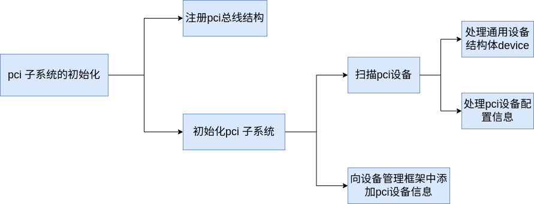
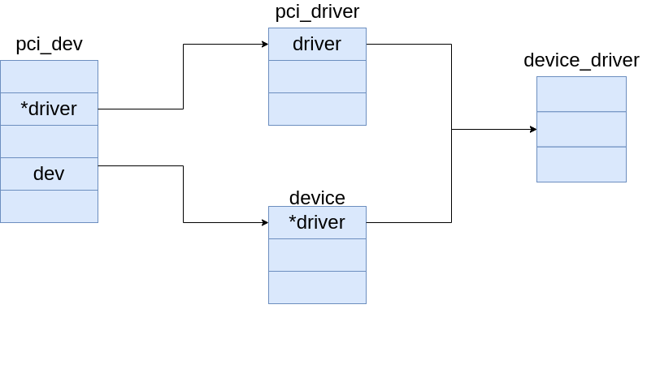
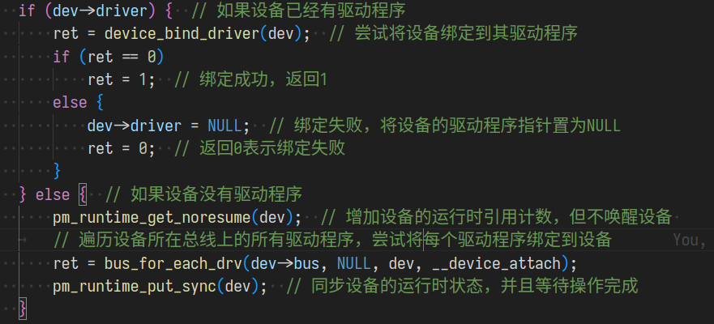
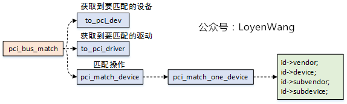
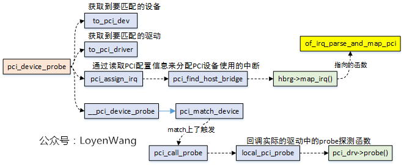
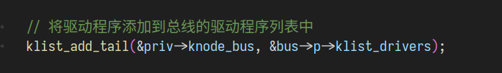

# pci 子系统的初始化



## 总线结构

在设备管理框架中，bus 是在 kobject 与 kset 基类上对总线设备更加具象化的描述。

```c
struct bus_type_private {
	struct kset subsys;                  // 此总线的主 kset
	struct kset *drivers_kset;           // 与此总线关联的驱动程序的 kset
	struct kset *devices_kset;           // 与此总线关联的设备的 kset
	struct klist klist_devices;          // 遍历设备的 klist
	struct klist klist_drivers;          // 遍历驱动程序的 klist
	struct blocking_notifier_head bus_notifier;  // 总线事件的通知器头
	unsigned int drivers_autoprobe:1;    // 自动探测驱动程序标志位
	struct bus_type *bus;                // 指向关联的总线类型
};
```

这是一个 pci 总线实例：

```c
struct bus_type pci_bus_type = {
	.name		= "pci",
	.match		= pci_bus_match,
	.uevent		= pci_uevent,
	.probe		= pci_device_probe,
	.remove		= pci_device_remove,
	.shutdown	= pci_device_shutdown,
	.dev_attrs	= pci_dev_attrs,
	.bus_attrs	= pci_bus_attrs,
	.pm		= PCI_PM_OPS_PTR,
};
```

## 注册pci总线

该函数会在init进程中被隐式的调用。

```c
static int __init pci_driver_init(void)
{
	return bus_register(&pci_bus_type);
}
postcore_initcall(pci_driver_init);
```

总线类型的注册函数：

```c
int bus_register(struct bus_type *bus)
{
	int retval;
	struct bus_type_private *priv;

	// 为总线类型的私有数据分配内存
	priv = kzalloc(sizeof(struct bus_type_private), GFP_KERNEL);
	if (!priv)
		return -ENOMEM;

	priv->bus = bus;
	bus->p = priv;

	// 初始化通知头
	BLOCKING_INIT_NOTIFIER_HEAD(&priv->bus_notifier);

	// 设置总线的 kobject 名称
	retval = kobject_set_name(&priv->subsys.kobj, "%s", bus->name);
	if (retval)
		goto out;

	// 关联 kobject 结构体到总线 kset
	priv->subsys.kobj.kset = bus_kset;
	priv->subsys.kobj.ktype = &bus_ktype;
	priv->drivers_autoprobe = 1;

	// 注册总线的 kset
	retval = kset_register(&priv->subsys);
	if (retval)
		goto out;

	// 为总线创建并注册 uevent 属性文件
	retval = bus_create_file(bus, &bus_attr_uevent);
	if (retval)
		goto bus_uevent_fail;

	// 创建 "devices" kset 并添加到总线的 kobject 子对象
	priv->devices_kset = kset_create_and_add("devices", NULL,
						 &priv->subsys.kobj);
	if (!priv->devices_kset) {
		retval = -ENOMEM;
		goto bus_devices_fail;
	}

	// 创建 "drivers" kset 并添加到总线的 kobject 子对象
	priv->drivers_kset = kset_create_and_add("drivers", NULL,
						 &priv->subsys.kobj);
	if (!priv->drivers_kset) {
		retval = -ENOMEM;
		goto bus_drivers_fail;
	}

	// 初始化设备和驱动的 klist
	klist_init(&priv->klist_devices, klist_devices_get, klist_devices_put);
	klist_init(&priv->klist_drivers, NULL, NULL);

	// 添加探测文件（probe files）
	retval = add_probe_files(bus);
	if (retval)
		goto bus_probe_files_fail;

	// 添加总线的属性文件
	retval = bus_add_attrs(bus);
	if (retval)
		goto bus_attrs_fail;

	// 打印调试信息，表示总线已成功注册
	pr_debug("bus: '%s': registered\n", bus->name);
	return 0;

bus_attrs_fail:
	remove_probe_files(bus);
bus_probe_files_fail:
	kset_unregister(bus->p->drivers_kset);
bus_drivers_fail:
	kset_unregister(bus->p->devices_kset);
bus_devices_fail:
	bus_remove_file(bus, &bus_attr_uevent);
bus_uevent_fail:
	kset_unregister(&bus->p->subsys);
	kfree(bus->p);
out:
	bus->p = NULL;
	return retval;
}
```

最终形成的层级结构：


## pci总线初始化的入口函数

pci子系统的初始化函数被注册在宏`subsys_initcall`中。该函数会在初始化时由1号线程 init 在 `do_initcalls` 函数中被隐式的调用。

在 `pci_subsys_init` 中执行了对 pci 设备的初始化

```c
//pci子系统的初始化
int __init pci_subsys_init(void)
{
	/*
	 * The init function returns an non zero value when
	 * pci_legacy_init should be invoked.
	 */
	if (x86_init.pci.init())
		pci_legacy_init();

	pcibios_fixup_peer_bridges();
	x86_init.pci.init_irq();
	pcibios_init();

	return 0;
}
subsys_initcall(pci_subsys_init);
```

## 特定的初始化选项

x86_init.pci.init()是特定模式下的pci初始化函数，注册在结构体 `x86_init_ops`中。

```c
struct x86_init_ops {
	struct x86_init_resources	resources;
	struct x86_init_mpparse		mpparse;
	struct x86_init_irqs		irqs;
	struct x86_init_oem		oem;
	struct x86_init_paging		paging;
	struct x86_init_timers		timers;
	struct x86_init_iommu		iommu;
	struct x86_init_pci		pci;
};
```

在2.6中包含以下几种初始化的选项。


以 `pci_numaq_init` 为例：

```c
//初始化 NUMA (非一致性内存访问) 环境下的 PCI 总线。
int __init pci_numaq_init(void)
{
    int quad;

    // 设置 PCI 操作的函数指针，指向特定的 PCI 配置函数
    raw_pci_ops = &pci_direct_conf1_mq;

    // 扫描根 PCI 总线并获取其设备
    pci_root_bus = pcibios_scan_root(0);
    if (pci_root_bus)
        pci_bus_add_devices(pci_root_bus);

    // 如果有多个在线 NUMA 节点，则对每个节点的 PCI 总线进行扫描
    if (num_online_nodes() > 1)
        for_each_online_node(quad) {
            // 跳过节点 0
            if (quad == 0)
                continue;

            // 打印扫描信息，显示当前扫描的 PCI 总线和 NUMA 节点
            printk("Scanning PCI bus %d for quad %d\n", 
                QUADLOCAL2BUS(quad,0), quad);

            // 使用特定的数据扫描当前 NUMA 节点的 PCI 总线
            pci_scan_bus_with_sysdata(QUADLOCAL2BUS(quad, 0));
        }

    // 初始化成功，返回 0
    return 0;
}
```

以下为 pci_numaq_init 注册的流程：

```c
setup_arch() -> initmem_init() -> get_memcfg_numa() -> get_memcfg_numaq() -> early_check_numaq() 
```

```c
static __init void early_check_numaq(void)
{
	/*
	 * get boot-time SMP configuration:
	 */
	if (smp_found_config)
		early_get_smp_config();

	if (found_numaq) {
		x86_init.mpparse.mpc_record = numaq_mpc_record;
		x86_init.mpparse.setup_ioapic_ids = x86_init_noop;
		x86_init.mpparse.mpc_apic_id = mpc_apic_id;
		x86_init.mpparse.smp_read_mpc_oem = smp_read_mpc_oem;
		x86_init.mpparse.mpc_oem_pci_bus = mpc_oem_pci_bus;
		x86_init.mpparse.mpc_oem_bus_info = mpc_oem_bus_info;
		x86_init.timers.tsc_pre_init = numaq_tsc_init;
		x86_init.pci.init = pci_numaq_init;
	}
}
```

## 通用的初始化程序

在通用pci子系统的初始化中，对所有连接在 pci 总线上的 pci 设备进行扫描，得到设备连接情况之后，再将连接在 pci 总线上的。

```c
int __init pci_legacy_init(void)
{
	if (!raw_pci_ops) {
		printk("PCI: System does not support PCI\n");
		return 0;
	}

	printk("PCI: Probing PCI hardware\n");
	pci_root_bus = pcibios_scan_root(0);//扫描pci总线上的设备
	if (pci_root_bus)
		pci_bus_add_devices(pci_root_bus);//向设备管理框架中添加 pci 设备

	return 0;
}
```

### 扫描总线上的设备

`pcibios_scan_root`

```c
struct pci_bus * __devinit pcibios_scan_root(int busnum)
{
	struct pci_bus *bus = NULL;          // 初始化 PCI 总线指针为 NULL
	struct pci_sysdata *sd;              // 用于存储每个根总线特定于架构的数据

	// 查找现有的 PCI 总线
	while ((bus = pci_find_next_bus(bus)) != NULL) {
		if (bus->number == busnum) {
			// 如果找到指定的总线号，则返回该总线，因为它已经被扫描过
			return bus;
		}
	}

	/*
	 * 为每个根总线分配特定于架构的数据（而不是每个总线）。
	 * TODO: 内存泄漏；这个内存从未释放。
	 * 是否值得关心这个问题是有争议的。
	 */
	sd = kzalloc(sizeof(*sd), GFP_KERNEL);
	if (!sd) {
		// 如果内存分配失败，打印错误信息，并返回 NULL
		printk(KERN_ERR "PCI: OOM, not probing PCI bus %02x\n", busnum);
		return NULL;
	}

	// 获取该总线对应的 NUMA 节点
	sd->node = get_mp_bus_to_node(busnum);

	printk(KERN_DEBUG "PCI: Probing PCI hardware (bus %02x)\n", busnum);
	// 扫描 PCI 总线并将其初始化
	bus = pci_scan_bus_parented(NULL, busnum, &pci_root_ops, sd);
	if (!bus)
		// 如果扫描失败，释放分配的内存
		kfree(sd);

	// 返回扫描到的总线
	return bus;
}
```

通过一系列的调用过程，最后由函数 `pci_scan_child_bus` 执行真正的设备扫描功能。

```c
unsigned int __devinit pci_scan_child_bus(struct pci_bus *bus)
{
	unsigned int devfn, pass, max = bus->secondary;
	struct pci_dev *dev;

	dev_dbg(&bus->dev, "scanning bus\n");

	/* 遍历总线上挂载的设备并获取他们的信息 */
	for (devfn = 0; devfn < 0x100; devfn += 8)
		pci_scan_slot(bus, devfn);

	/* Reserve buses for SR-IOV capability. */
	max += pci_iov_bus_range(bus);

	/*
	 * After performing arch-dependent fixup of the bus, look behind
	 * all PCI-to-PCI bridges on this bus.
	 */
	if (!bus->is_added) {
		dev_dbg(&bus->dev, "fixups for bus\n");
		pcibios_fixup_bus(bus);
		if (pci_is_root_bus(bus))
			bus->is_added = 1;
	}

	for (pass = 0; pass < 2; pass++)
        // 遍历总线上的所有设备
        list_for_each_entry(dev, &bus->devices, bus_list) {
            // 如果设备是 PCI 桥或 CardBus 桥
            if (dev->hdr_type == PCI_HEADER_TYPE_BRIDGE ||
                dev->hdr_type == PCI_HEADER_TYPE_CARDBUS)
                // 扫描桥接设备并更新最大设备编号
                max = pci_scan_bridge(bus, dev, max, pass);
        }
	dev_dbg(&bus->dev, "bus scan returning with max=%02x\n", max);
	return max;
}
```

函数调用链：

```c
pcibios_scan_root() -> pci_scan_bus_parented() -> pci_scan_child_bus() -> pci_scan_slot() -> pci_scan_single_device()
```

### 处理扫描到得 pci 设备

以下为 `struct pci_dev` ，用来描述 pci 设备的信息。每个 pci 设备都有自己的配置空间，里面写着 pci 设备的配置信息，这些信息最终会被填入到 pci_dev 结构中。

```c
struct pci_dev {
	struct list_head bus_list;	/* 在每个总线的设备列表中的节点 */

	struct pci_bus	*bus;		/* 设备所在的 PCI 总线 */
	struct pci_bus	*subordinate;	/* 设备所连接的桥接总线 */

	void		*sysdata;	/* 系统特定扩展的挂钩 */
	struct proc_dir_entry *procent;	/* 设备在 /proc/bus/pci 下的条目 */
	struct pci_slot	*slot;		/* 设备所在的物理插槽 */

	unsigned int	devfn;		/* 编码的设备和函数索引 */
	unsigned short	vendor;		/* 设备的厂商 ID */
	unsigned short	device;		/* 设备 ID */
	unsigned short	subsystem_vendor;	/* 子系统厂商 ID */
	unsigned short	subsystem_device;	/* 子系统设备 ID */
	unsigned int	class;		/* 3 字节：基类、次类、编程接口 */
	u8		revision;	/* PCI 修订版本，类字的低字节 */
	u8		hdr_type;	/* PCI 头部类型（`multi` 标志被屏蔽） */
	u8		pcie_cap;	/* PCI-E 能力偏移量 */
	u8		pcie_type;	/* PCI-E 设备/端口类型 */
	u8		rom_base_reg;	/* 控制 ROM 的配置寄存器 */
	u8		pin;  		/* 设备使用的中断引脚 */

	struct pci_driver *driver;	/* 分配此设备的驱动程序 */
	u64		dma_mask;	/* 设备支持的总线地址的位掩码。通常是 0xffffffff。
					   只有在设备有缺陷的 DMA 或支持 64 位传输时才需要更改此值。 */

	struct device_dma_parameters dma_parms; /* 设备的 DMA 参数 */

	pci_power_t     current_state;  /* 当前操作状态。在 ACPI 术语中，D0-D3，D0 表示完全功能，
					   D3 表示关闭。 */
	int		pm_cap;		/* 配置空间中的 PM 能力偏移量 */
	unsigned int	pme_support:5;	/* 从哪些状态可以生成 PME# 的位掩码 */
	unsigned int	pme_interrupt:1;	/* 是否支持 PME 中断 */
	unsigned int	d1_support:1;	/* 是否支持低功耗状态 D1 */
	unsigned int	d2_support:1;	/* 是否支持低功耗状态 D2 */
	unsigned int	no_d1d2:1;	/* 只允许 D0 和 D3 */
	unsigned int	wakeup_prepared:1; /* 唤醒是否已准备好 */
	unsigned int	d3_delay;	/* D3->D0 转换时间（毫秒） */

#ifdef CONFIG_PCIEASPM
	struct pcie_link_state	*link_state;	/* ASPM 链路状态 */
#endif

	pci_channel_state_t error_state;	/* 当前连接状态 */
	struct	device	dev;		/* 通用设备接口 */

	int		cfg_size;	/* 配置空间的大小 */

	/*
	 * 代替直接访问中断线路和基地址寄存器，使用存储在这里的值。它们可能会有所不同！
	 */
	unsigned int	irq;		/* 设备的中断号 */
	struct resource resource[DEVICE_COUNT_RESOURCE]; /* I/O 和内存区域 + 扩展 ROM */

	/* 这些字段用于通用修复 */
	unsigned int	transparent:1;	/* 透明 PCI 桥接 */
	unsigned int	multifunction:1;/* 多功能设备的一部分 */
	/* 记录设备状态 */
	unsigned int	is_added:1;	/* 设备是否已添加 */
	unsigned int	is_busmaster:1; /* 设备是否为总线主控 */
	unsigned int	no_msi:1;	/* 设备是否可能不使用 MSI */
	unsigned int	block_ucfg_access:1;	/* 阻止用户空间访问配置空间 */
	unsigned int	broken_parity_status:1;	/* 设备生成假阳性奇偶性错误 */
	unsigned int	irq_reroute_variant:2;	/* 设备是否需要 IRQ 重新路由变体 */
	unsigned int 	msi_enabled:1;	/* MSI 是否启用 */
	unsigned int	msix_enabled:1;	/* MSI-X 是否启用 */
	unsigned int	ari_enabled:1;	/* ARI 转发是否启用 */
	unsigned int	is_managed:1;	/* 设备是否被管理 */
	unsigned int	is_pcie:1;	/* PCI-E 设备（已废弃，将被移除） */
	unsigned int    needs_freset:1; /* 设备是否需要基础重置 */
	unsigned int	state_saved:1;	/* 设备状态是否已保存 */
	unsigned int	is_physfn:1;	/* 是否是物理功能（PF） */
	unsigned int	is_virtfn:1;	/* 是否是虚拟功能（VF） */
	unsigned int	reset_fn:1;	/* 是否需要重置功能 */
	unsigned int    is_hotplug_bridge:1;	/* 是否是热插拔桥接 */
	unsigned int    aer_firmware_first:1;	/* 是否优先固件 AER */
	pci_dev_flags_t dev_flags;	/* 设备标志 */
	atomic_t	enable_cnt;	/* pci_enable_device 是否已被调用 */

	u32		saved_config_space[16]; /* 挂起时保存的配置空间 */
	struct hlist_head saved_cap_space; /* 保存的能力空间的头 */
	struct bin_attribute *rom_attr; /* sysfs ROM 条目的属性描述符 */
	int rom_attr_enabled;		/* ROM 属性的显示是否已启用 */
	struct bin_attribute *res_attr[DEVICE_COUNT_RESOURCE]; /* 资源的 sysfs 文件 */
	struct bin_attribute *res_attr_wc[DEVICE_COUNT_RESOURCE]; /* 资源的 WC 映射的 sysfs 文件 */
#ifdef CONFIG_PCI_MSI
	struct list_head msi_list; /* MSI 列表 */
#endif
	struct pci_vpd *vpd;	/* VPD 结构体 */
#ifdef CONFIG_PCI_IOV
	union {
		struct pci_sriov *sriov;	/* SR-IOV 能力相关 */
		struct pci_dev *physfn;	/* 与此 VF 关联的 PF */
	};
	struct pci_ats	*ats;	/* 地址转换服务 */
#endif
};
```

对于扫描到的 pci 设备处理，将会分为两路进行。分别为对 `struct pci_dev` 中的通用设备结构体 `struct device dev` 的初始化，与对其余设备配置信息的初始化。


#### 初始化 device

在函数 `pci_device_add` 中将pci总线下的子设备加入 `pci_bus` 中记录的 `devices` 链表中。

```c
void pci_device_add(struct pci_dev *dev, struct pci_bus *bus)
{
	// 初始化设备结构体
	device_initialize(&dev->dev);
	dev->dev.release = pci_release_dev;  // 设置设备的释放函数
	pci_dev_get(dev);  // 增加设备的引用计数

	// 设置设备的 DMA 参数
	dev->dev.dma_mask = &dev->dma_mask;
	dev->dev.dma_parms = &dev->dma_parms;
	dev->dev.coherent_dma_mask = 0xffffffffull;

	// 设置 DMA 最大段大小和段边界
	pci_set_dma_max_seg_size(dev, 65536);
	pci_set_dma_seg_boundary(dev, 0xffffffff);

	// 修正设备头部中的错误
	pci_fixup_device(pci_fixup_header, dev);

	// 清除 state_saved 标志
	dev->state_saved = false;

	// 初始化设备的各种功能
	pci_init_capabilities(dev);

	/*
	 * 将设备添加到发现的设备列表
	 * 以及总线列表中，以便于修正功能等
	 */
	down_write(&pci_bus_sem);  // 获取总线的写锁
	list_add_tail(&dev->bus_list, &bus->devices);  // 将设备添加到总线的设备列表中
	up_write(&pci_bus_sem);  // 释放总线的写锁
}
```

#### 获取 pci 设备的信息

在该函数往后的调用链中，对 PCI 设备进行了初始化，并设置其配置空间的相关信息

```c
static struct pci_dev *pci_scan_device(struct pci_bus *bus, int devfn)
{
	struct pci_dev *dev;
	u32 l;
	int delay = 1;

	/* 读取设备的厂商 ID 和设备 ID */
	if (pci_bus_read_config_dword(bus, devfn, PCI_VENDOR_ID, &l))
		return NULL;

	/* 一些损坏的板卡如果插槽为空会返回 0 或 ~0： */
	if (l == 0xffffffff || l == 0x00000000 ||
	    l == 0x0000ffff || l == 0xffff0000)
		return NULL;

	/* 配置请求重试状态 */
	while (l == 0xffff0001) {
		msleep(delay);  /* 等待一段时间 */
		delay *= 2;     /* 每次重试时增加延迟 */
		if (pci_bus_read_config_dword(bus, devfn, PCI_VENDOR_ID, &l))
			return NULL;
		/* 如果卡在 60 秒内没有响应，说明可能出现了问题 */
		if (delay > 60 * 1000) {
			printk(KERN_WARNING "pci %04x:%02x:%02x.%d: not "
					"responding\n", pci_domain_nr(bus),
					bus->number, PCI_SLOT(devfn),
					PCI_FUNC(devfn));
			return NULL;
		}
	}

	/* 分配并初始化 PCI 设备结构体 */
	dev = alloc_pci_dev();
	if (!dev)
		return NULL;

	dev->bus = bus;
	dev->devfn = devfn;
	dev->vendor = l & 0xffff;
	dev->device = (l >> 16) & 0xffff;

	/* 设置设备的其他配置信息 */
	if (pci_setup_device(dev)) {
		kfree(dev);
		return NULL;
	}

	return dev;
}
```

```c
int pci_setup_device(struct pci_dev *dev)
{
    u32 class;
    u8 hdr_type;
    struct pci_slot *slot;
    int pos = 0;

    // 读取 PCI 设备的头部类型
    if (pci_read_config_byte(dev, PCI_HEADER_TYPE, &hdr_type))
        return -EIO; // 读取失败，返回 I/O 错误

    // 设置设备的基本信息
    dev->sysdata = dev->bus->sysdata;
    dev->dev.parent = dev->bus->bridge;
    dev->dev.bus = &pci_bus_type;
    dev->hdr_type = hdr_type & 0x7f; // 获取头部类型（忽略多功能标志）
    dev->multifunction = !!(hdr_type & 0x80); // 判断是否为多功能设备
    dev->error_state = pci_channel_io_normal; // 设置错误状态为正常
    set_pcie_port_type(dev); // 设置 PCIe 端口类型
    set_pci_aer_firmware_first(dev); // 设置 PCI AER 固件优先

    // 根据设备功能号查找设备插槽
    list_for_each_entry(slot, &dev->bus->slots, list)
        if (PCI_SLOT(dev->devfn) == slot->number)
            dev->slot = slot;

    // 默认假设设备是 32 位 PCI，64 位 PCI 设备可以自行调整
    dev->dma_mask = 0xffffffff;

    // 设置设备名称，包括 PCI 域、总线号、插槽号和功能号
    dev_set_name(&dev->dev, "%04x:%02x:%02x.%d", pci_domain_nr(dev->bus),
                 dev->bus->number, PCI_SLOT(dev->devfn),
                 PCI_FUNC(dev->devfn));

    // 读取并解析设备的类别和版本信息
    pci_read_config_dword(dev, PCI_CLASS_REVISION, &class);
    dev->revision = class & 0xff; // 获取版本号
    class >>= 8; // 上移以获取类别
    dev->class = class; // 设备类别
    class >>= 8; // 再次上移以获取子类别

    // 打印设备信息到调试日志
    dev_dbg(&dev->dev, "found [%04x:%04x] class %06x header type %02x\n",
            dev->vendor, dev->device, class, dev->hdr_type);

    // 设备配置空间大小的计算
    dev->cfg_size = pci_cfg_space_size(dev);

    // 设置当前电源状态为“未知”
    dev->current_state = PCI_UNKNOWN;

    // 早期修复，在探测 BARs 之前
    pci_fixup_device(pci_fixup_early, dev);
    // 设备类别可能在修复后发生变化
    class = dev->class >> 8;

    // 根据设备的头部类型进行处理
    switch (dev->hdr_type) {
    case PCI_HEADER_TYPE_NORMAL: // 标准头部
        if (class == PCI_CLASS_BRIDGE_PCI)
            goto bad; // 如果设备类别是 PCI 桥，但头部类型是标准类型，则标记为错误
        pci_read_irq(dev); // 读取中断信息
        pci_read_bases(dev, 6, PCI_ROM_ADDRESS); // 读取 BAR 信息
        pci_read_config_word(dev, PCI_SUBSYSTEM_VENDOR_ID, &dev->subsystem_vendor); // 读取子系统厂商 ID
        pci_read_config_word(dev, PCI_SUBSYSTEM_ID, &dev->subsystem_device); // 读取子系统设备 ID

        // 处理旧版 IDE 控制器的特定配置
        if (class == PCI_CLASS_STORAGE_IDE) {
            u8 progif;
            pci_read_config_byte(dev, PCI_CLASS_PROG, &progif); // 读取编程接口
            if ((progif & 1) == 0) {
                dev->resource[0].start = 0x1F0;
                dev->resource[0].end = 0x1F7;
                dev->resource[0].flags = LEGACY_IO_RESOURCE;
                dev->resource[1].start = 0x3F6;
                dev->resource[1].end = 0x3F6;
                dev->resource[1].flags = LEGACY_IO_RESOURCE;
            }
            if ((progif & 4) == 0) {
                dev->resource[2].start = 0x170;
                dev->resource[2].end = 0x177;
                dev->resource[2].flags = LEGACY_IO_RESOURCE;
                dev->resource[3].start = 0x376;
                dev->resource[3].end = 0x376;
                dev->resource[3].flags = LEGACY_IO_RESOURCE;
            }
        }
        break;

    case PCI_HEADER_TYPE_BRIDGE: // 桥接头部
        if (class != PCI_CLASS_BRIDGE_PCI)
            goto bad; // 如果设备类别不是 PCI 桥，则标记为错误
        pci_read_irq(dev); // 读取中断信息
        dev->transparent = ((dev->class & 0xff) == 1); // 判断是否为透明桥
        pci_read_bases(dev, 2, PCI_ROM_ADDRESS1); // 读取 BAR 信息
        set_pcie_hotplug_bridge(dev); // 设置 PCIe 热插拔桥接
        pos = pci_find_capability(dev, PCI_CAP_ID_SSVID); // 查找 SSVID 扩展功能
        if (pos) {
            pci_read_config_word(dev, pos + PCI_SSVID_VENDOR_ID, &dev->subsystem_vendor); // 读取子系统厂商 ID
            pci_read_config_word(dev, pos + PCI_SSVID_DEVICE_ID, &dev->subsystem_device); // 读取子系统设备 ID
        }
        break;

    case PCI_HEADER_TYPE_CARDBUS: // CardBus 桥接头部
        if (class != PCI_CLASS_BRIDGE_CARDBUS)
            goto bad; // 如果设备类别不是 CardBus 桥，则标记为错误
        pci_read_irq(dev); // 读取中断信息
        pci_read_bases(dev, 1, 0); // 读取 BAR 信息
        pci_read_config_word(dev, PCI_CB_SUBSYSTEM_VENDOR_ID, &dev->subsystem_vendor); // 读取子系统厂商 ID
        pci_read_config_word(dev, PCI_CB_SUBSYSTEM_ID, &dev->subsystem_device); // 读取子系统设备 ID
        break;

    default: // 未知头部类型
        dev_err(&dev->dev, "unknown header type %02x, "
                "ignoring device\n", dev->hdr_type);
        return -EIO; // 返回 I/O 错误

    bad:
        dev_err(&dev->dev, "ignoring class %02x (doesn't match header "
                "type %02x)\n", class, dev->hdr_type);
        dev->class = PCI_CLASS_NOT_DEFINED; // 标记为未定义的类别
    }

    // 设备配置完成，返回成功
    return 0;
}

```

### 添加设备到设备管理框架中

虽然在上述过程中已经遍历了 pci 上的设备，获取了他们的信息并设置了他们的功能。但是对于pci设备的管理是通过 sysfs 文件系统进行的，因此还需将 pci 总线及其所属的设备添加到设备管理框架中。

```c
void pci_bus_add_devices(const struct pci_bus *bus)
{
	struct pci_dev *dev;
	struct pci_bus *child;
	int retval;

	// 遍历总线上的所有 PCI 设备
	list_for_each_entry(dev, &bus->devices, bus_list) {
		// 跳过已经添加的设备
		if (dev->is_added)
			continue;

		// 添加设备到总线
		retval = pci_bus_add_device(dev);
		if (retval)
			dev_err(&dev->dev, "Error adding device, continuing\n");
	}

	// 遍历总线上的所有 PCI 设备
	list_for_each_entry(dev, &bus->devices, bus_list) {
		// 确保设备已经被添加
		BUG_ON(!dev->is_added);

		// 处理设备的子总线
		child = dev->subordinate;
		/*
		 * 如果存在未附加的子总线，则附加它
		 * 并扫描未附加的 PCI 设备
		 */
		if (!child)
			continue;
		if (list_empty(&child->node)) {
			down_write(&pci_bus_sem); // 获取写锁
			list_add_tail(&child->node, &dev->bus->children); // 将子总线添加到父总线的子列表中
			up_write(&pci_bus_sem); // 释放写锁
		}
		// 递归添加子总线上的设备
		pci_bus_add_devices(child);

		/*
		 * 注册子总线到 sysfs，因为父总线现在已经被正确注册
		 */
		if (child->is_added)
			continue;
		retval = pci_bus_add_child(child);
		if (retval)
			dev_err(&dev->dev, "Error adding bus, continuing\n");
	}
}

在此函数中将 pci 设备加入到 sysfs 中，以便于后续通过文件系统对设备进行管理。

int pci_bus_add_child(struct pci_bus *bus)
{
	int retval;

	if (bus->bridge)
		bus->dev.parent = bus->bridge;

	retval = device_register(&bus->dev);
	if (retval)
		return retval;

	bus->is_added = 1;

	retval = device_create_file(&bus->dev, &dev_attr_cpuaffinity);
	if (retval)
		return retval;

	retval = device_create_file(&bus->dev, &dev_attr_cpulistaffinity);

	/* Create legacy_io and legacy_mem files for this bus */
	pci_create_legacy_files(bus);

	return retval;
}
```

再将设备加入到fs中就可以通过 sysfs 对设备进行管理。

```c
int device_create_file(struct device *dev,
		       const struct device_attribute *attr)
{
	int error = 0;
	if (dev)
		error = sysfs_create_file(&dev->kobj, &attr->attr);
	return error;
}
```

## 初始化一个 pci 设备

在 pci 子系统初始化的过程中，也会对总线上扫描到得 pci 设备进行初始化。

以下为初始化 pci 设备的调用链：

```c
pci_bus_add_devices() -> pci_bus_add_device()
 -> device_add() -> bus_probe_device() 
 -> device_attach() -> __device_attach() 
 ->driver_probe_device() -> really_probe() 
 -> dev->bus->probe(dev) -> pci_device_probe() 
 -> __pci_device_probe() -> pci_call_probe() 
 -> local_pci_probe() -> pci_driver.probe()
```

其中 `dev->bus->probe(dev)` 为 `bus_type` 中的成员函数 `probe` 。该函数用作总线设备的探测函数，每个不同的总线设备都有不同的 `probe` 函数。

```c
struct bus_type pci_bus_type = {
	.name		= "pci",
	.match		= pci_bus_match,
	.uevent		= pci_uevent,
	.probe		= pci_device_probe,
	.remove		= pci_device_remove,
	.shutdown	= pci_device_shutdown,
	.dev_attrs	= pci_dev_attrs,
	.bus_attrs	= pci_bus_attrs,
	.pm		= PCI_PM_OPS_PTR,
};
```
在 pci 总线注册的 probe 函数中会逐层向下最终调用到具体的 pci 设备注册的 probe 函数中。
以 sata 为例：

```c
static struct pci_driver inic_pci_driver = {
	.name 		= DRV_NAME,
	.id_table	= inic_pci_tbl,
#ifdef CONFIG_PM
	.suspend	= ata_pci_device_suspend,
	.resume		= inic_pci_device_resume,
#endif
	.probe 		= inic_init_one,
	.remove		= ata_pci_remove_one,
};
```

`inic_pci_driver` 结构体中的 `inic_init_one` 函数即为 sata 的初始化程序。

那 pci_driver 又如何与 pci_dev 建立联系？



在函数`device_attach`中，检测设备是否有驱动程序。如果没有指向的pci设备驱动程序，则会调用 ` bus_for_each_drv `遍历设备驱动列表，找到与设备匹配的设备驱动结构。并调用回调函数 `__device_attach` 执行后续的初始化流程。



函数 bus_for_each_drv ：
```c
int bus_for_each_drv(struct bus_type *bus, struct device_driver *start,
		     void *data, int (*fn)(struct device_driver *, void *))
{
	struct klist_iter i;
	struct device_driver *drv;
	int error = 0;

	if (!bus)
		return -EINVAL;

	// 初始化驱动程序列表迭代器
	klist_iter_init_node(&bus->p->klist_drivers, &i,
			     start ? &start->p->knode_bus : NULL);
	
	// 遍历驱动程序列表，并对每个驱动程序调用回调函数
	while ((drv = next_driver(&i)) && !error)
		error = fn(drv, data);
	
	// 退出驱动程序列表迭代器
	klist_iter_exit(&i);
	
	return error;
}
```

注意，在这里找到的是 `device_driver` 结构，而并非 `pci_driver` 。但是通过 `device_driver` 在内核提供的宏的帮助下，就能找到 `pci_driver` 结构。

那么我们获取 `pci_driver` 结构又需要经历哪些过程？

在回调函数 `__device_attach` 中，会先调用 `driver_match_device` 函数。

```c
static int __device_attach(struct device_driver *drv, void *data)
{
	struct device *dev = data;

	if (!driver_match_device(drv, dev))
		return 0;

	return driver_probe_device(drv, dev);
}
```

该函数最终会调用总线设备注册的 match 函数，在pci子系统中即为 `pci_bus_match` 。



匹配成功后，就会去触发 `pci_device_probe` 的执行



```c
#define to_pci_dev(n) container_of(n, struct pci_dev, dev)

```

`container_of` 是内核提供的一个宏，他会通过结构体成员的地址，找到整个结构体的地址。在这里，我们通过 `device_driver` 找到 `pci_driver` 至此一路向下执行直至 pci 设备初始化完成。

### 注册 pci 设备驱动结构

在上文中提到了在pci设备初始化的过程中，会遍历 `bus->p->klist_drivers` 列表，找到与设备相匹配的设备驱动结构，那么 klist_drivers 中的设备驱动结构 `device_driver` 又从何而来？

以 sata 控制器为例，在注册该设备驱动时，作为一个 pci 设备会调用函数 `pci_register_driver` 。

```c
static int __init inic_init(void)
{
	return pci_register_driver(&inic_pci_driver);
}
module_init(inic_init);
```

```c
#define pci_register_driver(driver)		\
	__pci_register_driver(driver, THIS_MODULE, KBUILD_MODNAME)
```

函数调用链：

```c
inic_init() -> pci_register_driver() -> __pci_register_driver() -> driver_register() -> bus_add_driver()
```

在函数`bus_add_driver`中，会将`pci_driver`中的成员`device_driver`添加到 `bus_type` 中私有结构成员 `p` 中的 `klist_drivers`。



```c
struct bus_type_private {
	...
	struct klist klist_drivers;          // 遍历驱动程序的 klist
	...
}
```
