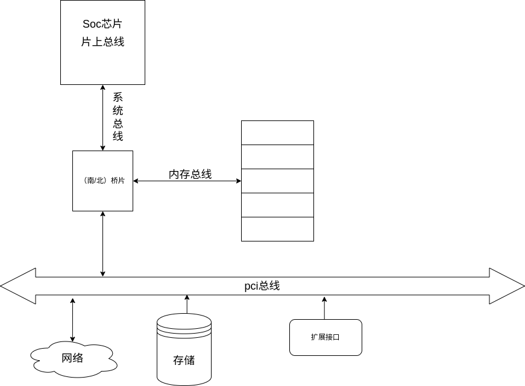
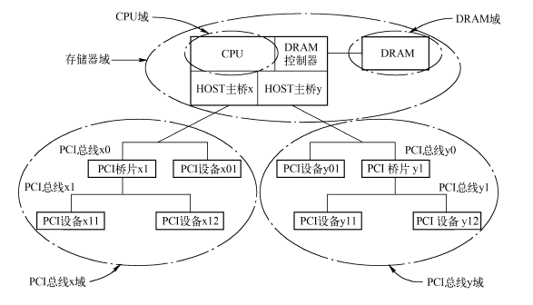
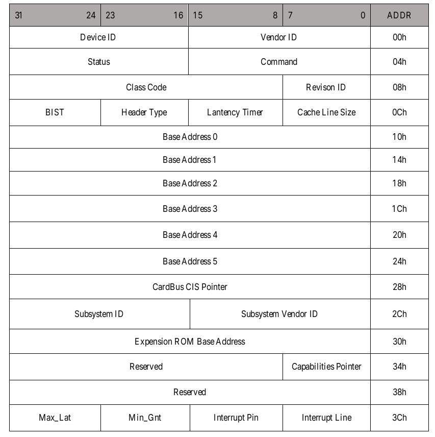
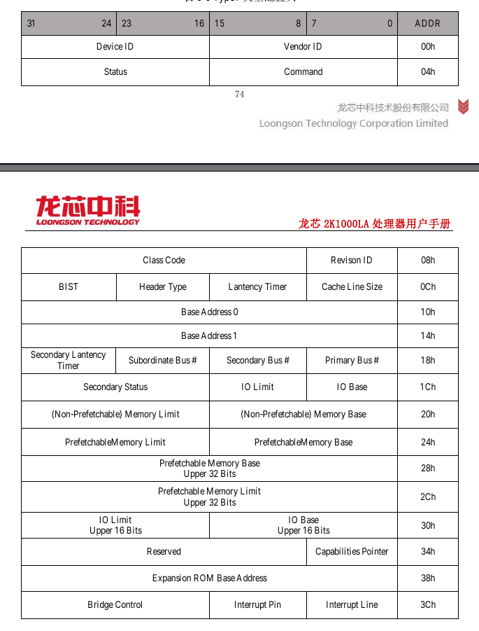
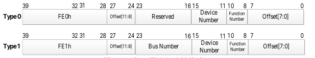

# pci总线

## 什么是总线

总线的本质作用是完成数据交换。 总线用于将两个或两个以上的部件连接起来, 使得它们
之间可以进行数据交换。

按照总线在计算机系统中所处的物理位置, 总线可以分为片上总线、 内存总线、 系统总线
和设备总线。

## pci总线的作用

pci 是一种总线协议，在计算机体系结构中起到连接主机与 I/O 设备的作用，属于设备总线的一种。



pci总线下可能连接着网卡，磁盘等多种设备，实现了对这些设备的统一管理。

pci总线采用配置空间、IO 空间和 Memory 空间的划分，将配置端口消息发送端口等区分开来。

## pci设备类型

pci 设备有多种类型，不同的pci设备有不同的配置头空间的划分

* PCI 主设备 通过总线仲裁获得 PCI 总线的使用权, 主动地向其他 PCI 设备或者主存储器发起存储器读写请求
* PCI 从设备 只能被动地接收来自 HOST 主桥或者其他 PCI 设备的读写请求
* 桥设备 它包括 PCI 桥、 PCI⁃to⁃( E) ISA 桥和PCI⁃to⁃Cardbus 桥



1. type0：此类pci设备一般为普通设备，例如网卡，磁盘等。
   如图为type0设备的配置头空间：
   
   配置头空间中大部分位都遵循pci标准协议，其中部分位由厂商自行定义。
2. type1：此类设备为pci桥接设备，如上图中的pci桥

   PCI 桥的存在使 PCI 总线极具扩展性, 处理器系统可以使用 PCI 桥进一步扩展 PCI 总线
   

通过对配置空间的读取，即可获取对应 pci 设备的设备信息。如bar地址等。其中对 PCI 设备配置空间的访问可以从上游总线转发到下游总线, 而数据传送可以双方向进行。

## 读写pci设备的配置信息

1. 获取pci设备配置空间的地址

   pci 配置头空间的地址由 pci 配置头空间的基地址，总线号，设备号，功能号组成。



```c
 unsigned long pcie_header_base = CSR_DMW0_BASE|base_cfg_addr| (bus << 16) | (device << 11)| (function<<8);
```

2. 解析bar地址

   bar地址分为I/O空间与MEM两种类型。

   该地址被存储在寄存器 Base Address Register 中，该寄存器中的位信息如下：

   基地址寄存器

   * Bit0:标志位，若为1则为io空间，若为0则为mem空间

   I/O基地址寄存器:

   * Bit1:保留
   * Bit31-2:基地址单元
   * Bit63-32:保留

   MEM 基地址存储器:

   * Bit2-1:MEM 基地址寄存器-译码器宽度单元,00-32 位,10-64 位
   * Bit3:预提取属性
   * Bit64-4:基地址单元

   将无关位使用掩码屏蔽后就能得到pci设备的bar地址。

## PCI 总线的存储器读写总线事务

PCI 总线支持多种总线事务。存储器读写总线事务与 I / O 读写总线事务