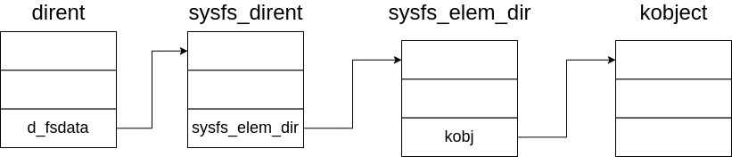

# 从设备到 sysfs

在设备管理框架中提到了 kobject kset 与 device 三大核心结构体。这些结构体是如何通过 sysfs 提供的接口进行管理的？

在设备被初始化时，会将 kobject 包装后变成一个目录树上对应的 dentry 项并创建其对应的 inode 。这样就将设备抽象为一个文件，通过文件系统提供的接口进行统一的管理。

## sysfs 文件系统中的结构体

### sysfs_dirent

`sysfs_dirent` 结构体是 sysfs 中的目录项结构体。

```c
struct sysfs_dirent {
	atomic_t		s_count;		// 引用计数
	atomic_t		s_active;		// 活跃引用计数
#ifdef CONFIG_DEBUG_LOCK_ALLOC
	struct lockdep_map	dep_map;	// 锁依赖映射，用于调试
#endif
	struct sysfs_dirent	*s_parent;	// 父目录项
	struct sysfs_dirent	*s_sibling;	// 兄弟目录项
	const char		*s_name;					// 目录项名称

	union {
		struct sysfs_elem_dir		s_dir;				// 目录类型
		struct sysfs_elem_symlink	s_symlink;	// 符号链接类型
		struct sysfs_elem_attr		s_attr;			// 属性类型
		struct sysfs_elem_bin_attr	s_bin_attr;	// 二进制属性类型
	};

	unsigned int		s_flags;		// 标志
	unsigned short		s_mode;		// 文件模式 (权限)
	ino_t			s_ino;						// inode 号
	struct sysfs_inode_attrs *s_iattr;	// inode 属性
};
```

`sysfs_buffer` 结构是 sysfs 中用做读写的缓冲区。由于 sysfs 仅仅存在于内存中，并不是普通的文件。对于sysfs中文件的写入与读取，其实是对设备控制信息的写入与读取。该结构体的作用就是用来记录写入信息的。

```c
struct sysfs_buffer {
	size_t			count;
	loff_t			pos;
	char			* page;
	const struct sysfs_ops	* ops;
	struct mutex		mutex;
	int			needs_read_fill;
	int			event;
	struct list_head	list;
};
```

## 从 kobject 到 sysfs 中的结构体

创建设备文件的函数调用流程：

```c
sysfs_create_file() -> sysfs_add_file() -> sysfs_add_file_mode()
```

在 kobject 中有成员 `sysfs_dirent *sd` 该成员将 kobject 链接到 sysfs 中。

```c
int sysfs_add_file_mode(struct sysfs_dirent *dir_sd,
			const struct attribute *attr, int type, mode_t amode)
{
	umode_t mode = (amode & S_IALLUGO) | S_IFREG;
	struct sysfs_addrm_cxt acxt;
	struct sysfs_dirent *sd;
	int rc;

	sd = sysfs_new_dirent(attr->name, mode, type);//创建 dirent 项
    if (!sd)
		return -ENOMEM;
	sd->s_attr.attr = (void *)attr;
	sysfs_dirent_init_lockdep(sd);

	sysfs_addrm_start(&acxt, dir_sd);
	rc = sysfs_add_one(&acxt, sd);
	sysfs_addrm_finish(&acxt);//完成sysfs_dirent的添加或移除

	if (rc)
		sysfs_put(sd);

	return rc;
}
```

`sysfs_dirent` 并不是在被创建之初就与 `dentey` 建立好联系。毕竟 `dentey` 也需要占用内存。

```c
static struct dentry * sysfs_lookup(struct inode *dir, struct dentry *dentry,
				struct nameidata *nd)
{
	struct dentry *ret = NULL;
	struct sysfs_dirent *parent_sd = dentry->d_parent->d_fsdata;
	struct sysfs_dirent *sd;
	struct inode *inode;

	mutex_lock(&sysfs_mutex);

	sd = sysfs_find_dirent(parent_sd, dentry->d_name.name);

	/* no such entry */
	if (!sd) {
		ret = ERR_PTR(-ENOENT);
		goto out_unlock;
	}

	/* attach dentry and inode */
	inode = sysfs_get_inode(dir->i_sb, sd);
	if (!inode) {
		ret = ERR_PTR(-ENOMEM);
		goto out_unlock;
	}

	/* instantiate and hash dentry */
	ret = d_find_alias(inode);
	if (!ret) {
		dentry->d_op = &sysfs_dentry_ops;
		dentry->d_fsdata = sysfs_get(sd);
		d_add(dentry, inode);
	} else {
		d_move(ret, dentry);
		iput(inode);
	}

 out_unlock:
	mutex_unlock(&sysfs_mutex);
	return ret;
}
```

当要打开一个设备文件时，先要进行路径的查找。

```c

sys_open() -> do_sys_open() -> do_filp_open() -> link_path_walk() -> do_lookup() 

```

如果在目录缓存中没有找到 dentry 中找到。则会调用文件系统原生的查询操作即 sysfs_lookup

```c
if (new) {
	dentry = dir->i_op->lookup(dir, new, nd);
	if (dentry)
		dput(new);
	else
		dentry = new;
}
```

```c
static struct dentry * sysfs_lookup(struct inode *dir, struct dentry *dentry, struct nameidata *nd)
{
	struct dentry *ret = NULL;
	struct sysfs_dirent *parent_sd = dentry->d_parent->d_fsdata;
	struct sysfs_dirent *sd;
	struct inode *inode;

	mutex_lock(&sysfs_mutex);

	sd = sysfs_find_dirent(parent_sd, dentry->d_name.name);

	/* no such entry */
	if (!sd) {
		ret = ERR_PTR(-ENOENT);
		goto out_unlock;
	}

	/* attach dentry and inode */
	inode = sysfs_get_inode(dir->i_sb, sd);
	if (!inode) {
		ret = ERR_PTR(-ENOMEM);
		goto out_unlock;
	}

	/* instantiate and hash dentry */
	ret = d_find_alias(inode);
	if (!ret) {
		dentry->d_op = &sysfs_dentry_ops;
		dentry->d_fsdata = sysfs_get(sd);//找到 sys_dentry,并将其加入到 dentry 中
		d_add(dentry, inode);
	} else {
		d_move(ret, dentry);
		iput(inode);
	}

 out_unlock:
	mutex_unlock(&sysfs_mutex);
	return ret;
}
```

最终文件系统结构与设备管理框架结构的关系

