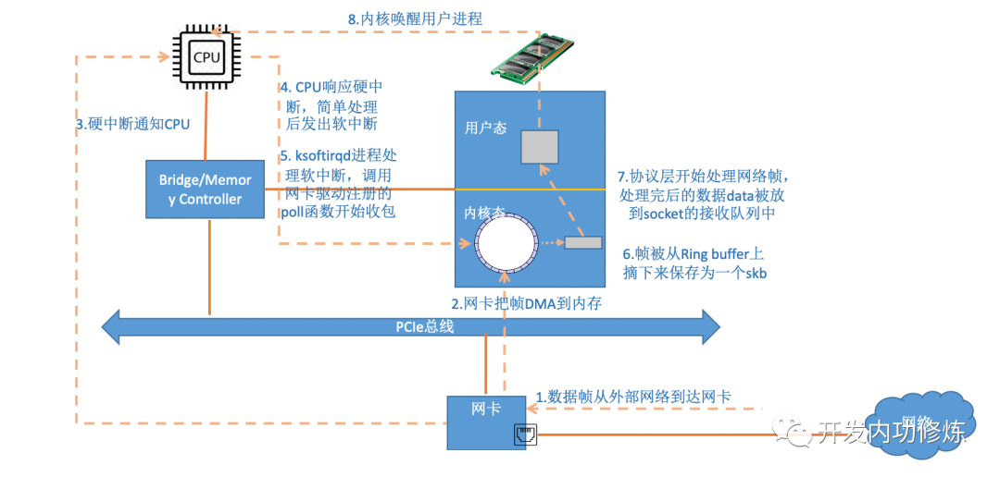

# vritio

## 网络收包过程

## 全虚拟化

发送：

1. Guest OS在准备好网络包数据以及描述符资源后，通过写TDT寄存器，触发VM的异常退出，由KVM模块接管；
2. KVM模块返回到Qemu后，Qemu会检查VM退出的原因，比如检查到e1000寄存器访问出错，因而触发e1000前端工作；
3. Qemu能访问Guest OS中的地址内容，因而e1000前端能获取到Guest OS内存中的网络包数据，发送给后端，后端再将网络包数据发送给TUN/TAP驱动，其中TUN/TAP为虚拟网络设备；
4. 数据发送完成后，除了更新ring-buffer的指针及描述符状态信息外，KVM模块会模拟TX中断；
5. 当再次进入VM时，Guest OS看到的是数据已经发送完毕，同时还需要进行中断处理；
6. Guest OS跑在vCPU线程中，发送数据时相当于会打算它的执行，直到处理完后再恢复回来，也就是一个严格的同步处理过程；

## 设备的半虚拟化

从图中的流程可以看出，原先虚拟机准备好数据之后需要先通过中断退出到宿主机的内核态，再由内核态的kvm向qemu返回虚拟机退出的原因，在由qemu找到虚拟机退出的原因，最后才能执行设备的前端驱动来模拟网卡。

但是在引入了 vritio 之后，前端驱动在虚拟机的内核中实现。这样就能减少一次虚拟机到客户机的切换（中断上下文切换）

在 vritio 前端将数据准备好放入到 vritio_queue 后虚拟机向qemu发送通知表示已将数据准备好。

https://blog.csdn.net/qq_41596356/article/details/128248214

