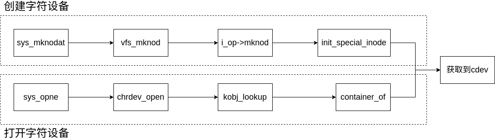

# 字符设备

## 字符设备的结构体

```c
struct cdev {
    struct kobject kobj;                  //内嵌的内核对象.
    struct module *owner;                 //该字符设备所在的内核模块的对象指针.
    const struct file_operations *ops;    //该结构描述了字符设备所能实现的方法，是极为关键的一个结构体.
    struct list_head list;                //用来将已经向内核注册的所有字符设备形成链表.
    dev_t dev;                            //字符设备的设备号，由主设备号和次设备号构成.
    unsigned int count;                   //隶属于同一主设备号的次设备号的个数.
} __randomize_layout;
```

cdev结构体还有另一个相关联的结构体char_device_struct。这里首先会定义主设备号和次设备号：主设备号用来标识与设备文件相连的驱动程序，用来反映设备类型。次设备号被驱动程序用来辨别操作的是哪个设备，用来区分同类型的设备。这里minorct指的是分配的区域，用于主设备号和次设备号的分配工作。

```c
static struct char_device_struct {
    struct char_device_struct *next;
    /*
     * 指向下一个字符设备结构的指针，形成链表结构，主要用于处理同一个哈希桶中
     * 的冲突（哈希冲突解决），以便在同一个哈希索引位置存储多个字符设备结构。
     */
    
    unsigned int major;
    /*
     * 主设备号 (major number)，用于标识字符设备的驱动程序类型。
     * 在 Linux 中，主设备号用于区分不同类型的设备驱动。
     */
    
    unsigned int baseminor;
    /*
     * 次设备号的基础值 (baseminor)，它是一个范围的起点。每个字符设备通常拥有
     * 多个次设备号，用于区分同一类型设备的不同实例。
     */
    
    int minorct;
    /*
     * 次设备号的数量 (minorct)，表示从 `baseminor` 开始的次设备号的个数。
     * 该字段定义了字符设备所覆盖的次设备号范围。
     */
    
    char name[64];
    /*
     * 字符设备的名称，用于识别和描述字符设备。最多可以存储 63 个字符，
     * 包括设备名称和空终止符（'\0'）。
     */
    
    struct cdev *cdev;  /* will die */
    /*
     * 指向字符设备结构体 (struct cdev) 的指针，用于与字符设备的操作函数
     * 进行关联。这是字符设备的核心结构之一，包含设备操作函数 (file_operations)。
     * 注释中的 "will die" 表示这个字段将来可能被废弃或重构。
     */
} *chrdevs[CHRDEV_MAJOR_HASH_SIZE];
/*
 * chrdevs 是字符设备的哈希表数组，用于按主设备号进行索引和存储
 * `char_device_struct` 结构体的指针。`CHRDEV_MAJOR_HASH_SIZE` 是哈希表的大小，
 * 用于快速查找和注册字符设备。
 */
```

```c
struct kobj_map {
    /* 
     * probe 结构体用于描述一个设备探测函数（probe function），
     * 该函数用于匹配特定设备，并在设备和驱动之间建立关联。
     */
    struct probe {
        struct probe *next;   // 指向下一个 probe 结构的指针，形成一个链表
        dev_t dev;            // 设备号，表示设备的主设备号和次设备号
        unsigned long range;  // 表示设备号的范围，用于匹配多个设备
        struct module *owner; // 指向模块的指针，确保设备探测时模块保持被引用，不被卸载
        kobj_probe_t *get;    // 指向设备探测函数的指针，用于找到合适的设备驱动
        int (*lock)(dev_t, void *); // 用于同步的锁函数，确保在并发场景下安全操作设备
        void *data;           // 指向与该设备相关的私有数据，传递给探测函数
    } *probes[255];           // 存储 probe 结构体的数组，最多支持 255 个设备类型

    /* 
     * lock 用于保护 kobj_map 结构体中的 probes 数组，避免并发访问时出现竞争条件，
     * 这是一个互斥锁（mutex），确保同一时间只有一个线程能够修改 probes 数组。
     */
    struct mutex *lock;
};
```

## 创建并打开一个字符设备的过程



在创建字符设备时，我们通常使用这个命令。当在用户空间键入 mknod 来创建一个字符设备时，内核中又会发生什么？

```sh
mknod /dev/hello c 250 0 
```

上述命令的意思：

- mknod：这是一个用于创建设备文件的命令。
- /dev/hello：这是要创建的设备文件的路径和名称。
- c：指定要创建的设备类型是字符设备。字符设备是与数据流相关的设备，如终端、串口等。
- 250：这是设备的主设备号（major number）。主设备号用于识别设备驱动程序。
- 0：这是设备的次设备号（minor number）。次设备号用于识别特定的设备或设备实例。

该命令对应的系统调用为 `mknodat`：

```c
SYSCALL_DEFINE4(mknodat, int, dfd, const char __user *, filename, int, mode, unsigned, dev)
```

在系统调用函数 `mknodat` 中真正处理创建设备的逻辑为：

```c
switch (mode & S_IFMT) {
    case 0: case S_IFREG://常规文件
        error = vfs_create(nd.path.dentry->d_inode, dentry, mode, &nd);
        break;
    case S_IFCHR: case S_IFBLK://字符设备
        error = vfs_mknod(nd.path.dentry->d_inode, dentry, mode, new_decode_dev(dev));
        break;
    case S_IFIFO: case S_IFSOCK://管道或socket
        error = vfs_mknod(nd.path.dentry->d_inode, dentry, mode, 0);
        break;
}
```

对于字符设备的创建使用 `vfs_mknod` 函数

```c
int vfs_mknod(struct inode *dir, struct dentry *dentry, int mode, dev_t dev)
{
	int error = may_create(dir, dentry); // 检查是否有权限创建文件

	if (error)
		return error; // 如果没有权限，返回错误码

	// 如果创建的是字符设备或块设备文件，且没有足够的权限，返回 -EPERM
	if ((S_ISCHR(mode) || S_ISBLK(mode)) && !capable(CAP_MKNOD))
		return -EPERM;

	// 检查目录项是否支持 mknod 操作
	if (!dir->i_op->mknod)
		return -EPERM;

	// 处理设备组相关的权限检查
	error = devcgroup_inode_mknod(mode, dev);
	if (error)
		return error;

	// 执行安全性检查
	error = security_inode_mknod(dir, dentry, mode, dev);
	if (error)
		return error;

	// 调用目录项的 `mknod` 操作函数创建文件
	error = dir->i_op->mknod(dir, dentry, mode, dev);
	if (!error)
		fsnotify_create(dir, dentry); // 如果成功，通知文件系统事件

	return error; // 返回创建文件的结果
}
```

`dir->i_op->mknod` 指向文件系统底层的 mknod 处理函数。

在文件系统底层的函数 `mknod` 中，调用 `init_special_inode` ，该函数设置了 inode 对应的文件操作指针。

```c
void init_special_inode(struct inode *inode, umode_t mode, dev_t rdev)
{
	inode->i_mode = mode;
	if (S_ISCHR(mode)) {//字符设备
		inode->i_fop = &def_chr_fops;
		inode->i_rdev = rdev;
	} else if (S_ISBLK(mode)) {
		inode->i_fop = &def_blk_fops;
		inode->i_rdev = rdev;
	} else if (S_ISFIFO(mode))
		inode->i_fop = &def_fifo_fops;
	else if (S_ISSOCK(mode))
		inode->i_fop = &bad_sock_fops;
	else
		printk(KERN_DEBUG "init_special_inode: bogus i_mode (%o) for"
				  " inode %s:%lu\n", mode, inode->i_sb->s_id,
				  inode->i_ino);
}
EXPORT_SYMBOL(init_special_inode);
```

在文件的操作指针中只定义了一个 open 函数。在这个设备被打开时，会执行 `chrdev_open` ，将对应设备号的设备与 inode 中的成员 `i_cdev` 联系到一起。

```c
const struct file_operations def_chr_fops = {
	.open = chrdev_open,
};
```

```c
static int chrdev_open(struct inode *inode, struct file *filp)
{
	struct cdev *p;
	struct cdev *new = NULL;
	int ret = 0;

	// 1. 获取 cdev 锁
	spin_lock(&cdev_lock);
	p = inode->i_cdev;

	// 2. 如果 inode 还没有关联的 cdev
	if (!p) {
		struct kobject *kobj;
		int idx;

		// 3. 解锁 cdev 锁，查找对应的 cdev 对象
		spin_unlock(&cdev_lock);
		kobj = kobj_lookup(cdev_map, inode->i_rdev, &idx);
		if (!kobj)
			return -ENXIO;  // 设备未找到

		// 4. 从 kobject 中获取 cdev 对象
		new = container_of(kobj, struct cdev, kobj);
		spin_lock(&cdev_lock);

		// 5. 再次检查 inode 的 i_cdev，确保在我们重新加锁期间没有其他线程修改
		p = inode->i_cdev;
		if (!p) {
			inode->i_cdev = p = new;
			list_add(&inode->i_devices, &p->list);  // 将 cdev 添加到设备列表
			new = NULL;
		} else if (!cdev_get(p))  // 增加 cdev 的引用计数
			ret = -ENXIO;  // 设备未找到
	} else if (!cdev_get(p))  // 增加 cdev 的引用计数
		ret = -ENXIO;  // 设备未找到

	// 6. 释放 cdev 锁
	spin_unlock(&cdev_lock);
	cdev_put(new);  // 释放对 new 的引用

	// 7. 检查是否出错
	if (ret)
		return ret;

	// 8. 获取文件操作结构体 f_op
	ret = -ENXIO;
	filp->f_op = fops_get(p->ops);
	if (!filp->f_op)
		goto out_cdev_put;

	// 9. 如果文件操作结构体有 open 函数，则调用它
	if (filp->f_op->open) {
		ret = filp->f_op->open(inode, filp);
		if (ret)
			goto out_cdev_put;
	}

	return 0;

 out_cdev_put:
	cdev_put(p);  // 释放对 cdev 的引用
	return ret;
}
```

那 `i_cdev` 指向的 cdev 又从何而来？

## 字符设备的映射

```c
static struct kobj_map *cdev_map;
```