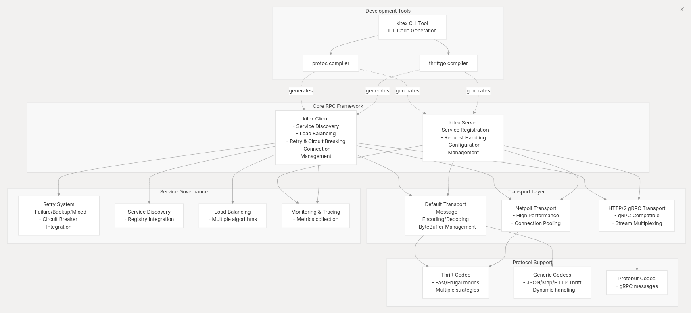

## Answer

Kitex的代码生成管道通过一个多阶段流程，将IDL文件转换为Go服务代码。<cite/>

### 主要入口点和模式检测

代码生成从`tool/cmd/kitex/main.go`的主函数开始，通过环境变量`KITEX_PLUGIN_MODE`检测运行模式： [1](#0-0) 

当设置为插件模式时，会调用相应的插件处理器（`thriftgo.Run()`或`protoc.Run()`）。否则作为独立CLI工具运行。<cite/>

### 参数解析和配置

CLI模式下，`Arguments`结构体处理命令行参数解析和IDL类型检测： [2](#0-1) 

参数系统支持广泛的配置选项，包括模块名、服务名、输出路径、IDL类型等： [3](#0-2) 

### 外部编译器集成

对于不同的IDL类型，系统构建相应的编译器命令：

**Thrift处理**：设置`KITEX_PLUGIN_MODE=thriftgo`并调用thriftgo编译器： [4](#0-3) 

**Protobuf处理**：设置`KITEX_PLUGIN_MODE=protoc`并调用protoc编译器： [5](#0-4) 

### 插件模式代码生成

**Thrift插件**通过`thriftgo/plugin.go`处理请求，将Thrift AST转换为内部`ServiceInfo`结构： [6](#0-5) 

**Protobuf插件**通过`protoc/plugin.go`处理protobuf描述符： [7](#0-6) 

### 代码生成核心

生成器创建三类输出文件：

1. **服务代码**：包含client.go和server.go的服务包文件
2. **主包代码**：应用脚手架的main.go和handler.go  
3. **构建脚本**：部署相关的build.sh等脚本

模板系统使用Go的`text/template`包渲染代码： [8](#0-7) 

### 生成的文件结构

最终生成的代码包括：
- **Service Code**: `client.go`、`server.go`提供RPC客户端和服务端实现
- **Codec Code**: 快速读写和深拷贝方法用于序列化
- **Scaffold Code**: `main.go`和构建脚本用于应用启动

## Notes

代码生成管道支持两种IDL格式（Thrift和Protobuf），通过插件架构与外部编译器集成，最终生成完整的Go微服务代码。整个流程高度可配置，支持自定义模板和扩展功能。

Wiki pages you might want to explore:
- [Overview (cloudwego/kitex)](/wiki/cloudwego/kitex#1)
- [Code Generation (cloudwego/kitex)](/wiki/cloudwego/kitex#6)