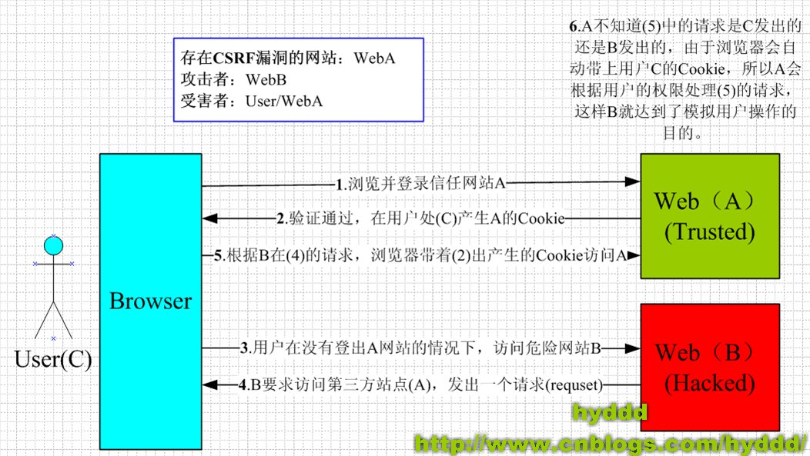

# 安全性

## 常见的攻击手段

### csrf漏洞

csrf漏洞是指在客户端正常访问合法网页时，攻击者引诱客户端访问恶意链接，在该链接中会向合法网页请求，由于处于同一域名下，因此恶意网页会获取到客户端的 cookies 。并利用这点发起攻击



从上图可以看出，要完成一次CSRF攻击，受害者必须依次完成两个步骤：

1. 登录受信任网站A，并在本地生成Cookie。

2. 在不登出A的情况下，访问危险网站B。

对于csrf漏洞又分为Get与Post两种

CSRF（跨站请求伪造）漏洞可以通过两种主要的 HTTP 方法——`GET` 和 `POST`——来实施。以下是这两种情况的说明和示例：

---

### **1. GET 请求中的 CSRF 漏洞**

#### **特点**

- GET 请求是幂等的，通常用于获取资源。
- 如果敏感操作（如修改用户信息、转账）被不正确地设计为接受 GET 请求，就可能导致 CSRF 漏洞。

#### **攻击场景**

假设某银行网站的转账操作通过以下 URL 实现：

```http
https://bank.com/transfer?amount=1000&to=12345
```

任何已登录的用户点击此链接，都会向银行服务器发送转账请求，而无需进一步验证。

#### **攻击示例**

攻击者可以通过以下方式诱导受害者发起请求：

1. 在网页中嵌入图片：

   ```html
   
   ```

   当受害者打开此网页时，浏览器会自动向银行服务器发送 GET 请求，执行转账。

2. 在超链接中诱导点击：

   ```html
   <a href="https://bank.com/transfer?amount=1000&to=12345">Click here for a surprise!</a>
   ```

---

### **2. POST 请求中的 CSRF 漏洞**

#### 特点

- POST 请求通常用于提交表单或进行有副作用的操作。
- POST 请求的 CSRF 攻击通过伪造提交表单来完成。

#### 攻击场景

假设某社交媒体网站的用户设置修改功能通过 POST 请求完成：

```http
POST https://socialmedia.com/update-profile
Content-Type: application/x-www-form-urlencoded

email=attacker@example.com&username=hacked
```

服务器没有验证 CSRF 令牌或其他保护措施，任何登录用户发出的此请求都会生效。

#### 攻击示例

攻击者可以通过伪造表单诱导受害者发起请求：

```html
<form action="https://socialmedia.com/update-profile" method="POST">
    <input type="hidden" name="email" value="attacker@example.com">
    <input type="hidden" name="username" value="hacked">
    <input type="submit" value="Click to win a prize!">
</form>
```

当受害者点击按钮时，浏览器会向目标网站发送 POST 请求，更新用户信息。

---

### **对比与防护措施**

| **GET 请求 CSRF**                 | **POST 请求 CSRF**                |
|-----------------------------------|-----------------------------------|
| 使用图片、脚本、超链接等容易诱导  | 需要伪造表单                     |
| 请求参数直接暴露在 URL 中         | 请求参数在请求体中               |

#### **防护措施**

1. **使用 CSRF Token：**
   - 在表单或请求中添加随机生成的 Token，服务器验证其有效性。
   - 例：Django、Spring 等框架默认支持 CSRF 防护。

2. **检查 Referer 或 Origin Header：**
   - 确保请求来源自可信域名。

3. **使用 SameSite Cookie 属性：**
   - 设置 Cookie 的 `SameSite=Strict` 或 `SameSite=Lax`，防止第三方网站携带 Cookie 发起跨站请求。

4. **避免敏感操作使用 GET 请求：**
   - 例如，不应通过 GET 请求实现转账、修改密码等操作。

5. **用户确认：**
   - 对关键操作要求用户再次验证（如输入密码或 OTP）。

### xss漏洞

xss漏洞主要是让用户访问危险的网页

### SQL 注入

SQL注入的攻击方式主要体现为向数据库发起异常的请求导致数据库崩溃

SQL 注入攻击是一种通过构造恶意 SQL 语句，利用程序对用户输入过滤不足的漏洞来攻击数据库的手段。以下是 SQL 注入攻击的具体示例：

---

### **攻击场景**

#### **目标**
假设一个简单的登录系统通过以下 SQL 查询验证用户输入：

```sql
SELECT * FROM users WHERE username = 'user_input' AND password = 'password_input';
```

系统会检查数据库中是否存在用户名和密码匹配的记录。如果有，则用户成功登录。

---

### **攻击示例 1：联合条件注入**

#### **场景**
攻击者在用户名输入框中输入恶意代码 `admin' OR '1'='1`，密码框中随便填写或留空。

#### **SQL 查询**
输入替换后，SQL 查询变为：
```sql
SELECT * FROM users WHERE username = 'admin' OR '1'='1' AND password = '';
```

#### **效果**
- 条件 `1='1'` 始终为真，因此无论密码如何，都会返回 `admin` 的记录。
- 攻击者可以绕过身份验证直接登录。

---

### **攻击示例 2：注释截断**

#### **场景**
攻击者输入 `admin' --` 作为用户名，密码留空。

#### **SQL 查询**
输入替换后，SQL 查询变为：
```sql
SELECT * FROM users WHERE username = 'admin' --' AND password = '';
```

#### **效果**
- 双破折号 (`--`) 注释掉了后面的内容。
- 实际查询变成：`SELECT * FROM users WHERE username = 'admin';`，绕过了密码验证。

---

### **攻击示例 3：堆叠查询**

#### **场景**
攻击者输入 `admin'; DROP TABLE users; --`。

#### **SQL 查询**
输入替换后，SQL 查询变为：
```sql
SELECT * FROM users WHERE username = 'admin'; DROP TABLE users; --' AND password = '';
```

#### **效果**
- 第一条查询正常执行。
- 第二条查询会删除 `users` 表，导致数据库损坏。

---

### **攻击示例 4：联合查询泄露数据**

#### **场景**
攻击者输入 `admin' UNION SELECT null, database(), null --`。

#### **SQL 查询**
输入替换后，SQL 查询变为：
```sql
SELECT id, username, password FROM users WHERE username = 'admin'
UNION SELECT null, database(), null --' AND password = '';
```

#### **效果**
- 使用 `UNION` 合并查询结果。
- 第二条查询会返回当前数据库名。

---

### **攻击示例 5：盲注**

#### **特点**
攻击者通过观察响应的变化来逐步推测数据库内容。

#### **场景**
攻击者输入：`admin' AND 1=1 --` 和 `admin' AND 1=2 --`。

#### **SQL 查询**
- 第一条：`SELECT * FROM users WHERE username = 'admin' AND 1=1 --';`
- 第二条：`SELECT * FROM users WHERE username = 'admin' AND 1=2 --';`

#### **效果**
- 第一条返回记录，第二条不返回记录。
- 攻击者通过这种方法判断条件是否成立，进一步推测数据库结构或数据。

---

### **防御措施**

1. **使用预编译语句和参数化查询：**
   - 确保用户输入作为数据，而不是代码执行。
   - 示例（Python + SQLite）：
     ```python
     query = "SELECT * FROM users WHERE username = ? AND password = ?"
     cursor.execute(query, (username, password))
     ```

2. **严格验证和过滤用户输入：**
   - 限制输入长度、类型、格式。
   - 避免直接将用户输入插入到 SQL 语句中。

3. **最小化数据库权限：**
   - 应用程序只使用最低权限的数据库账户，避免使用 `root`。

4. **开启错误屏蔽：**
   - 避免直接将数据库错误信息暴露给用户。

5. **使用 Web 应用防火墙（WAF）：**
   - 检测和拦截潜在的 SQL 注入攻击。

6. **定期审查和修复代码：**
   - 结合自动化工具检测 SQL 注入漏洞。

---

**总结**  
SQL 注入是一种严重的漏洞，可能导致数据泄露或破坏，防御的关键在于输入验证和安全的编程实践。