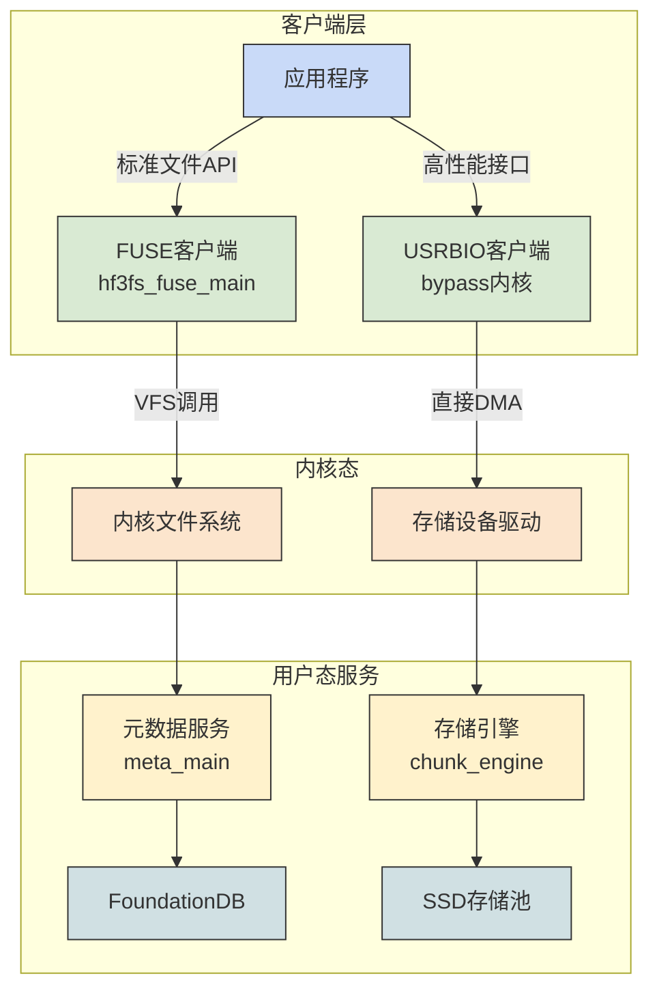
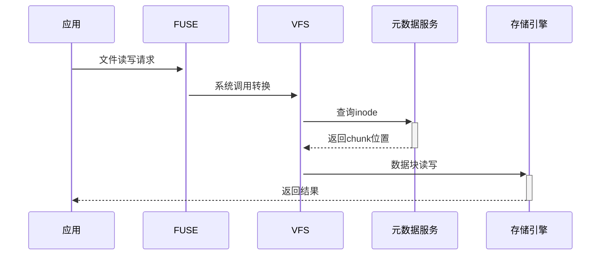

项目架构：

```mermaid

graph TD
    subgraph 客户端层
        A[应用程序] -->|标准文件API| B[FUSE客户端\nhf3fs_fuse_main]
        A -->|高性能接口| C[USRBIO客户端\nbypass内核]
    end

    subgraph 内核态
        B -->|VFS调用| D[内核文件系统]
        C -->|直接DMA| E[存储设备驱动]
    end

    subgraph 用户态服务
        D --> F[元数据服务\nmeta_main]
        E --> G[存储引擎\nchunk_engine]
        F --> H[FoundationDB]
        G --> I[SSD存储池]
    end

    style A fill:#c9daf8,stroke:#333
    style B fill:#d9ead3,stroke:#333
    style C fill:#d9ead3,stroke:#333
    style D fill:#fce5cd,stroke:#333
    style E fill:#fce5cd,stroke:#333
    style F fill:#fff2cc,stroke:#333
    style G fill:#fff2cc,stroke:#333
    style H fill:#d0e0e3,stroke:#333
    style I fill:#d0e0e3,stroke:#333
```
FUSE 客户端 ：实现 FUSE（用户空间文件系统）接口，允许应用程序使用 3FS 作为具有熟悉的 POSIX 语义的标准文件系统挂载点。

USRBIO Native Client ：一款用于零拷贝 I/O 操作的高性能 API，可绕过 FUSE 的一些限制。它使用共享内存区域 (Iov) 和环形缓冲区 (Ior) 来实现高效的数据传输。

```mermaid
sequenceDiagram
    应用->>+FUSE: 文件读写请求
    FUSE->>+VFS: 系统调用转换
    VFS->>+元数据服务: 查询inode
    元数据服务-->>-VFS: 返回chunk位置
    VFS->>+存储引擎: 数据块读写
    存储引擎-->>-应用: 返回结果
```