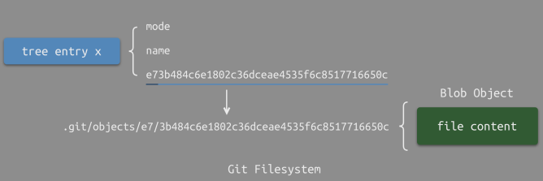

Git 的整体架构，主要包含三大部分分别为上层命令底层命令和对象数据库


## github底层指令

我们一般使用 commit、add、checkout、branch、remote 等上层的命令来操作git，这些指令会被解析为对应的底层指令。底层指令包含 update read write commit cat 这五种。

在 Git 对象数据库的底层操作中，`update`、`read`、`write`、`commit` 和 `cat` 是核心指令，分别对应不同的数据操作。以下是它们的详细解释：

---

**1. `update`（更新对象）**
• 作用：修改 Git 对象数据库中的现有对象（如 Blob、Tree 或 Commit）。

• 底层行为：

  • 修改文件内容后，Git 会生成新的 Blob 对象（因为内容变化导致 SHA-1 哈希改变）。

  • 更新 Tree 对象以引用新的 Blob。

  • 最终生成新的 Commit 对象指向更新后的 Tree。

• 示例：

  ```bash
  echo "new content" > file.txt
  git add file.txt  # 触发 Blob 和 Tree 的更新
  git commit        # 生成新的 Commit 对象
  ```

---

**2. `read`（读取对象）**
• 作用：从 Git 对象数据库中提取对象内容。

• 底层行为：

  • 通过 SHA-1 哈希值定位对象文件（存储在 `.git/objects` 目录中）。

  • 自动解压缩对象数据（Git 使用 zlib 压缩存储）。

• 示例：

  ```bash
  git cat-file -p HEAD  # 读取当前提交对象的内容
  ```

---

**3. `write`（写入对象）**
• 作用：将新对象写入 Git 数据库。

• 底层行为：

  • 计算内容的 SHA-1 哈希值。

  • 将数据压缩后存入 `.git/objects/[hash前缀]/[hash剩余部分]`。

• 示例：

  ```bash
  git hash-object -w file.txt  # 将文件内容写入 Blob 对象
  ```

---

**4. `commit`（提交对象）**
• 作用：生成一个新的提交对象，记录仓库状态。

• 底层行为：

  1. 基于当前 Tree 对象（反映目录结构）生成 Commit 对象。
  2. 包含作者、时间戳、父提交指针（形成版本链）。
  3. 更新 `HEAD` 引用指向新提交。
• 示例：

  ```bash
  git commit -m "message"  # 生成 Commit 对象并更新引用
  ```

---

**5. `cat`（查看对象内容）**
• 作用：直接输出 Git 对象的内容（无需解压）。

• 底层行为：

  • 读取 `.git/objects` 中的二进制文件。

  • 解析对象类型（Blob/Tree/Commit）并格式化输出。

• 示例：

  ```bash
  git cat-file -p <hash>  # 查看指定对象内容
  ```

---

**总结：指令与 Git 对象的关系**
| 指令     | 操作对象          | 关键行为                          |
|----------|------------------|----------------------------------|
| `update` | Blob/Tree/Commit | 修改内容 → 生成新对象 → 更新引用  |
| `read`   | 任意对象          | 通过哈希定位并解压数据            |
| `write`  | Blob/Tree        | 计算哈希 → 压缩存储               |
| `commit` | Commit           | 绑定 Tree 和元数据 → 形成版本链   |
| `cat`    | 任意对象          | 解析二进制对象并输出              |

---

**底层实现路径**
• 所有对象存储在 `.git/objects` 目录下，例如：

  ```plaintext
  .git/objects/
  ├── 12/3456789...  # Blob 对象
  ├── ab/cdef012...  # Tree 对象
  └── cd/012345...   # Commit 对象
  ```
• 通过 `git cat-file -t <hash>` 可查看对象类型。


这些指令是 Git 版本控制的核心，理解它们有助于深入掌握 Git 的运作机制。

这里的对象数据库可以类似于一个文件系统，不过文件系统存储的是文件，而对象数据库存储的是对象。

组织形式：


## 对象数据库

对象数据库中包括 Blob 对象 Tree 对象 Commit 对象 Tag 对象。

### Blob 对象

存储文件内容（二进制数据）只记录产生变化的地方。

### ​Tree 对象​​

记录目录结构，包含文件和子目录的引用。类似于文件系统中dentry的作用。一个树对象可以指向一个树对象（目录）和一个blob对象（文件）。
  对于每个树对象来说会有在该对象中记录一个哈希数组，这个哈希值对应了一个对象在物理磁盘上的实际路径。
  

  这里位于 obiject 目录下。
  
  对于没有产生更新的文件，tree会指向原先的版本号，对于产生了更新的文件则是指向最新创建的 blog

  

### Commit 对象​​

保存版本历史，包含作者、时间、父提交指针等信息。一个提交对象指向一个树对象。这个树对象是当前版本的根。

版本更新：

  以修改文件 README.md 并提交为例：

​  ​生成新 Blob​​：

   修改后的文件内容 → 新 Blob 对象（新 SHA-1 哈希）。

​  ​更新父 Tree​​：

   父 Tree 对象中 README.md 的哈希值替换为新 Blob 的哈希 → 生成新 Tree 对象（新 SHA-1）。

​  ​递归更新上级 Tree​​：

   如果父 Tree 的哈希变化，其上级 Tree 也需更新对该子 Tree 的引用，直到根目录的 Tree。

​  ​生成新 Commit​​：

   新 Commit 对象指向最新的根 Tree 对象，形成新的版本快照。
   

**1. 场景假设**
• 目录结构：

  ```sh
  / (根目录)
  ├── a1/
  │   └── b2       # 文件内容未修改
  └── a2/
      └── b2       # 文件内容被修改
  ```

• 操作：修改 `a2/b2` 文件并提交。

**2. Git 的 Tree 更新逻辑**
Git 会自底向上递归更新受影响的 Tree 对象，具体步骤如下：

**(1) 更新 `b2` 的 Blob 对象**
• 修改后的 `a2/b2` 文件内容 → 生成新的 Blob 对象（新 SHA-1 哈希）。

• `a1/b2` 无变化：继续引用原有的 Blob 对象。

**(2) 更新直接父 Tree（`a2/`）**
• `a2/` 目录的 Tree 对象中，`b2` 的哈希值更新为新 Blob → 生成新的 `a2/` Tree 对象。

• `a1/` 目录的 Tree 对象：由于 `a1/b2` 未变化，`a1/` 的 Tree 对象保持不变，复用原有 SHA-1。

**(3) 更新根 Tree**
• 根 Tree 对象中：

  • `a1/` 的引用保持不变（复用旧 Tree）。

  • `a2/` 的引用更新为新生成的 Tree 对象。

• 因此会生成一个新的 根 Tree 对象。

**3. 关键结论**

| 对象       | 是否重新创建 | 原因                                                                 |
|----------------|------------------|--------------------------------------------------------------------------|
| `a2/b2` Blob   | ✅ 是            | 文件内容修改，必须生成新 Blob。                                          |
| `a2/` Tree     | ✅ 是            | 因 `b2` 的 Blob 变化，需更新对 `b2` 的引用。                             |
| `a1/` Tree     | ❌ 否            | `a1/b2` 未变化，复用原有 Tree。                                          |
| 根 Tree        | ✅ 是            | 需要更新对 `a2/` 的新 Tree 引用（即使 `a1/` 未变）。                     |


* ​Tag 对象​​：标记特定提交（如版本号）
